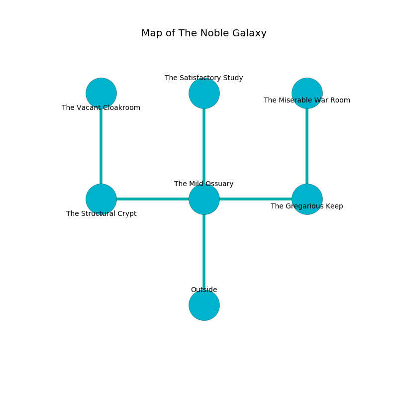

%Ruin Dogs

##The Noble Galaxy
###Overview
The Noble Galaxy is located on a broken rift. Some areas of The Noble Galaxy are inaccessible. The ruin is coming to life. It is occupied by Githyanki. Leonard Troutman The Materialistic, an Incubus is here. The Githyanki have been charmed by Leonard Troutman The Materialistic. He  is founding a new religion. 

###Artifact
####The Weekly Trait

The Weekly Trait looks like a cold orb. It is a bright red color. Fire flows around it. It smells like grain. When worn it burns the mind. 

###Locations

####the mild ossuary
The floor is glossy. The obsidion walls are scratched. There are an Ice Mephit, a Night Hag, and a Grick here. The air smells like alcohol here. Red ferns are growing from the ceiling. 

* To the west a torchlit cavern opens to [the structural crypt](#the-structural-crypt).
* To the east a small threshold connects to [the gregarious keep](#the-gregarious-keep).
* To the north a dripping corridor opens to [the satisfactory study](#the-satisfactory-study).
* To the south is the entrance.

####the gregarious keep
The air tastes like autumn here. There are a Giant Rat, a Swarm of Rats, a Guard, a Half-Ogre, a Sahuagin, a Dire Wolf, a Lizardfolk Shaman, a Slaad Tadpole, a Poisonous Snake, a Sea Horse, a Lemure, and a Commoner here. White razorgrass is growing in cracks in the floor. The crystal walls are bloodstained. 

* [The Weekly Trait](#The-Weekly-Trait) is here.
* To the west a small threshold leads to [the mild ossuary](#the-mild-ossuary).
* To the north a dark passageway connects to [the miserable war Room](#the-miserable-war-Room).

####the satisfactory study
The metallic walls are covered in mold. The air tastes like earth here. There is a Hill Giant here. 

* There is a jewel here.
* There is a lyre here.
* There is a roof here.
* [Leonard Troutman The Materialistic](#Leonard-Troutman-The-Materialistic) is here.
* To the south a dripping corridor leads to [the mild ossuary](#the-mild-ossuary).

####the structural crypt
The floor is sticky. White lichens are decaying in a patch on the floor. There are two Githyanki Warriors here. The Githyanki are fighting amongst themselves. 

There is an engraving on the wall written in common. 

> I could not try leaving.
>

* To the east a torchlit cavern opens to [the mild ossuary](#the-mild-ossuary).
* To the north a flooded path leads to [the vacant cloakroom](#the-vacant-cloakroom).

####the vacant cloakroom
The concrete walls are ruined. 

There is an engraving on the wall written in Githyanki Script. 

> Dear me! sorry we
>
> cute and free
>
> it is always past
>
> nothing is free
>

* To the south a flooded path leads to [the structural crypt](#the-structural-crypt).

####the miserable war Room
White mushrooms are swaying in cracks in the floor. The air smells like grilling here. The metallic walls are covered in mold. There are two Githyanki Warriors here. One of the Githyanki is working a mechanism that can flood the room. 

* To the south a dark passageway opens to [the gregarious keep](#the-gregarious-keep).

