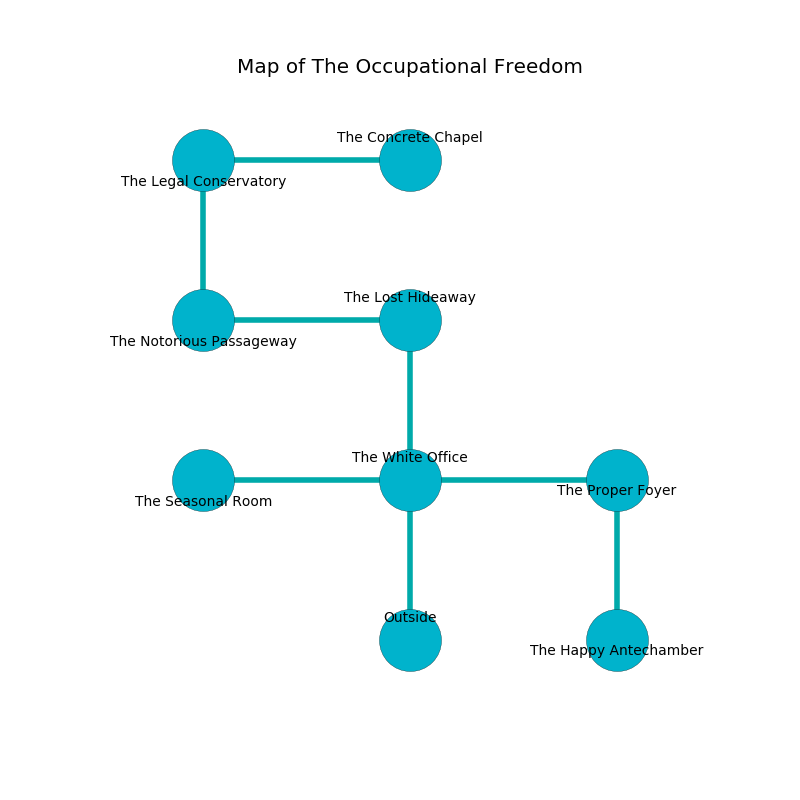

%Ruin Dogs

##The Occupational Freedom
###Overview
The Occupational Freedom is located in a poisoned plain. Some rooms of The Occupational Freedom are inaccessible. A battle between raiders is happening outside. It is occupied by Pixies. Karol Ketchum The Harsh, a Sahuagin Baron is here. The Pixies have been charmed by Karol Ketchum The Harsh. She  is trying to research [Emehwiiaei](#Emehwiiaei). 

###Artifact
####Emehwiiaei

Emehwiiaei looks like a broken gem. It smells like cantaloupe. It is a shifting black color. When eaten it destroys itself. 

###Locations

####the white office
The air smells like bacon here. Blue moss is sprouting in broken urns. The floor is flooded with five inch deep cool water. 

* To the west a long cave leads to [the seasonal room](#the-seasonal-room).
* To the east a windy corridor opens to [the proper foyer](#the-proper-foyer).
* To the north a long passageway leads to [the lost hideaway](#the-lost-hideaway).
* To the south is the entrance.

####the lost hideaway
The air tastes like fruit here. There are twenty Pixies here. The floor is smooth. One of the Pixies is pointing a ballista at the entrance. 

* To the west a narrow cave connects to [the notorious passageway](#the-notorious-passageway).
* To the south a long passageway connects to [the white office](#the-white-office).

####the notorious passageway
The floor is sticky. The crystal walls are caving in. The air smells like earth here. Green mushrooms are sprouting in a patch on the floor. 

There is an engraving on the floor written in Pixies Script. 

> O! the world is sadistic
>
> it is never characteristic
>
> random, memorable, comprehensive
>
> all is offensive
>

* There is a plate here.
* There is a blade here.
* To the east a narrow cave connects to [the lost hideaway](#the-lost-hideaway).
* To the north a hazy cavern connects to [the legal conservatory](#the-legal-conservatory).

####the seasonal room
The crystal walls are pristine. There are twenty Pixies here. The floor is bloodstained. One of the Pixies is working a mechanism that can flood the room. 

* To the east a long cave opens to [the white office](#the-white-office).

####the legal conservatory
There are a Giant Constrictor Snake, a Giant Wasp, an Eagle, a Cockatrice, and a Githzerai Monk here. Red ferns are decaying in cracks in the floor. 

* [Emehwiiaei](#Emehwiiaei) is here.
* To the east a twisted corridor connects to [the concrete chapel](#the-concrete-chapel).
* To the south a hazy cavern connects to [the notorious passageway](#the-notorious-passageway).

####the proper foyer
The air tastes like stringent here. The floor is smooth. The obsidion walls are bloodstained. There are a Raven, a Warhorse Skeleton, a Mezzoloth, a Druid, a Quipper, and a Giant Wasp here. 

* To the west a windy corridor connects to [the white office](#the-white-office).
* To the south a torchlit walkway connects to [the happy antechamber](#the-happy-antechamber).

####the happy antechamber
Yellow mushrooms are growing from the ceiling. There is a trap here. When activated, a tripwire will make the ceiling slowly lower. The obsidion walls are unsettled. 

There is an engraving on the ceiling written in Pixies Script. 

> They are joyful
>
> yet late
>
> easy, visible, irrelevant
>
> you shall be frozen
>

* There is a skirt here.
* To the north a torchlit walkway opens to [the proper foyer](#the-proper-foyer).

####the concrete chapel
The concrete walls are ruined. The air tastes like lobster here. 

There is an engraving on a stone written in common. 

> Hide here.
>

* [Karol Ketchum The Harsh](#Karol-Ketchum-The-Harsh) is here.
* To the west a twisted corridor leads to [the legal conservatory](#the-legal-conservatory).

