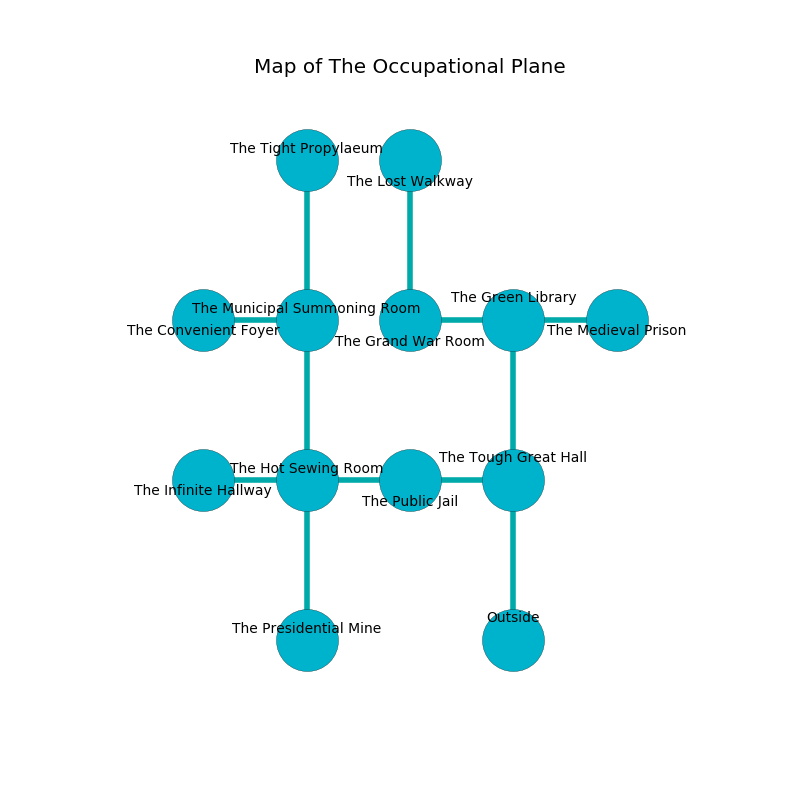

%Ruin Dogs

##The Occupational Plane
###Overview
The Occupational Plane is located on a broken tree. Parts of The Occupational Plane are inaccessible. A lunar eclipse is happening outside. It is occupied by Lizardfolk. Claudio Painter The Intolerant, an Orc War Chief is here. The Lizardfolk are battling Claudio Painter The Intolerant. He  is trying to research [Faiaefcm](#Faiaefcm). 

###Artifact
####Faiaefcm

Faiaefcm has the form of an opaque amulet. It smells like seafood. It is a sickly brown color. When worshipped it projects energy. 

###Locations

####the tough great hall
The floor is sticky. Red mushrooms are decaying from the ceiling. 

* There is an egg here.
* To the west a twisted pathway leads to [the public jail](#the-public-jail).
* To the north a long path connects to [the green library](#the-green-library).
* To the south is the entrance.

####the public jail
The floor is smooth. The air smells like kiwi here. The obsidion walls are scratched. 

* There is a kettle here.
* To the west a dark artery connects to [the hot sewing room](#the-hot-sewing-room).
* To the east a twisted pathway leads to [the tough great hall](#the-tough-great-hall).

####the green library
The air smells like hazelnut here. The floor is bloodstained. The stone walls are unsettled. There are two Lizardfolk Shamans and three Lizardfolk here. The Lizardfolk are willing to negotiate. 

* To the west a windy gap opens to [the grand war Room](#the-grand-war-Room).
* To the east a flooded gap leads to [the medieval prison](#the-medieval-prison).
* To the south a long path leads to [the tough great hall](#the-tough-great-hall).

####the hot sewing room
Gray lichens are swaying in broken urns. The air tastes like beef here. The crystal walls are covered in mold. 

* There is a plow here.
* There is a picture here.
* There is a ring here.
* [Claudio Painter The Intolerant](#Claudio-Painter-The-Intolerant) is here.
* To the west a small cavern opens to [the infinite hallway](#the-infinite-hallway).
* To the east a dark artery connects to [the public jail](#the-public-jail).
* To the north a windy artery leads to [the municipal summoning room](#the-municipal-summoning-room).
* To the south a twisted cavern opens to [the presidential mine](#the-presidential-mine).

####the municipal summoning room
There are a Salamander, a Giant Frog, a Crocodile, a Hobgoblin, a Sahuagin, a Copper Dragon Wyrmling, a Mastiff, and a Giant Bat here. The obsidion walls are caving in. The air tastes like juniper here. 

* [Faiaefcm](#Faiaefcm) is here.
* To the west a torchlit path opens to [the convenient foyer](#the-convenient-foyer).
* To the north a flooded cave leads to [the tight propylaeum](#the-tight-propylaeum).
* To the south a windy artery connects to [the hot sewing room](#the-hot-sewing-room).

####the presidential mine
The floor is bloodstained. 

* To the north a twisted cavern connects to [the hot sewing room](#the-hot-sewing-room).

####the infinite hallway
There is a trap here. When activated, a magical rune will close a portcullis. Green mushrooms are swaying in broken urns. The air smells like thyme here. The glass walls are bloodstained. 

* There is a bridge here.
* There is a plate here.
* To the east a small cavern connects to [the hot sewing room](#the-hot-sewing-room).

####the tight propylaeum
The air smells like capers here. 

* There is a triptych here.
* To the south a flooded cave connects to [the municipal summoning room](#the-municipal-summoning-room).

####the grand war Room
The floor is flooded with four inch deep lukewarm water. 

* To the east a windy gap leads to [the green library](#the-green-library).
* To the north a windy cave opens to [the lost walkway](#the-lost-walkway).

####the medieval prison
There are two Lizardfolk Shamans and two Lizardfolk here. The air tastes like roasted peanut here. The floor is glossy. The Lizardfolk are willing to negotiate. 

* To the west a flooded gap opens to [the green library](#the-green-library).

####the lost walkway
There is a trap here. When activated, a tripwire will make the walls close in. The floor is flooded with four inch deep cold water. There are three Lizardfolk Shamans and a Lizardfolk here. Red razorgrass is decaying in broken urns. The air tastes like capers here. The glass walls are pristine. The Lizardfolk are willing to fight to the death. 

* To the south a windy cave opens to [the grand war Room](#the-grand-war-Room).

####the convenient foyer
Red moss is growing from the walls. There are a Warhorse, a Veteran, an Allosaurus, and a Reef Shark here. The floor is smooth. The air smells like sage here. 

* There is a baby here.
* To the east a torchlit path connects to [the municipal summoning room](#the-municipal-summoning-room).

