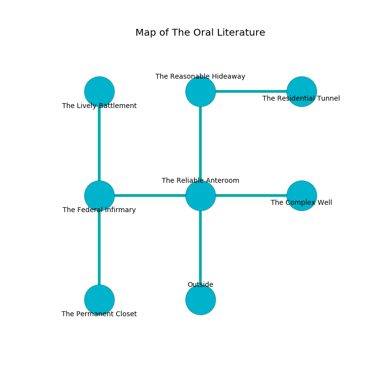

%Ruin Dogs

##The Oral Literature
###Overview
The Oral Literature is located in a spikey rift. Regions of The Oral Literature are incredibly cold. The ruin is coming to life. It is occupied by Drows. Leigh Girard The Cantankerous, a Cloud Giant is here. The Drows are the slaves of Leigh Girard The Cantankerous. He  is trying to destroy [Abdhuwibamd](#Abdhuwibamd). 

###Artifact
####Abdhuwibamd

Abdhuwibamd is a powerful artifact in the shape of a hard meteorite. Gravity pours away from it. When touched it becomes a deadly projectile. 

###Locations

####the reliable anteroom
The floor is smooth. There are a Clay Golem, an Owlbear, and a White Dragon Wyrmling here. Blue mushrooms are growing from the ceiling. 

* To the west a narrow opening leads to [the federal infirmary](#the-federal-infirmary).
* To the east a torchlit path opens to [the complex well](#the-complex-well).
* To the north a narrow cavern leads to [the reasonable hideaway](#the-reasonable-hideaway).
* To the south is the entrance.

####the reasonable hideaway
The air smells like freesia here. The floor is glossy. 

* There is a drawer here.
* [Leigh Girard The Cantankerous](#Leigh-Girard-The-Cantankerous) is here.
* To the east a twisted path connects to [the residential tunnel](#the-residential-tunnel).
* To the south a narrow cavern leads to [the reliable anteroom](#the-reliable-anteroom).

####the residential tunnel
The wooden walls are ruined. The floor is bloodstained. The air tastes like citronella here. 

* To the west a twisted path connects to [the reasonable hideaway](#the-reasonable-hideaway).

####the complex well
The air smells like cloth here. There are forty Drows here. The mirrored walls are unsettled. Yellow lichens are swaying in cracks in the floor. One of the Drows is on watch, the rest are sleeping. 

There is an engraving on a monolith written in Drows Script. 

> I am lonely.
>
> Hide here.
>

* To the west a torchlit path connects to [the reliable anteroom](#the-reliable-anteroom).

####the federal infirmary
Yellow razorgrass is decaying in cracks in the floor. The metallic walls are caving in. The floor is bloodstained. The air smells like verbena here. 

* There is a brain here.
* [Abdhuwibamd](#Abdhuwibamd) is here.
* To the east a narrow opening leads to [the reliable anteroom](#the-reliable-anteroom).
* To the north a torchlit opening connects to [the lively battlement](#the-lively-battlement).
* To the south a flooded hall connects to [the permanent closet](#the-permanent-closet).

####the permanent closet
The wooden walls are bloodstained. The air tastes like pear skin here. 

* There is a spear here.
* To the north a flooded hall connects to [the federal infirmary](#the-federal-infirmary).

####the lively battlement
There are forty Drows here. The floor is cluttered with bones. Yellow razorgrass is decaying from the walls. The air smells like potato here. If the Drows notice the Ruin Dogs, one of them will retreat and alert the others. 

There is an engraving on a tablet written in common. 

> Leave now.
>

* To the south a torchlit opening opens to [the federal infirmary](#the-federal-infirmary).

