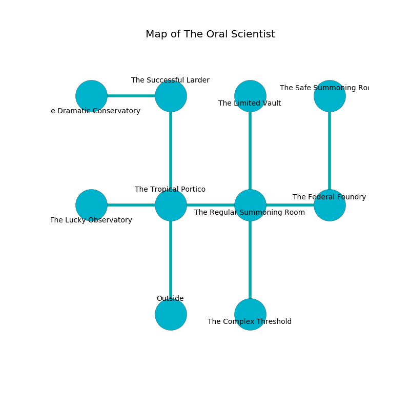

%Ruin Dogs

##The Oral Scientist
###Overview
The Oral Scientist is located under a crystal mountain. Some areas of it are foggy. A blizzard is happening outside. It is occupied by Drows. Erline Mccreary The Unpredictable, a Gladiator is here. The Drows are the soldiers of Erline Mccreary The Unpredictable. She  is trying to understand [Dewi Imuiaaf](#Dewi-Imuiaaf). 

###Artifact
####Dewi Imuiaaf

Dewi Imuiaaf looks like a hard meteorite. It is a bright yellow color. Power bends from it. When touched it turns surrounding objects to ashes. 

###Locations

####the tropical portico
The floor is sticky. The wooden walls are covered in mold. 

* [Erline Mccreary The Unpredictable](#Erline-Mccreary-The-Unpredictable) is here.
* To the west a twisted cavern connects to [the lucky observatory](#the-lucky-observatory).
* To the east a torchlit walkway opens to [the regular summoning room](#the-regular-summoning-room).
* To the north a twisted opening opens to [the successful larder](#the-successful-larder).
* To the south is the entrance.

####the successful larder
The air tastes like roasted coffee here. 

There is an engraving on the wall written in common. 

> I tried fighting.
>

* To the west a twisted gap connects to [the dramatic conservatory](#the-dramatic-conservatory).
* To the south a twisted opening opens to [the tropical portico](#the-tropical-portico).

####the regular summoning room
The air tastes like cedarwood here. The floor is glossy. The glass walls are unsettled. There are a Goblin, a Deep Gnome, a Knight, and a Zombie here. 

* There is a key here.
* To the west a torchlit walkway leads to [the tropical portico](#the-tropical-portico).
* To the east a flooded hall leads to [the federal foundry](#the-federal-foundry).
* To the north a long pathway leads to [the limited vault](#the-limited-vault).
* To the south a twisted path connects to [the complex threshold](#the-complex-threshold).

####the limited vault
The floor is glossy. The concrete walls are ruined. The air tastes like strawberry here. Gray lichens are decaying in cracks in the floor. 

* There is a knife here.
* To the south a long pathway leads to [the regular summoning room](#the-regular-summoning-room).

####the federal foundry
White razorgrass is decaying in cracks in the floor. The brick walls are scratched. 

* [Dewi Imuiaaf](#Dewi-Imuiaaf) is here.
* To the west a flooded hall leads to [the regular summoning room](#the-regular-summoning-room).
* To the north a narrow threshold connects to [the safe summoning room](#the-safe-summoning-room).

####the dramatic conservatory
The floor is glossy. The air smells like turni here. Yellow moss is decaying in broken urns. There are a Cat, a Basilisk, and a Dire Wolf here. 

There is an engraving on a stone written in common. 

> Oh meak god
>
> proper, paralyzed, odd
>
> familiar, social, optional
>
> everything is odd
>

* To the east a twisted gap leads to [the successful larder](#the-successful-larder).

####the complex threshold
There is an Orc War Chief here. There is a trap here. When activated, a pressure plate will fire a net. The floor is glossy. 

* To the north a twisted path connects to [the regular summoning room](#the-regular-summoning-room).

####the lucky observatory
There are a Darkmantle, a Lion, a Peryton, a Baboon, a Scarecrow, and an Octopus here. The air smells like liver here. Green moss is growing from the walls. 

* To the east a twisted cavern leads to [the tropical portico](#the-tropical-portico).

####the safe summoning room
The mirrored walls are pristine. Blue razorgrass is sprouting in broken urns. 

* To the south a narrow threshold leads to [the federal foundry](#the-federal-foundry).

