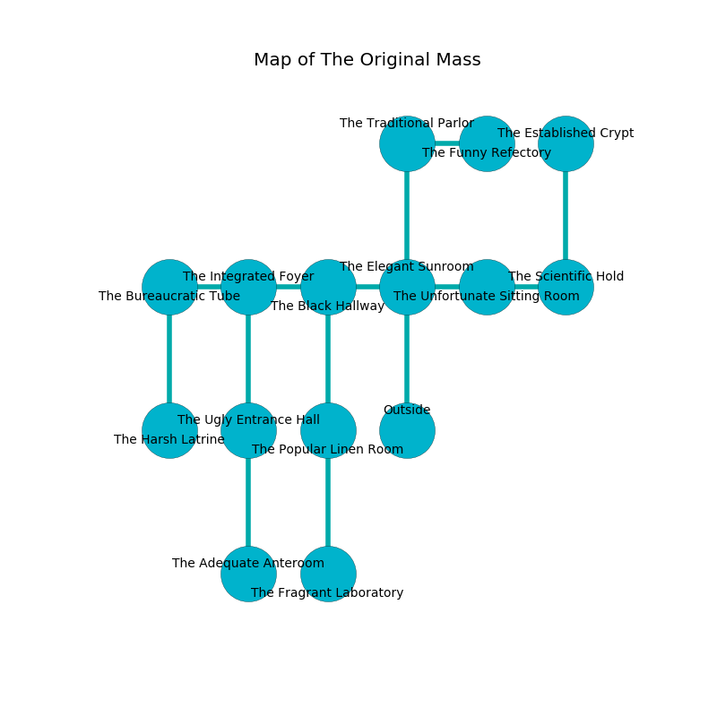

%Ruin Dogs

##The Original Mass
###Overview
The Original Mass is located in a ruined plain. Parts of it are foggy. The ruin is burning. It is occupied by Kenku. Von Rountree The Bitchy, a Bearded Devil is here. The Kenku are battling Von Rountree The Bitchy. He  is trying to research [Baecfudmuma](#Baecfudmuma). 

###Artifact
####Baecfudmuma

Baecfudmuma is a powerful artifact in the shape of a warm crystal. It smells like salmon. Psychic energy pours around it. When eaten it sings the hymn of the damned. 

###Locations

####the elegant sunroom
The air tastes like black currant here. The wooden walls are ruined. 

* To the west a dark cave opens to [the black hallway](#the-black-hallway).
* To the east a hazy corridor opens to [the unfortunate sitting Room](#the-unfortunate-sitting-Room).
* To the north a long opening opens to [the traditional parlor](#the-traditional-parlor).
* To the south is the entrance.

####the black hallway
The floor is flooded with six inch deep lukewarm water. The metallic walls are unsettled. The air smells like cinnamon here. 

There is an engraving on a monolith written in common. 

> I am looting this place.
>

* To the west a windy corridor leads to [the integrated foyer](#the-integrated-foyer).
* To the east a dark cave opens to [the elegant sunroom](#the-elegant-sunroom).
* To the south a dark cave connects to [the popular linen room](#the-popular-linen-room).

####the unfortunate sitting Room
The crystal walls are unsettled. The floor is glossy. White moss is decaying from the ceiling. The air tastes like sassafrass here. 

There is an engraving on the floor written in common. 

> I thought about fighting.
>

* To the west a hazy corridor opens to [the elegant sunroom](#the-elegant-sunroom).
* To the east a long pathway connects to [the scientific hold](#the-scientific-hold).

####the integrated foyer
The floor is smooth. There are a Draft Horse, a Swarm of Insects, a Quasit, a Warhorse, a Brown Bear, and an Animated Armor here. The crystal walls are unsettled. The air smells like castoreum here. 

* There is a crystal here.
* There is a femur here.
* [Von Rountree The Bitchy](#Von-Rountree-The-Bitchy) is here.
* To the west a long cave leads to [the bureaucratic tube](#the-bureaucratic-tube).
* To the east a windy corridor connects to [the black hallway](#the-black-hallway).
* To the south a flooded path connects to [the ugly entrance hall](#the-ugly-entrance-hall).

####the traditional parlor
The air smells like macadamia here. Blue mushrooms are swaying from the ceiling. 

* To the east a hazy pathway opens to [the funny refectory](#the-funny-refectory).
* To the south a long opening opens to [the elegant sunroom](#the-elegant-sunroom).

####the popular linen room
The air smells like cheese here. There is a Lamia here. 

* [Baecfudmuma](#Baecfudmuma) is here.
* To the north a dark cave opens to [the black hallway](#the-black-hallway).
* To the south a windy opening connects to [the fragrant laboratory](#the-fragrant-laboratory).

####the bureaucratic tube
The brick walls are caving in. There are sixteen Kenkus here. One of the Kenku is on watch, the rest are fighting amongst themselves. 

* There is a church here.
* To the east a long cave leads to [the integrated foyer](#the-integrated-foyer).
* To the south a flooded opening opens to [the harsh latrine](#the-harsh-latrine).

####the funny refectory
The air tastes like quince here. The brick walls are scratched. White moss is swaying in cracks in the floor. 

* To the west a hazy pathway leads to [the traditional parlor](#the-traditional-parlor).

####the ugly entrance hall
The air smells like opoponax here. Red ferns are growing in a patch on the floor. There are sixteen Kenkus here. The floor is cluttered with debris. The Kenku are berserk with rage. 

* There is a spade here.
* To the north a flooded path connects to [the integrated foyer](#the-integrated-foyer).
* To the south a hazy pathway opens to [the adequate anteroom](#the-adequate-anteroom).

####the adequate anteroom
The air smells like sharp here. The stone walls are ruined. There are sixteen Kenkus here. The Kenku are defending this room from intruders. 

* There is a crossbow here.
* There is a bridge here.
* To the north a hazy pathway opens to [the ugly entrance hall](#the-ugly-entrance-hall).

####the harsh latrine
The air tastes like bouillon here. The floor is glossy. 

* To the north a flooded opening leads to [the bureaucratic tube](#the-bureaucratic-tube).

####the scientific hold
The concrete walls are scratched. The air smells like plastic here. There are a Wolf, a Spider, a Panther, a Centaur, a Black Pudding, and a Giant Frog here. 

* To the west a long pathway connects to [the unfortunate sitting Room](#the-unfortunate-sitting-Room).
* To the north a dripping corridor connects to [the established crypt](#the-established-crypt).

####the established crypt
Green ferns are swaying in a patch on the floor. There are a Thug, a Veteran, a Ghoul, a Kenku, and a Giant Badger here. 

There is an engraving on a monolith written in common. 

> They are damned
>
> always dry
>
> spatial and painful
>
> [Baecfudmuma](#Baecfudmuma)
>
> elegant and outside
>
> vertical and harsh
>
> A needle is a possibility
>
> necessary and vacant
>

* To the south a dripping corridor leads to [the scientific hold](#the-scientific-hold).

####the fragrant laboratory
The air tastes like starfruit here. There are sixteen Kenkus here. The obsidion walls are unsettled. One of the Kenku is working a mechanism that can launch acid at the Ruin Dogs. 

* To the north a windy opening opens to [the popular linen room](#the-popular-linen-room).

