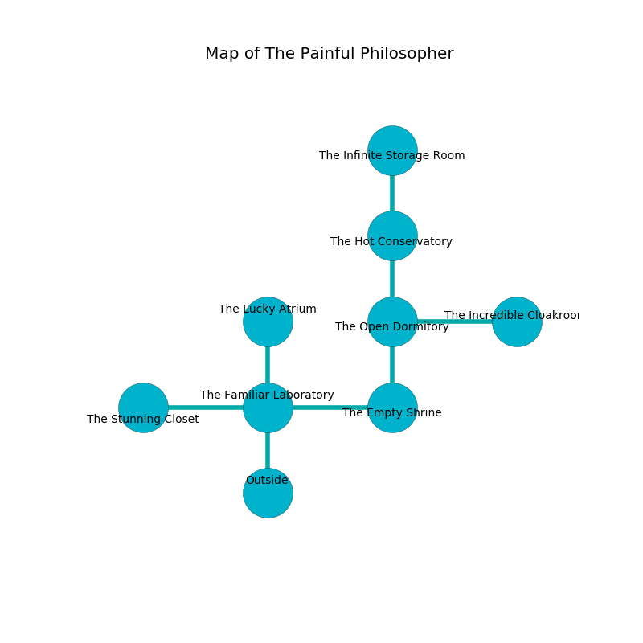

%Ruin Dogs

##The Painful Philosopher
###Overview
The Painful Philosopher is located on a volcanic rift. Some areas of it are frozen. The ruin is larger on the inside than the outside. It is occupied by Sahuagin. Maryetta Salazar The Jealous, a Gladiator is here. The Sahuagin are the slaves of Maryetta Salazar The Jealous. She  is trying to use [The Dynamic Conflict](#The-Dynamic-Conflict). 

###Artifact
####The Dynamic Conflict

The Dynamic Conflict looks like a smooth rock. It smells like narcissus. Psychic energy bends towards it. When smelled it become energized with a powerful vibration. 

###Locations

####the familiar laboratory
The floor is sticky. There are eight Sahuagin here. Gray ferns are swaying from the walls. The air tastes like jam here. The brick walls are scratched. One of the Sahuagin is on watch, the rest are caring for babies. 

There is an engraving on the floor written in common. 

> I discovered [The Dynamic Conflict](#The-Dynamic-Conflict).
>
> Run away.
>

* [The Dynamic Conflict](#The-Dynamic-Conflict) is here.
* [Maryetta Salazar The Jealous](#Maryetta-Salazar-The-Jealous) is here.
* To the west a windy passageway leads to [the stunning closet](#the-stunning-closet).
* To the east a long hallway connects to [the empty shrine](#the-empty-shrine).
* To the north a narrow passageway leads to [the lucky atrium](#the-lucky-atrium).
* To the south is the entrance.

####the empty shrine
Red moss is growing in broken urns. The air smells like petitgrain here. 

* To the west a long hallway opens to [the familiar laboratory](#the-familiar-laboratory).
* To the north a windy cave leads to [the open dormitory](#the-open-dormitory).

####the open dormitory
The air smells like must here. The floor is bloodstained. There are eight Sahuagin here. If the Sahuagin notice the Ruin Dogs, one of them will retreat and alert the others. 

There is an engraving on the floor written in common. 

> O! cruel we
>
> but free
>
> central and typical
>
> nothing is free
>

* To the east a torchlit gap opens to [the incredible cloakroom](#the-incredible-cloakroom).
* To the north a dripping hallway leads to [the hot conservatory](#the-hot-conservatory).
* To the south a windy cave connects to [the empty shrine](#the-empty-shrine).

####the incredible cloakroom
There are eight Sahuagin here. Gray ferns are growing from the walls. The air smells like ginseng here. The Sahuagin are defending this room from intruders. 

* To the west a torchlit gap leads to [the open dormitory](#the-open-dormitory).

####the hot conservatory
The floor is smooth. There are eight Sahuagin here. White ferns are swaying in broken urns. The air tastes like tuberose here. If the Sahuagin notice the Ruin Dogs, one of them will retreat and alert [Maryetta Salazar](#Maryetta-Salazar). 

* To the north a flooded gap connects to [the infinite storage room](#the-infinite-storage-room).
* To the south a dripping hallway connects to [the open dormitory](#the-open-dormitory).

####the infinite storage room
The air tastes like orris here. 

* To the south a flooded gap opens to [the hot conservatory](#the-hot-conservatory).

####the stunning closet
Yellow moss is sprouting in broken urns. The air tastes like spruce here. The floor is glossy. 

* There is a girl here.
* There is a bridge here.
* There is a rat here.
* There is a skirt here.
* There is a brain here.
* There is a flag here.
* To the east a windy passageway leads to [the familiar laboratory](#the-familiar-laboratory).

####the lucky atrium

* There is a bird here.
* To the south a narrow passageway opens to [the familiar laboratory](#the-familiar-laboratory).

