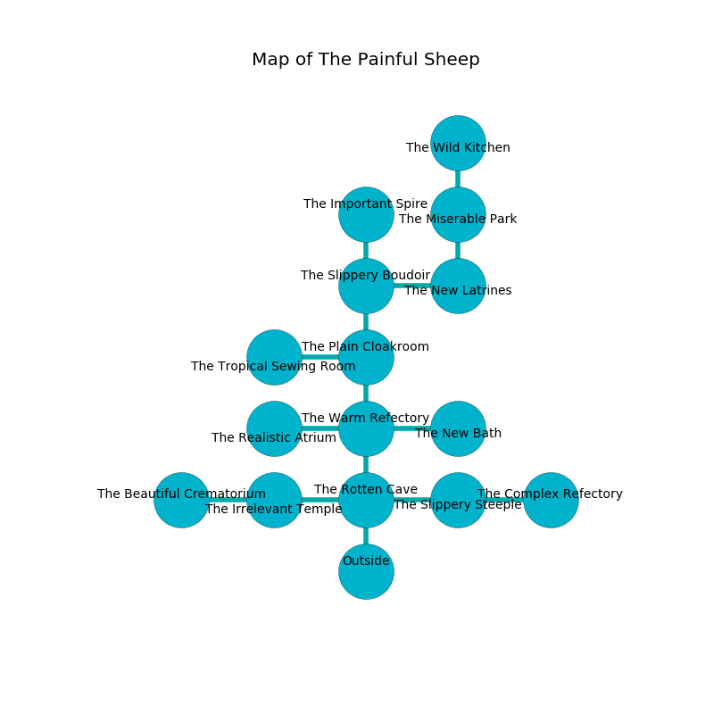

%Ruin Dogs

##The Painful Sheep
###Overview
The Painful Sheep is located in an obsidion plain. Regions of The Painful Sheep are frozen. A solar eclipse is happening outside. It is occupied by Orc. Jamel Scribner The Impulsive, an Orc War Chief is here. The Orc have been charmed by Jamel Scribner The Impulsive. He  is trying to find [Haema Feaem](#Haema-Feaem). 

###Artifact
####Haema Feaem

Haema Feaem is a powerful artifact in the shape of a smooth monument. Water pours towards it. It smells like peanut butter. When worn it makes its owner invisible. 

###Locations

####the rotten cave
The air smells like brown sugar here. The floor is cluttered with debris. White lichens are growing in broken urns. 

* To the west a flooded artery opens to [the irrelevant temple](#the-irrelevant-temple).
* To the east a small hallway opens to [the slippery steeple](#the-slippery-steeple).
* To the north a flooded cave leads to [the warm refectory](#the-warm-refectory).
* To the south is the entrance.

####the warm refectory
The obsidion walls are unsettled. Yellow razorgrass is sprouting in a patch on the floor. The air tastes like roasted hazelnut here. 

There is an engraving on a monolith written in common. 

> Go away.
>

* To the west a torchlit cavern opens to [the realistic atrium](#the-realistic-atrium).
* To the east a dripping passageway connects to [the new bath](#the-new-bath).
* To the north a narrow gap leads to [the plain cloakroom](#the-plain-cloakroom).
* To the south a flooded cave connects to [the rotten cave](#the-rotten-cave).

####the new bath
Blue mushrooms are sprouting in cracks in the floor. The floor is cluttered with rocks. 

* To the west a dripping passageway connects to [the warm refectory](#the-warm-refectory).

####the irrelevant temple
The wooden walls are unsettled. The air tastes like grass here. There are six Orcs here. There is a trap here. When activated, a magical sound detector will cast a curse. One of the Orc is on watch, the rest are caring for babies. 

There is an engraving on the ceiling written in Orc Script. 

> A trap ahead.
>

* There is an orange here.
* There is a crossbow here.
* To the west a torchlit gap opens to [the beautiful crematorium](#the-beautiful-crematorium).
* To the east a flooded artery opens to [the rotten cave](#the-rotten-cave).

####the realistic atrium
The floor is bloodstained. The concrete walls are pristine. The air smells like cypress here. Green ferns are decaying in cracks in the floor. 

* To the east a torchlit cavern connects to [the warm refectory](#the-warm-refectory).

####the plain cloakroom
The air tastes like corn chip here. The floor is smooth. Green moss is growing in broken urns. There are six Orcs here. One of the Orc is on watch, the rest are drunk. 

* To the west a narrow gap connects to [the tropical sewing room](#the-tropical-sewing-room).
* To the north a hazy gap leads to [the slippery boudoir](#the-slippery-boudoir).
* To the south a narrow gap opens to [the warm refectory](#the-warm-refectory).

####the beautiful crematorium
Yellow moss is growing in broken urns. The air tastes like black tea here. The floor is sticky. There is a trap here. When activated, a pressure plate will launch a blade. The glass walls are covered in mold. 

* [Jamel Scribner The Impulsive](#Jamel-Scribner-The-Impulsive) is here.
* To the east a torchlit gap connects to [the irrelevant temple](#the-irrelevant-temple).

####the slippery boudoir
The air smells like egg nog here. 

* To the east a windy walkway opens to [the new latrines](#the-new-latrines).
* To the north a dripping corridor connects to [the important spire](#the-important-spire).
* To the south a hazy gap opens to [the plain cloakroom](#the-plain-cloakroom).

####the tropical sewing room
The air smells like alfalfa here. Blue mushrooms are swaying from the walls. 

* To the east a narrow gap connects to [the plain cloakroom](#the-plain-cloakroom).

####the new latrines
There are a Gnoll Pack Lord, a Lizardfolk, and a Thri-Kreen here. The crystal walls are scratched. The floor is bloodstained. 

* To the west a windy walkway opens to [the slippery boudoir](#the-slippery-boudoir).
* To the north a small walkway leads to [the miserable park](#the-miserable-park).

####the important spire
Green lichens are sprouting from the walls. 

There is an engraving on a tablet written in Orc Script. 

> Oh my! pitiful fate
>
> it is never straight
>
> it is always proud
>
> all is loud
>

* There is a picture here.
* There is a salamander here.
* To the south a dripping corridor opens to [the slippery boudoir](#the-slippery-boudoir).

####the slippery steeple
The air smells like pork here. The floor is glossy. White ferns are decaying in broken urns. 

* There is a box here.
* To the west a small hallway opens to [the rotten cave](#the-rotten-cave).
* To the east a narrow passageway leads to [the complex refectory](#the-complex-refectory).

####the complex refectory
The air smells like apple here. The floor is flooded with four inch deep cold water. Red ferns are growing from the ceiling. There are six Orcs here. The Orc are willing to negotiate. 

* There is a rail here.
* To the west a narrow passageway leads to [the slippery steeple](#the-slippery-steeple).

####the miserable park
There are six Orcs here. The floor is smooth. If the Orc notice the Ruin Dogs, one of them will retreat and alert [Jamel Scribner](#Jamel-Scribner). 

* [Haema Feaem](#Haema-Feaem) is here.
* To the north a dripping cavern opens to [the wild kitchen](#the-wild-kitchen).
* To the south a small walkway opens to [the new latrines](#the-new-latrines).

####the wild kitchen
The air tastes like huckleberry here. 

* To the south a dripping cavern connects to [the miserable park](#the-miserable-park).

