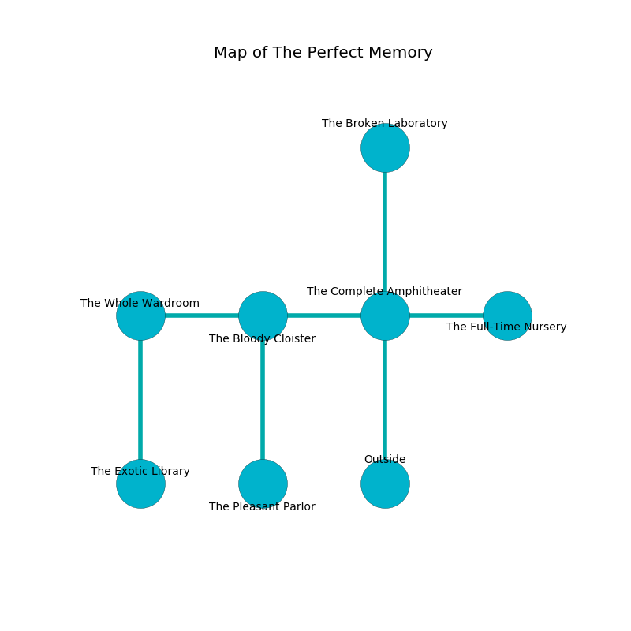

%Ruin Dogs

##The Perfect Memory
###Overview
The Perfect Memory is located on a haunted tree. Parts of it are flooded. The ruin is larger on the inside than the outside. It is occupied by Satyrs. Zane Aviles The Secretive, a Cloud Giant is here. The Satyrs are ruled by Zane Aviles The Secretive. He  is trying to exploit [The Insufficient Leftovers](#The-Insufficient-Leftovers). 

###Artifact
####The Insufficient Leftovers

The Insufficient Leftovers looks like a wet doll. It smells like sandalwood. It is a light orange color. When gazed upon it projects energy. 

###Locations

####the complete amphitheater
The air smells like citrus peel here. 

* To the west a long cavern connects to [the bloody cloister](#the-bloody-cloister).
* To the east a twisted pathway connects to [the full-time nursery](#the-full-time-nursery).
* To the north a windy opening leads to [the broken laboratory](#the-broken-laboratory).
* To the south is the entrance.

####the bloody cloister
The wooden walls are bloodstained. There are an Axe Beak, a Giant Octopus, a Commoner, an Old Faerie Dragon, and a Chimera here. The air tastes like bitter orange here. There is a trap here. When activated, a pressure plate will open a large pit in the floor. 

* [The Insufficient Leftovers](#The-Insufficient-Leftovers) is here.
* To the west a dripping cave connects to [the whole wardroom](#the-whole-wardroom).
* To the east a long cavern connects to [the complete amphitheater](#the-complete-amphitheater).
* To the south a flooded corridor connects to [the pleasant parlor](#the-pleasant-parlor).

####the whole wardroom
Blue ferns are decaying from the ceiling. The air smells like smoke here. The metallic walls are pristine. 

* [Zane Aviles The Secretive](#Zane-Aviles-The-Secretive) is here.
* To the east a dripping cave connects to [the bloody cloister](#the-bloody-cloister).
* To the south a twisted hall leads to [the exotic library](#the-exotic-library).

####the broken laboratory
The air smells like avocado here. There are sixteen Satyrs here. The glass walls are ruined. The Satyrs are willing to negotiate. 

* There is a crystal here.
* To the south a windy opening opens to [the complete amphitheater](#the-complete-amphitheater).

####the exotic library
Red mushrooms are growing from the ceiling. There are a Githzerai Zerth and a Druid here. The obsidion walls are caving in. 

* To the north a twisted hall leads to [the whole wardroom](#the-whole-wardroom).

####the full-time nursery
The floor is smooth. Blue lichens are growing from the walls. There are sixteen Satyrs here. The Satyrs are willing to negotiate. 

* To the west a twisted pathway opens to [the complete amphitheater](#the-complete-amphitheater).

####the pleasant parlor
The air smells like lemongrass here. There are a Zombie, a Swarm of Bats, a Nightmare, a Black Bear, a Harpy, a Tyrannosaurus Rex, a Poisonous Snake, a Giant Wasp, and a Brass Dragon Wyrmling here. 

* There is a bottle here.
* There is a knot here.
* To the north a flooded corridor connects to [the bloody cloister](#the-bloody-cloister).

