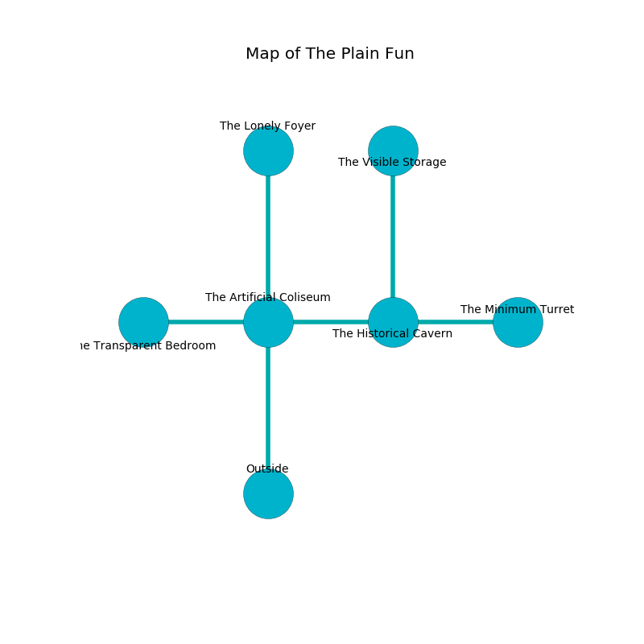

%Ruin Dogs

##The Plain Fun
###Overview
The Plain Fun is located on a ruined tree. Parts of it are cursed. A windstorm is happening outside. It is occupied by Ogres. Kirby Ashcraft The Intolerant, a Mind Flayer Arcanist is here. The Ogres are ruled by Kirby Ashcraft The Intolerant. He  is founding a new religion. 

###Artifact
####Cubdaemedaeum Faddaeha

Cubdaemedaeum Faddaeha looks like a warm sphere. It smells like mint. It is a dark gray color. When picked up it changes the past. 

###Locations

####the artificial coliseum
There is a trap here. When activated, a tripwire will open a large pit in the floor. The floor is glossy. The air tastes like jam here. Blue moss is sprouting in cracks in the floor. There are a Young Brass Dragon and a Mezzoloth here. 

* To the west a small passageway connects to [the transparent bedroom](#the-transparent-bedroom).
* To the east a hazy opening connects to [the historical cavern](#the-historical-cavern).
* To the north a hazy walkway opens to [the lonely foyer](#the-lonely-foyer).
* To the south is the entrance.

####the transparent bedroom
The concrete walls are unsettled. The air tastes like smoked sausage here. The floor is cluttered with bones. 

* [Kirby Ashcraft The Intolerant](#Kirby-Ashcraft-The-Intolerant) is here.
* To the east a small passageway connects to [the artificial coliseum](#the-artificial-coliseum).

####the historical cavern
The air tastes like toasted grain here. The crystal walls are pristine. There are five Half-Ogres and two Ogres here. One of the Ogres is pointing a ballista at the entrance. 

* [Cubdaemedaeum Faddaeha](#Cubdaemedaeum-Faddaeha) is here.
* To the west a hazy opening leads to [the artificial coliseum](#the-artificial-coliseum).
* To the east a small corridor leads to [the minimum turret](#the-minimum-turret).
* To the north a dark passageway leads to [the visible storage](#the-visible-storage).

####the visible storage
The obsidion walls are caving in. The floor is sticky. 

There is an engraving on a stone written in common. 

> I found The Plain Fun.
>
> Leave now.
>

* To the south a dark passageway leads to [the historical cavern](#the-historical-cavern).

####the lonely foyer
The mirrored walls are covered in mold. 

There is an engraving on a stone written in common. 

> I thought about dying.
>

* There is a fork here.
* To the south a hazy walkway opens to [the artificial coliseum](#the-artificial-coliseum).

####the minimum turret
The air smells like jasmin here. The floor is cluttered with broken glass. The mirrored walls are caving in. 

* To the west a small corridor leads to [the historical cavern](#the-historical-cavern).

