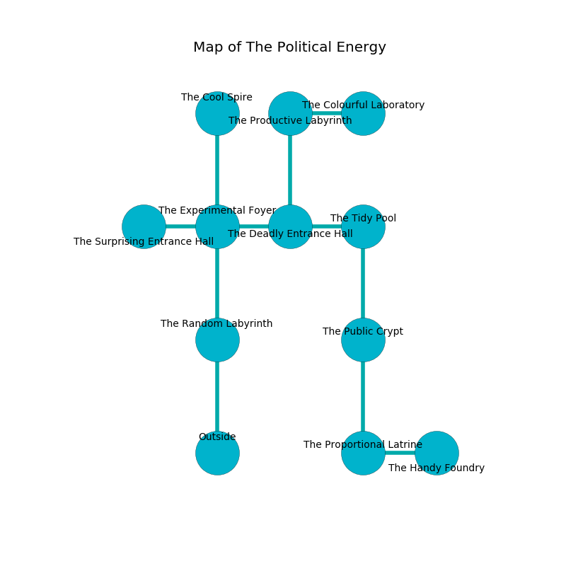

%Ruin Dogs

##The Political Energy
###Overview
The Political Energy is located on a volcanic mountain. Parts of it are inaccessible. The ruin is flooding. It is occupied by Thri-Kreens. Ouida Lott The Cruel, an Orc War Chief is here. The Thri-Kreens are battling Ouida Lott The Cruel. She  is founding a new religion. 

###Artifact
####The Fashionable Exit

The Fashionable Exit has the form of a mushy figurine. Water slips away from it. It is a bright orange color. When touched it floats above the ground. 

###Locations

####the random labyrinth
The brick walls are pristine. The air tastes like dry	durian here. The floor is glossy. White mushrooms are decaying in cracks in the floor. 

* There is a flag here.
* To the north a long threshold connects to [the experimental foyer](#the-experimental-foyer).
* To the south is the entrance.

####the experimental foyer
The floor is cluttered with shells. The air smells like peanut butter here. There are an Allosaurus, a Kuo-Toa, an Axe Beak, a Hobgoblin, a Giant Hyena, and a Gibbering Mouther here. 

* To the west a hazy walkway connects to [the surprising entrance hall](#the-surprising-entrance-hall).
* To the east a dripping pathway opens to [the deadly entrance hall](#the-deadly-entrance-hall).
* To the north a twisted pathway opens to [the cool spire](#the-cool-spire).
* To the south a long threshold opens to [the random labyrinth](#the-random-labyrinth).

####the surprising entrance hall
There are a Warhorse, a Grick, and a Succubus here. The concrete walls are covered in mold. Green mushrooms are growing in a patch on the floor. 

* There is a goblin here.
* To the east a hazy walkway connects to [the experimental foyer](#the-experimental-foyer).

####the deadly entrance hall
The stone walls are scratched. The air tastes like elderflower here. 

* To the west a dripping pathway opens to [the experimental foyer](#the-experimental-foyer).
* To the east a windy cave opens to [the tidy pool](#the-tidy-pool).
* To the north a hazy corridor leads to [the productive labyrinth](#the-productive-labyrinth).

####the cool spire
The air tastes like geranium here. The floor is cluttered with shells. 

* There is a girl here.
* To the south a twisted pathway connects to [the experimental foyer](#the-experimental-foyer).

####the productive labyrinth
White moss is sprouting in cracks in the floor. There are five Thri-Kreens here. The floor is flooded with two inch deep scalding water. The brick walls are bloodstained. The Thri-Kreens are caring for babies. 

There is an engraving on the floor written in common. 

> I am lost in The Political Energy.
>
> Try giving up.
>

* There is a horse here.
* To the east a dripping artery opens to [the colourful laboratory](#the-colourful-laboratory).
* To the south a hazy corridor opens to [the deadly entrance hall](#the-deadly-entrance-hall).

####the tidy pool
There are five Thri-Kreens here. The floor is cluttered with broken glass. Blue lichens are swaying from the ceiling. The wooden walls are scratched. The Thri-Kreens are performing a ritual. If not interrupted, the Thri-Kreens will become more powerful. 

* To the west a windy cave leads to [the deadly entrance hall](#the-deadly-entrance-hall).
* To the south a windy corridor leads to [the public crypt](#the-public-crypt).

####the public crypt
The air tastes like hay here. The obsidion walls are pristine. The floor is bloodstained. 

* To the north a windy corridor opens to [the tidy pool](#the-tidy-pool).
* To the south a hazy passageway connects to [the proportional latrine](#the-proportional-latrine).

####the proportional latrine
White ferns are swaying in cracks in the floor. 

* [The Fashionable Exit](#The-Fashionable-Exit) is here.
* To the east a windy artery opens to [the handy foundry](#the-handy-foundry).
* To the north a hazy passageway opens to [the public crypt](#the-public-crypt).

####the colourful laboratory
The floor is glossy. White moss is swaying from the ceiling. 

There is an engraving on the floor written in Thri-Kreens Script. 

> A cake is a democracy
>
> always aloof
>
> crude, great, qualified
>
> ever dry
>

* To the west a dripping artery opens to [the productive labyrinth](#the-productive-labyrinth).

####the handy foundry
There are five Thri-Kreens here. Green mushrooms are sprouting from the ceiling. The air tastes like yeast here. The concrete walls are ruined. One of the Thri-Kreens is pointing a ballista at the entrance. 

There is an engraving on a monolith written in Thri-Kreens Script. 

> O meak fate
>
> clean and persistent
>
> ever late
>
> fate is distant
>

* There is a portrait here.
* [Ouida Lott The Cruel](#Ouida-Lott-The-Cruel) is here.
* To the west a windy artery leads to [the proportional latrine](#the-proportional-latrine).

