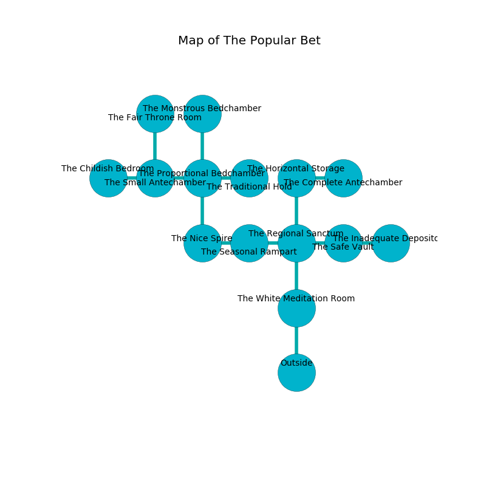

%Ruin Dogs

##The Popular Bet
###Overview
The Popular Bet is located on a volcanic mountain. Some areas of it are inaccessible. The ruin is collapsing slowly. It is occupied by Pixies. Freeman Beals The Possessive, a Cloud Giant is here. The Pixies are the minions of Freeman Beals The Possessive. He  is trying to hide [Iwibduh](#Iwibduh). 

###Artifact
####Iwibduh

Iwibduh is a powerful artifact in the shape of a mushy sphere. It smells like coffee. When carried it emits dust. 

###Locations

####the white meditation room
The crystal walls are pristine. 

* To the north a twisted hallway connects to [the regional sanctum](#the-regional-sanctum).
* To the south is the entrance.

####the regional sanctum
The floor is sticky. Yellow lichens are sprouting in cracks in the floor. The air tastes like filbert here. 

* To the west a dark threshold opens to [the seasonal rampart](#the-seasonal-rampart).
* To the east a dripping threshold opens to [the safe vault](#the-safe-vault).
* To the north a twisted corridor leads to [the horizontal storage](#the-horizontal-storage).
* To the south a twisted hallway connects to [the white meditation room](#the-white-meditation-room).

####the seasonal rampart
The glass walls are scratched. The floor is flooded with six inch deep hot water. Blue ferns are decaying in a patch on the floor. 

* To the west a windy threshold leads to [the nice spire](#the-nice-spire).
* To the east a dark threshold leads to [the regional sanctum](#the-regional-sanctum).

####the nice spire
The air tastes like cornmeal here. The floor is bloodstained. 

* There is an apple here.
* To the east a windy threshold leads to [the seasonal rampart](#the-seasonal-rampart).
* To the north a dripping pathway opens to [the proportional bedchamber](#the-proportional-bedchamber).

####the horizontal storage
The concrete walls are pristine. The air tastes like nut here. There are a Magma Mephit, a Wererat, a Flameskull, an Orc, and a Minotaur here. Red ferns are sprouting in broken urns. 

* To the east a long cavern opens to [the complete antechamber](#the-complete-antechamber).
* To the south a twisted corridor opens to [the regional sanctum](#the-regional-sanctum).

####the complete antechamber
Green razorgrass is decaying in a patch on the floor. The brick walls are covered in mold. The floor is glossy. 

* To the west a long cavern opens to [the horizontal storage](#the-horizontal-storage).

####the safe vault
The air smells like hazelnut here. There are forty Pixies here. The floor is smooth. The mirrored walls are bloodstained. Green lichens are growing in cracks in the floor. The Pixies are performing a ritual. If not interrupted, [Freeman Beals](#Freeman-Beals) will be magically alarmed. 

* [Iwibduh](#Iwibduh) is here.
* To the west a dripping threshold opens to [the regional sanctum](#the-regional-sanctum).
* To the east a hazy passageway opens to [the inadequate depository](#the-inadequate-depository).

####the proportional bedchamber
The floor is cluttered with shells. The air tastes like melon here. There are an Aboleth and a Noble here. 

* There is a table here.
* There is a pendant here.
* To the west a flooded pathway leads to [the small antechamber](#the-small-antechamber).
* To the east a dark walkway leads to [the traditional hold](#the-traditional-hold).
* To the north a hazy passageway leads to [the monstrous bedchamber](#the-monstrous-bedchamber).
* To the south a dripping pathway connects to [the nice spire](#the-nice-spire).

####the small antechamber
The air tastes like rain here. The floor is glossy. Gray moss is decaying from the walls. 

There is an engraving on a stone written in common. 

> Dear me! meak fate
>
> it is always great
>
> bureaucratic and perfect
>
> nothing is direct
>

* To the west a hazy cavern leads to [the childish bedroom](#the-childish-bedroom).
* To the east a flooded pathway connects to [the proportional bedchamber](#the-proportional-bedchamber).
* To the north a twisted corridor leads to [the fair throne room](#the-fair-throne-room).

####the childish bedroom
The mirrored walls are scratched. White ferns are growing in cracks in the floor. 

* [Freeman Beals The Possessive](#Freeman-Beals-The-Possessive) is here.
* To the east a hazy cavern connects to [the small antechamber](#the-small-antechamber).

####the fair throne room
The air tastes like fruit here. Red razorgrass is growing from the walls. There are forty Pixies here. The mirrored walls are pristine. The Pixies are willing to negotiate. 

* To the south a twisted corridor connects to [the small antechamber](#the-small-antechamber).

####the monstrous bedchamber
The air tastes like linden flower here. There are a Bearded Devil, a Spirit Naga, and a Deer here. 

* To the south a hazy passageway leads to [the proportional bedchamber](#the-proportional-bedchamber).

####the traditional hold

* To the west a dark walkway opens to [the proportional bedchamber](#the-proportional-bedchamber).

####the inadequate depository
The air smells like nut here. The stone walls are caving in. 

* To the west a hazy passageway opens to [the safe vault](#the-safe-vault).

