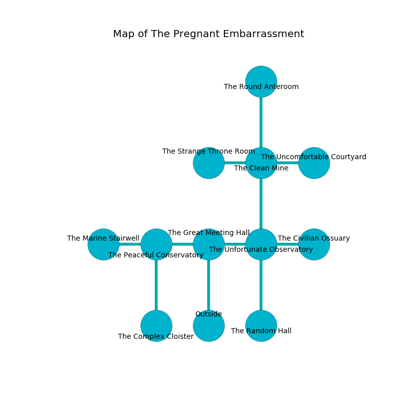

%Ruin Dogs

##The Pregnant Embarrassment
###Overview
The Pregnant Embarrassment is located in a poisoned mountain. Some areas of it are inaccessible. A massive storm is happening outside. It is occupied by Orcs. Rueben Palacios The Aloof, a Fire Giant is here. The Orcs are ruled by Rueben Palacios The Aloof. He  is trying to destroy [Dfaeium](#Dfaeium). 

###Artifact
####Dfaeium

Dfaeium is a powerful artifact in the shape of a sharp monument. Cacophony pours away from it. When carried it becomes a shielding force. 

###Locations

####the great meeting hall
Green razorgrass is growing in broken urns. The wooden walls are unsettled. The air tastes like marzipan here. There are a Thug, a Kuo-Toa Monitor, a Quaggoth Thonot, a Bone Naga, and a Mimic here. 

* To the west a twisted threshold connects to [the peaceful conservatory](#the-peaceful-conservatory).
* To the east a hazy passageway opens to [the unfortunate observatory](#the-unfortunate-observatory).
* To the south is the entrance.

####the unfortunate observatory
White lichens are swaying from the walls. The brick walls are pristine. The air tastes like roasted hazelnut here. There are a Barlgura and a Treant here. 

* [Dfaeium](#Dfaeium) is here.
* To the west a hazy passageway leads to [the great meeting hall](#the-great-meeting-hall).
* To the east a dark cave leads to [the civilian ossuary](#the-civilian-ossuary).
* To the north a torchlit artery opens to [the clean mine](#the-clean-mine).
* To the south a flooded cavern opens to [the random hall](#the-random-hall).

####the peaceful conservatory
The floor is glossy. The air tastes like agarwood here. There are an Orc War Chief and three Orc Eyes of Gruumsh here. The brick walls are pristine. If the Orcs notice the Ruin Dogs, one of them will retreat and alert the others. 

* [Rueben Palacios The Aloof](#Rueben-Palacios-The-Aloof) is here.
* To the west a small walkway leads to [the marine stairwell](#the-marine-stairwell).
* To the east a twisted threshold connects to [the great meeting hall](#the-great-meeting-hall).
* To the south a dark path leads to [the complex cloister](#the-complex-cloister).

####the complex cloister
The glass walls are scratched. Yellow ferns are decaying in broken urns. 

* To the north a dark path leads to [the peaceful conservatory](#the-peaceful-conservatory).

####the clean mine
The air smells like acetone here. The floor is cluttered with ashes. 

There is an engraving on the wall written in Orcs Script. 

> Oh my! my life is woe
>
> curious, just, low
>
> ever formal
>
> the world is informal
>

* To the west a windy cavern opens to [the strange throne room](#the-strange-throne-room).
* To the east a dark walkway connects to [the uncomfortable courtyard](#the-uncomfortable-courtyard).
* To the north a dripping cave connects to [the round anteroom](#the-round-anteroom).
* To the south a torchlit artery leads to [the unfortunate observatory](#the-unfortunate-observatory).

####the uncomfortable courtyard
There are two Orc War Chiefs and two Orc Eyes of Gruumsh here. The floor is smooth. The Orcs are fighting amongst themselves. 

* There is a horse here.
* There is a map here.
* To the west a dark walkway opens to [the clean mine](#the-clean-mine).

####the marine stairwell
The air tastes like root here. There are two Orc War Chiefs and an Orc Eye of Gruumsh here. The floor is sticky. The Orcs are performing a ritual. If not interrupted, the ruin dogs will be weakened. 

* To the east a small walkway opens to [the peaceful conservatory](#the-peaceful-conservatory).

####the strange throne room
The floor is glossy. The air tastes like balsam	petal here. Gray ferns are decaying from the walls. 

* To the east a windy cavern connects to [the clean mine](#the-clean-mine).

####the civilian ossuary
The concrete walls are scratched. The air tastes like animal here. The floor is glossy. 

* To the west a dark cave opens to [the unfortunate observatory](#the-unfortunate-observatory).

####the round anteroom
The mirrored walls are caving in. Red mushrooms are sprouting in cracks in the floor. 

* To the south a dripping cave connects to [the clean mine](#the-clean-mine).

####the random hall
The air smells like deertongue here. The floor is sticky. Gray moss is growing in a patch on the floor. 

* To the north a flooded cavern opens to [the unfortunate observatory](#the-unfortunate-observatory).

