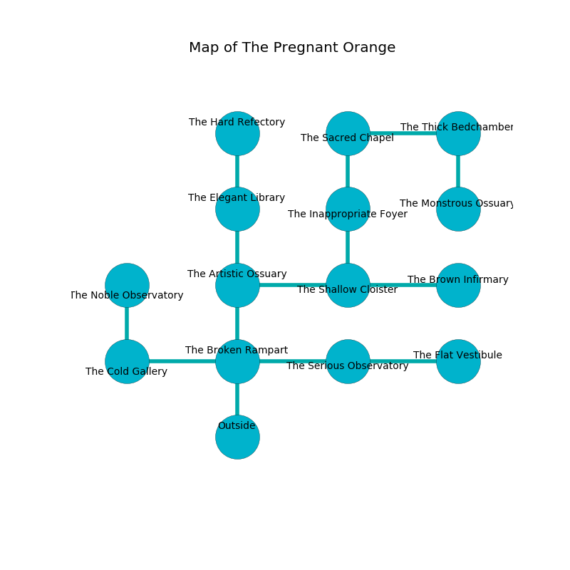

%Ruin Dogs

##The Pregnant Orange
###Overview
The Pregnant Orange is constructed on a cursed rift. Some areas of The Pregnant Orange are corrupted. A lunar eclipse is happening outside. It is occupied by Sahuagins. Bernadine Sells The Detached, a Cloud Giant is here. The Sahuagins worship Bernadine Sells The Detached. She  is founding a new religion. 

###Artifact
####The Blind Courage

The Blind Courage has the form of a warm rock. Light pours away from it. When thrown it illuminates its surroundings. 

###Locations

####the broken rampart
The floor is flooded with nine inch deep hot water. Green lichens are decaying in a patch on the floor. There are five Sahuagin Priestesses here. The air smells like raisin here. The Sahuagins are sleeping. 

* To the west a hazy pathway connects to [the cold gallery](#the-cold-gallery).
* To the east a dripping passageway leads to [the serious observatory](#the-serious-observatory).
* To the north a windy passageway leads to [the artistic ossuary](#the-artistic-ossuary).
* To the south is the entrance.

####the artistic ossuary
There are five Sahuagin Priestesses here. The floor is sticky. The Sahuagins are crazy with bloodlust. 

There is an engraving on the ceiling written in Sahuagins Script. 

> I was injured in this place.
>

* To the east a torchlit corridor leads to [the shallow cloister](#the-shallow-cloister).
* To the north a hazy opening connects to [the elegant library](#the-elegant-library).
* To the south a windy passageway opens to [the broken rampart](#the-broken-rampart).

####the shallow cloister
The glass walls are caving in. The floor is sticky. The air smells like nut here. 

* To the west a torchlit corridor leads to [the artistic ossuary](#the-artistic-ossuary).
* To the east a dark opening leads to [the brown infirmary](#the-brown-infirmary).
* To the north a hazy hallway leads to [the inappropriate foyer](#the-inappropriate-foyer).

####the serious observatory
The air tastes like sage here. Blue razorgrass is decaying in broken urns. There are five Sahuagin Priestesses here. The Sahuagins are crazy with bloodlust. 

* To the west a dripping passageway connects to [the broken rampart](#the-broken-rampart).
* To the east a twisted path connects to [the flat vestibule](#the-flat-vestibule).

####the inappropriate foyer
Gray mushrooms are decaying from the ceiling. The air tastes like honey here. 

* To the north a torchlit threshold leads to [the sacred chapel](#the-sacred-chapel).
* To the south a hazy hallway connects to [the shallow cloister](#the-shallow-cloister).

####the sacred chapel
The obsidion walls are bloodstained. The floor is sticky. The air tastes like hawthorn here. 

* To the east a windy opening opens to [the thick bedchamber](#the-thick-bedchamber).
* To the south a torchlit threshold connects to [the inappropriate foyer](#the-inappropriate-foyer).

####the thick bedchamber
Green moss is growing in cracks in the floor. The floor is cluttered with broken glass. There are a Quipper, a Poisonous Snake, a Monodrone, a Kuo-Toa Whip, and an Assassin here. The air smells like celery here. 

* To the west a windy opening leads to [the sacred chapel](#the-sacred-chapel).
* To the south a small gap connects to [the monstrous ossuary](#the-monstrous-ossuary).

####the monstrous ossuary
The floor is sticky. There are a Wight, a Giant Octopus, a Merrow, a Giant Goat, a Scout, and a Barlgura here. 

* There is a cart here.
* To the north a small gap opens to [the thick bedchamber](#the-thick-bedchamber).

####the elegant library
The floor is smooth. The obsidion walls are scratched. There are a Hook Horror and a Young Brass Dragon here. 

* [The Blind Courage](#The-Blind-Courage) is here.
* To the north a narrow path opens to [the hard refectory](#the-hard-refectory).
* To the south a hazy opening opens to [the artistic ossuary](#the-artistic-ossuary).

####the brown infirmary
The air smells like cardamom here. 

* To the west a dark opening leads to [the shallow cloister](#the-shallow-cloister).

####the cold gallery
There are a Bugbear Chief, a Badger, a Jackalwere, a Kuo-Toa, a Panther, a Sea Horse, a Chimera, and a Mule here. The mirrored walls are bloodstained. The floor is sticky. 

* To the east a hazy pathway connects to [the broken rampart](#the-broken-rampart).
* To the north a twisted opening connects to [the noble observatory](#the-noble-observatory).

####the flat vestibule
The floor is sticky. There are five Sahuagin Priestesses here. The Sahuagins are fighting amongst themselves. 

* To the west a twisted path leads to [the serious observatory](#the-serious-observatory).

####the noble observatory
White mushrooms are growing from the walls. The floor is glossy. The air smells like fougere here. The concrete walls are covered in mold. 

* To the south a twisted opening leads to [the cold gallery](#the-cold-gallery).

####the hard refectory
The brick walls are caving in. Blue lichens are growing in a patch on the floor. The floor is sticky. The air smells like tansy here. 

There is an engraving on the floor written in common. 

> [The Blind Courage](#The-Blind-Courage)
>
> latest and false
>
> [The Blind Courage](#The-Blind-Courage)
>

* [Bernadine Sells The Detached](#Bernadine-Sells-The-Detached) is here.
* To the south a narrow path connects to [the elegant library](#the-elegant-library).

