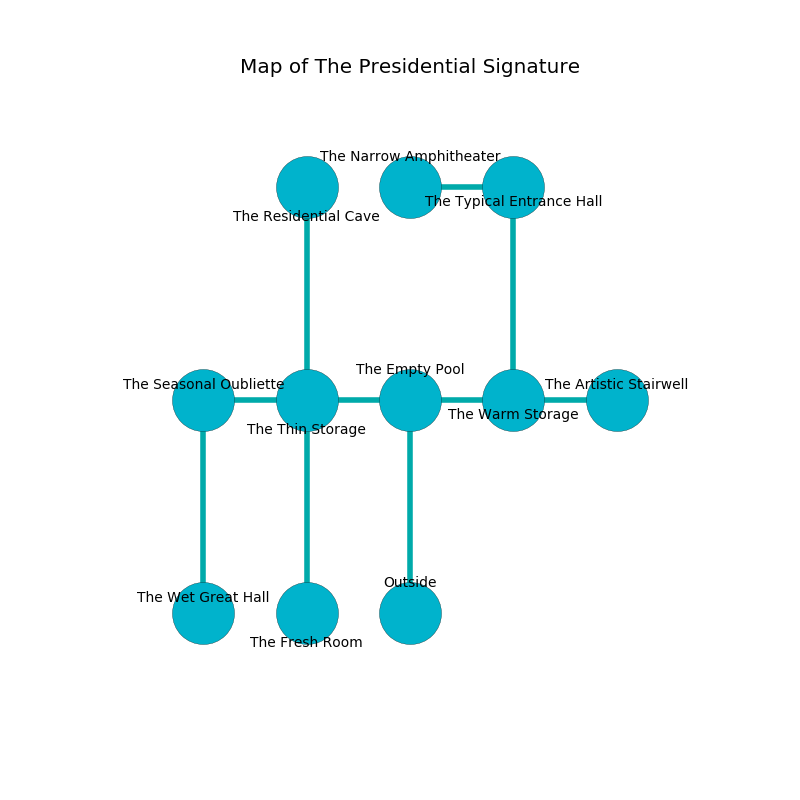

%Ruin Dogs

##The Presidential Signature
###Overview
The Presidential Signature is located in a flooded tree. Regions of The Presidential Signature are corrupted. The ruin is collapsing slowly. It is occupied by Humans. Norman Richie The Boring, a Yuan-Ti Abomination is here. The Humans are the minions of Norman Richie The Boring. He  is trying to steal [Decdaec Dmfael](#Decdaec-Dmfael). 

###Artifact
####Decdaec Dmfael

Decdaec Dmfael is a powerful artifact in the shape of a soft amulet. It is a shifting white color. It smells like mimosa. When touched it tunnels into the earth. 

###Locations

####the empty pool
The stone walls are unsettled. The air smells like lobster here. 

* To the west a dark hallway opens to [the thin storage](#the-thin-storage).
* To the east a windy cave opens to [the warm storage](#the-warm-storage).
* To the south is the entrance.

####the warm storage
There are a Thug, an Acolyte, a Knight, a Priest, and a Berserker here. Gray moss is decaying in broken urns. The floor is smooth. The air smells like ylang here. If the Humans notice the Ruin Dogs, one of them will retreat and alert the others. 

There is an engraving on the wall written in Humans Script. 

> I am worshipping The Presidential Signature.
>
> A trap ahead.
>

* There is a horse here.
* To the west a windy cave connects to [the empty pool](#the-empty-pool).
* To the east a long corridor opens to [the artistic stairwell](#the-artistic-stairwell).
* To the north a twisted passageway opens to [the typical entrance hall](#the-typical-entrance-hall).

####the thin storage
The glass walls are caving in. The air smells like cantaloupe here. The floor is smooth. 

* There is a trousers here.
* To the west a small threshold opens to [the seasonal oubliette](#the-seasonal-oubliette).
* To the east a dark hallway leads to [the empty pool](#the-empty-pool).
* To the north a twisted cave leads to [the residential cave](#the-residential-cave).
* To the south a dripping cave connects to [the fresh room](#the-fresh-room).

####the fresh room
The floor is sticky. There are a Gladiator and a Mage here. White moss is growing in broken urns. The concrete walls are ruined. The air tastes like oatmeal here. The Humans are willing to fight to the death. 

* There is a diamond here.
* To the north a dripping cave connects to [the thin storage](#the-thin-storage).

####the typical entrance hall
The wooden walls are caving in. The floor is smooth. The air smells like peppermint here. There are a Grick and a Sahuagin Baron here. Gray lichens are growing in cracks in the floor. 

There is an engraving on the ceiling written in Humans Script. 

> I am alone.
>
> Dig here.
>

* There is a picture here.
* There is a cow here.
* To the west a dripping pathway connects to [the narrow amphitheater](#the-narrow-amphitheater).
* To the south a twisted passageway opens to [the warm storage](#the-warm-storage).

####the residential cave
There are a Giant Rat, a Young Copper Dragon, a Satyr, a Giant Spider, a Swarm of Insects, a Quipper, a Duergar, a Twig Blight, an Awakened Shrub, a Kobold, and a Goblin Boss here. The metallic walls are unsettled. The air tastes like horhound here. 

There is an engraving on the wall written in Humans Script. 

> [Decdaec Dmfael](#Decdaec-Dmfael)
>
> ever frozen
>
> They are lost
>
> essential, linear, independent
>
> you will be punished
>

* To the south a twisted cave connects to [the thin storage](#the-thin-storage).

####the narrow amphitheater
The air tastes like green apple here. The mirrored walls are unsettled. 

* To the east a dripping pathway connects to [the typical entrance hall](#the-typical-entrance-hall).

####the artistic stairwell
Green lichens are decaying in a patch on the floor. The floor is smooth. 

* There is a bucket here.
* To the west a long corridor connects to [the warm storage](#the-warm-storage).

####the seasonal oubliette
The floor is sticky. The stone walls are pristine. The air smells like black currant here. There are a Thug, a Tribal Warrior, two Commoners, a Scout, a Guard, a Bandit Captain, a Gladiator, and  here. The Humans are performing a ritual. If not interrupted, [Norman Richie](#Norman-Richie) will be magically alarmed. 

There is an engraving on a monolith written in common. 

> Dear me! sad you
>
> it is never due
>
> it is never vicious
>
> everything is ambitious
>

* [Decdaec Dmfael](#Decdaec-Dmfael) is here.
* [Norman Richie The Boring](#Norman-Richie-The-Boring) is here.
* To the east a small threshold connects to [the thin storage](#the-thin-storage).
* To the south a narrow pathway leads to [the wet great hall](#the-wet-great-hall).

####the wet great hall
There are a Guard, a Cultist, a Gladiator, a Druid, and a Scout here. The air smells like plastic here. Gray lichens are growing in cracks in the floor. One of the Humans is working a mechanism that can pour snakes from the ceiling. 

* To the north a narrow pathway leads to [the seasonal oubliette](#the-seasonal-oubliette).

