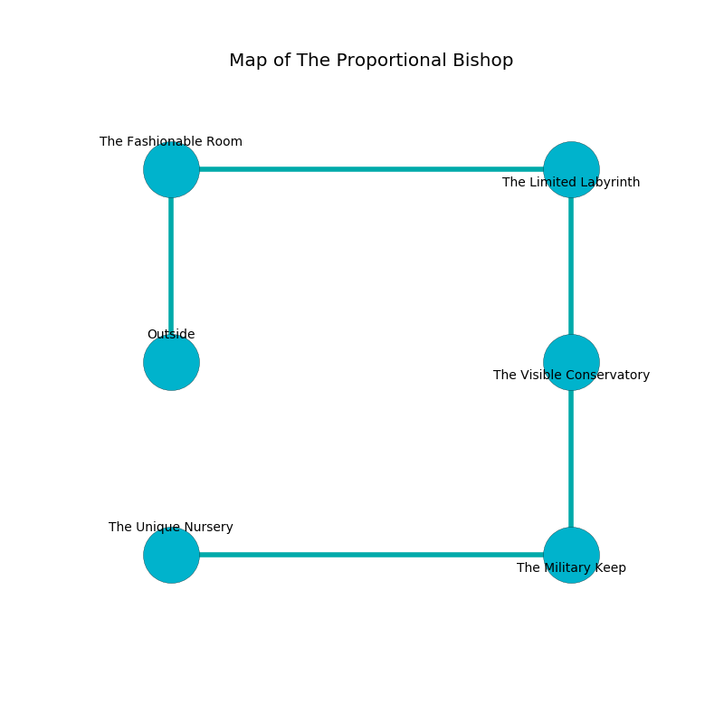

%Ruin Dogs

##The Proportional Bishop
###Overview
The Proportional Bishop is located on a ruined mountain. Parts of The Proportional Bishop are flooded. The ruin is collapsing slowly. It is occupied by Giants. Jetta Greenlee The Thoughtless, a Drow Mage is here. The Giants are the soldiers of Jetta Greenlee The Thoughtless. She  is trying to understand [The Romantic Tip](#The-Romantic-Tip). 

###Artifact
####The Romantic Tip

The Romantic Tip has the form of a warm amulet. It is a shifting brown color. It smells like malt. When touched it become energized with a powerful vibration. 

###Locations

####the fashionable room
The obsidion walls are covered in mold. The air smells like green apple here. There is a trap here. When activated, a magical rune will blast flames. The floor is smooth. Gray razorgrass is decaying in cracks in the floor. 

* There is a skull here.
* There is a net here.
* To the east a narrow cavern opens to [the limited labyrinth](#the-limited-labyrinth).
* To the south is the entrance.

####the limited labyrinth

* To the west a narrow cavern connects to [the fashionable room](#the-fashionable-room).
* To the south a windy walkway connects to [the visible conservatory](#the-visible-conservatory).

####the visible conservatory
The floor is glossy. The air tastes like camphoreous here. There are an Earth Elemental and a Drow Mage here. Gray razorgrass is growing in cracks in the floor. 

* To the north a windy walkway opens to [the limited labyrinth](#the-limited-labyrinth).
* To the south a small pathway leads to [the military keep](#the-military-keep).

####the military keep
The air tastes like cashew here. The obsidion walls are scratched. There is a trap here. When activated, a magical proximity detector will flood the room with water. There are a Hill Giant and a Stone Giant here. The Giants are performing a ritual. If not interrupted, the Giants will become more powerful. 

* There is a jewel here.
* [The Romantic Tip](#The-Romantic-Tip) is here.
* To the west a long hallway leads to [the unique nursery](#the-unique-nursery).
* To the north a small pathway leads to [the visible conservatory](#the-visible-conservatory).

####the unique nursery
The metallic walls are ruined. The floor is glossy. The air smells like orangeflower here. 

* [Jetta Greenlee The Thoughtless](#Jetta-Greenlee-The-Thoughtless) is here.
* To the east a long hallway leads to [the military keep](#the-military-keep).

