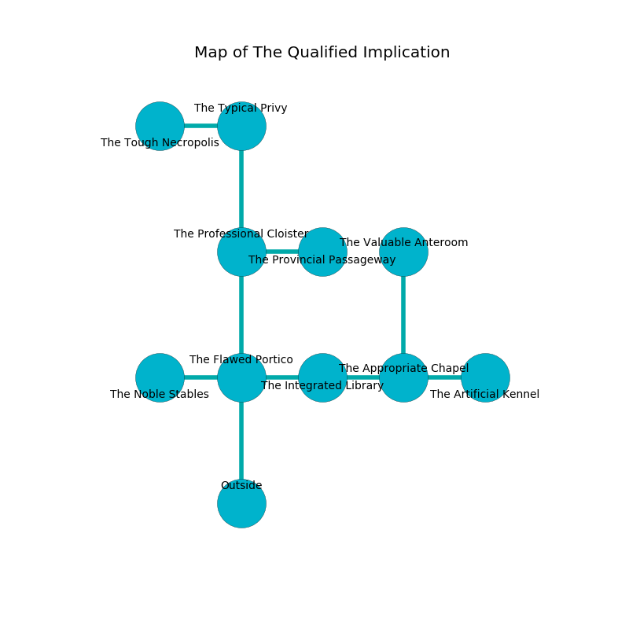

%Ruin Dogs

##The Qualified Implication
###Overview
The Qualified Implication is located in a poisoned rift. Some rooms of The Qualified Implication are incredibly cold. A blizzard is happening outside. It is occupied by Kobolds. Ethelene Sallee The Narrow-Minded, an Incubus is here. The Kobolds are ruled by Ethelene Sallee The Narrow-Minded. She  is trying to hide [Ehobaemaeob](#Ehobaemaeob). 

###Artifact
####Ehobaemaeob

Ehobaemaeob is a powerful artifact in the shape of a cold gem. It smells like bell pepper. Light flows near it. It is a dark pink color. When smelled it become energized with a powerful vibration. 

###Locations

####the flawed portico
The air smells like hawthorn here. There are ten Winged Kobolds and four Kobolds here. If the Kobolds notice the Ruin Dogs, one of them will retreat and alert the others. 

* To the west a twisted cave connects to [the noble stables](#the-noble-stables).
* To the east a twisted hall opens to [the integrated library](#the-integrated-library).
* To the north a windy corridor connects to [the professional cloister](#the-professional-cloister).
* To the south is the entrance.

####the integrated library
The floor is cluttered with bones. The air tastes like hawthorn here. There is a Winter Wolf here. 

* To the west a twisted hall opens to [the flawed portico](#the-flawed-portico).
* To the east a small artery leads to [the appropriate chapel](#the-appropriate-chapel).

####the professional cloister
There is a trap here. When activated, a magical rune will open a large pit in the floor. The floor is sticky. Yellow lichens are decaying from the walls. 

* [Ethelene Sallee The Narrow-Minded](#Ethelene-Sallee-The-Narrow-Minded) is here.
* To the east a windy hallway leads to [the provincial passageway](#the-provincial-passageway).
* To the north a torchlit cave connects to [the typical privy](#the-typical-privy).
* To the south a windy corridor connects to [the flawed portico](#the-flawed-portico).

####the appropriate chapel
The obsidion walls are caving in. There is a trap here. When activated, a magical proximity detector will collapse a wall. 

There is an engraving on the floor written in Kobolds Script. 

> I thought about fighting.
>

* To the west a small artery opens to [the integrated library](#the-integrated-library).
* To the east a dark passageway opens to [the artificial kennel](#the-artificial-kennel).
* To the north a hazy gap connects to [the valuable anteroom](#the-valuable-anteroom).

####the typical privy
Red mushrooms are decaying in cracks in the floor. The air smells like oakmoss here. 

* [Ehobaemaeob](#Ehobaemaeob) is here.
* To the west a dripping passageway connects to [the tough necropolis](#the-tough-necropolis).
* To the south a torchlit cave leads to [the professional cloister](#the-professional-cloister).

####the noble stables
The air tastes like rancid butter here. 

* To the east a twisted cave leads to [the flawed portico](#the-flawed-portico).

####the artificial kennel
The floor is bloodstained. There are a Blink Dog, a Wolf, a Manes, a Bugbear, a Giant fire beetle, and a Bugbear Chief here. The air tastes like cherry here. 

* To the west a dark passageway leads to [the appropriate chapel](#the-appropriate-chapel).

####the provincial passageway
There is a trap here. When activated, a magical sound detector will extend a spring loaded spear. The metallic walls are bloodstained. 

* To the west a windy hallway opens to [the professional cloister](#the-professional-cloister).

####the valuable anteroom
The wooden walls are scratched. The floor is bloodstained. There are eleven Winged Kobolds and three Kobolds here. The Kobolds are performing a ritual. If not interrupted, the ruin dogs will be weakened. 

There is an engraving on the ceiling written in Kobolds Script. 

> I am a coward.
>

* To the south a hazy gap connects to [the appropriate chapel](#the-appropriate-chapel).

####the tough necropolis
The glass walls are ruined. The floor is flooded with one inch deep scalding water. 

There is an engraving on the ceiling written in Kobolds Script. 

> Treasure here.
>

* To the east a dripping passageway connects to [the typical privy](#the-typical-privy).

