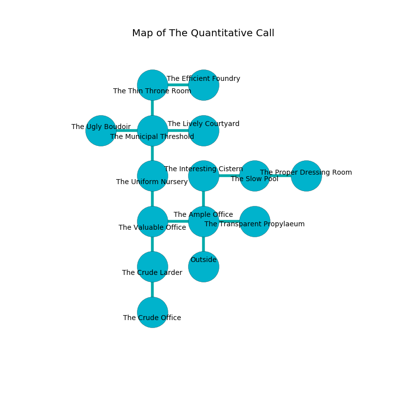

%Ruin Dogs

##The Quantitative Call
###Overview
The Quantitative Call is constructed on a poisoned city. Some rooms of it are somewhat cold. A battle between raiders is happening outside. It is occupied by Yuan-Ti. Chris Zimmerman The Rude, a Quaggoth is here. The Yuan-Ti have been charmed by Chris Zimmerman The Rude. He  is founding a new religion. 

###Artifact
####The Dead Achievement

The Dead Achievement looks like a warm crystal. It is a shifting purple color. It smells like amber. When worshipped it liquifies. 

###Locations

####the ample office
The glass walls are unsettled. The floor is glossy. 

* [Chris Zimmerman The Rude](#Chris-Zimmerman-The-Rude) is here.
* To the west a narrow hall leads to [the valuable office](#the-valuable-office).
* To the east a flooded hall connects to [the transparent propylaeum](#the-transparent-propylaeum).
* To the north a twisted threshold leads to [the interesting cistern](#the-interesting-cistern).
* To the south is the entrance.

####the interesting cistern
Green razorgrass is swaying from the walls. The floor is smooth. There are a Giant Vulture, a Dryad, and a Druid here. The air smells like banana here. 

* To the east a flooded pathway opens to [the slow pool](#the-slow-pool).
* To the south a twisted threshold opens to [the ample office](#the-ample-office).

####the valuable office
The air smells like starch here. The metallic walls are pristine. The floor is sticky. 

* To the east a narrow hall opens to [the ample office](#the-ample-office).
* To the north a hazy pathway connects to [the uniform nursery](#the-uniform-nursery).
* To the south a twisted walkway connects to [the crude larder](#the-crude-larder).

####the slow pool
The floor is flooded with four inch deep hot water. There are a Yuan-Ti Pureblood and a Yuan-Ti Malison here. Blue ferns are sprouting in broken urns. The Yuan-Ti are berserk with rage. 

* There is a scissors here.
* To the west a flooded pathway leads to [the interesting cistern](#the-interesting-cistern).
* To the east a hazy cave leads to [the proper dressing room](#the-proper-dressing-room).

####the uniform nursery
The air tastes like fruit here. Red razorgrass is swaying in broken urns. 

* To the north a dark walkway opens to [the municipal threshold](#the-municipal-threshold).
* To the south a hazy pathway opens to [the valuable office](#the-valuable-office).

####the crude larder
There is a trap here. When activated, a magical proximity detector will open a large pit in the floor. The air tastes like myrrh here. The crystal walls are scratched. The floor is glossy. There are a Yuan-Ti Malison and a Yuan-Ti Pureblood here. The Yuan-Ti are berserk with rage. 

* To the north a twisted walkway opens to [the valuable office](#the-valuable-office).
* To the south a torchlit pathway opens to [the crude office](#the-crude-office).

####the municipal threshold
There are a Sea Horse, a Smoke Mephit, a Minotaur Skeleton, and a Berserker here. The air tastes like goat here. The floor is sticky. 

* There is a comb here.
* [The Dead Achievement](#The-Dead-Achievement) is here.
* To the west a dark cave leads to [the ugly boudoir](#the-ugly-boudoir).
* To the east a dripping path connects to [the lively courtyard](#the-lively-courtyard).
* To the north a dark path leads to [the thin throne room](#the-thin-throne-room).
* To the south a dark walkway leads to [the uniform nursery](#the-uniform-nursery).

####the thin throne room
The floor is glossy. Blue ferns are decaying in cracks in the floor. There are a Yuan-Ti Malison and a Yuan-Ti Pureblood here. The crystal walls are ruined. The air tastes like banana here. The Yuan-Ti are performing a ritual. If not interrupted, a powerful monster will be summoned. 

* There is a femur here.
* To the east a long gap connects to [the efficient foundry](#the-efficient-foundry).
* To the south a dark path leads to [the municipal threshold](#the-municipal-threshold).

####the efficient foundry
The air tastes like calamus here. The stone walls are pristine. There is a trap here. When activated, a pressure plate will make the ceiling slowly lower. The floor is smooth. 

* To the west a long gap opens to [the thin throne room](#the-thin-throne-room).

####the transparent propylaeum
The obsidion walls are ruined. The floor is cluttered with bones. The air smells like citronella here. There are a Lizard King and a Shrieker here. 

* To the west a flooded hall leads to [the ample office](#the-ample-office).

####the proper dressing room
The obsidion walls are bloodstained. 

* There is a cup here.
* To the west a hazy cave leads to [the slow pool](#the-slow-pool).

####the crude office
The floor is flooded with four inch deep cold water. There are a Thug, a Quaggoth Thonot, and a Swarm of Insects here. The stone walls are scratched. 

* To the north a torchlit pathway leads to [the crude larder](#the-crude-larder).

####the lively courtyard
The concrete walls are ruined. The floor is bloodstained. 

* There is a gold coin here.
* To the west a dripping path opens to [the municipal threshold](#the-municipal-threshold).

####the ugly boudoir
The floor is smooth. 

* To the east a dark cave connects to [the municipal threshold](#the-municipal-threshold).

