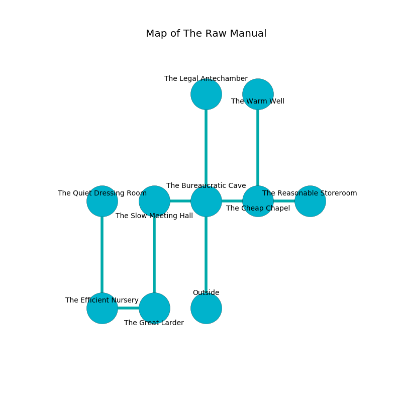

%Ruin Dogs

##The Raw Manual
###Overview
The Raw Manual is located under a giant city. Some rooms of it are somewhat cold. The ruin is sinking into the earth. It is occupied by Vampires. Blaine Toro The Superficial, an Assassin is here. The Vampires are the minions of Blaine Toro The Superficial. He  is founding a new religion. 

###Artifact
####Laelhaema

Laelhaema has the form of a smooth rock. Water pours from it. When worshipped it burns the mind. 

###Locations

####the bureaucratic cave
The floor is sticky. The air tastes like cucumber here. The brick walls are unsettled. 

* There is a finger here.
* To the west a small artery opens to [the slow meeting hall](#the-slow-meeting-hall).
* To the east a windy hallway leads to [the cheap chapel](#the-cheap-chapel).
* To the north a dripping artery connects to [the legal antechamber](#the-legal-antechamber).
* To the south is the entrance.

####the slow meeting hall
The metallic walls are unsettled. The floor is flooded with one inch deep cold water. There is a trap here. When activated, a tripwire will open a large pit in the floor. Red moss is swaying in broken urns. 

* [Blaine Toro The Superficial](#Blaine-Toro-The-Superficial) is here.
* To the east a small artery leads to [the bureaucratic cave](#the-bureaucratic-cave).
* To the south a flooded artery opens to [the great larder](#the-great-larder).

####the legal antechamber
The air tastes like hops here. The metallic walls are covered in mold. There are a Manticore, a Giant Crab, a Hell Hound, a White Dragon Wyrmling, a Specter, and a Deer here. 

* To the south a dripping artery opens to [the bureaucratic cave](#the-bureaucratic-cave).

####the great larder
The concrete walls are caving in. There are two Vampire Spawns here. The air tastes like honey here. The floor is smooth. The Vampires are willing to negotiate. 

There is an engraving on a stone written in common. 

> Dear me! life is woe
>
> patient and formal
>
> it is always slow
>
> the world is abnormal
>

* To the west a windy passageway connects to [the efficient nursery](#the-efficient-nursery).
* To the north a flooded artery connects to [the slow meeting hall](#the-slow-meeting-hall).

####the cheap chapel
The wooden walls are scratched. The floor is smooth. There are two Vampire Spawns here. Blue moss is growing in cracks in the floor. The air tastes like lilac here. One of the Vampires is working a mechanism that can flood the room. 

* There is a rowboat here.
* There is a trousers here.
* To the west a windy hallway connects to [the bureaucratic cave](#the-bureaucratic-cave).
* To the east a twisted hallway connects to [the reasonable storeroom](#the-reasonable-storeroom).
* To the north a dripping hall opens to [the warm well](#the-warm-well).

####the efficient nursery
There are two Vampire Spawns here. The air smells like mulberry here. Yellow mushrooms are swaying from the walls. There is a trap here. When activated, a pressure plate will open a large pit in the floor. The Vampires are berserk with rage. 

* [Laelhaema](#Laelhaema) is here.
* To the east a windy passageway leads to [the great larder](#the-great-larder).
* To the north a hazy pathway connects to [the quiet dressing room](#the-quiet-dressing-room).

####the reasonable storeroom
The obsidion walls are pristine. Blue mushrooms are growing from the ceiling. The floor is sticky. 

There is an engraving on the wall written in common. 

> I hid something in The Raw Manual.
>
> Leave at once.
>

* To the west a twisted hallway connects to [the cheap chapel](#the-cheap-chapel).

####the warm well
The mirrored walls are covered in mold. Red moss is sprouting in a patch on the floor. 

* There is a stick here.
* To the south a dripping hall connects to [the cheap chapel](#the-cheap-chapel).

####the quiet dressing room
There are two Vampire Spawns here. The floor is smooth. White lichens are growing in a patch on the floor. The Vampires are willing to negotiate. 

* To the south a hazy pathway leads to [the efficient nursery](#the-efficient-nursery).

