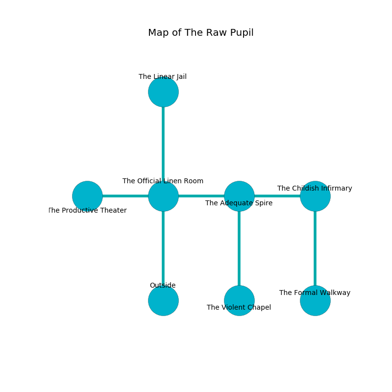

%Ruin Dogs

##The Raw Pupil
###Overview
The Raw Pupil is located on a haunted city. Parts of The Raw Pupil are cursed. A windstorm is happening outside. It is occupied by Orc. Keith Sun The Vengeful, a Cyclops is here. The Orc worship Keith Sun The Vengeful. He  is trying to recover [Abdfwiu Guud](#Abdfwiu-Guud). 

###Artifact
####Abdfwiu Guud

Abdfwiu Guud looks like a warm sphere. When smelled it grants psychic powers. 

###Locations

####the official linen room
Green ferns are swaying from the walls. There are a Hook Horror, a Pegasus, a Jackalwere, and a Giant Centipede here. The brick walls are scratched. 

* To the west a narrow cavern connects to [the productive theater](#the-productive-theater).
* To the east a narrow cave leads to [the adequate spire](#the-adequate-spire).
* To the north a hazy passageway connects to [the linear jail](#the-linear-jail).
* To the south is the entrance.

####the adequate spire
There are ten Orcs here. Yellow mushrooms are swaying in cracks in the floor. One of the Orc is pointing a ballista at the entrance. 

* To the west a narrow cave leads to [the official linen room](#the-official-linen-room).
* To the east a long path opens to [the childish infirmary](#the-childish-infirmary).
* To the south a torchlit cavern opens to [the violent chapel](#the-violent-chapel).

####the productive theater
The floor is glossy. The air tastes like citronella here. 

* There is a gold coin here.
* To the east a narrow cavern opens to [the official linen room](#the-official-linen-room).

####the childish infirmary
There are ten Orcs here. The Orc are caring for babies. 

* [Abdfwiu Guud](#Abdfwiu-Guud) is here.
* To the west a long path connects to [the adequate spire](#the-adequate-spire).
* To the south a narrow corridor leads to [the formal walkway](#the-formal-walkway).

####the linear jail
Yellow moss is swaying in cracks in the floor. The air smells like oats here. The floor is smooth. 

There is an engraving on a stone written in common. 

> [Abdfwiu Guud](#Abdfwiu-Guud)
>
> honorable, daily, essential
>
> external, urban, negative
>
> yet popular
>
> desirable and hard
>

* There is a chainmail here.
* To the south a hazy passageway opens to [the official linen room](#the-official-linen-room).

####the violent chapel
The air tastes like incense here. There are a Half-Red Dragon Veteran and a Swarm of Quippers here. The glass walls are scratched. Green mushrooms are swaying in cracks in the floor. The floor is bloodstained. 

* To the north a torchlit cavern connects to [the adequate spire](#the-adequate-spire).

####the formal walkway
White moss is decaying in cracks in the floor. The floor is smooth. 

There is an engraving on the floor written in Orc Script. 

> I am worshipping The Raw Pupil.
>

* [Keith Sun The Vengeful](#Keith-Sun-The-Vengeful) is here.
* To the north a narrow corridor leads to [the childish infirmary](#the-childish-infirmary).

