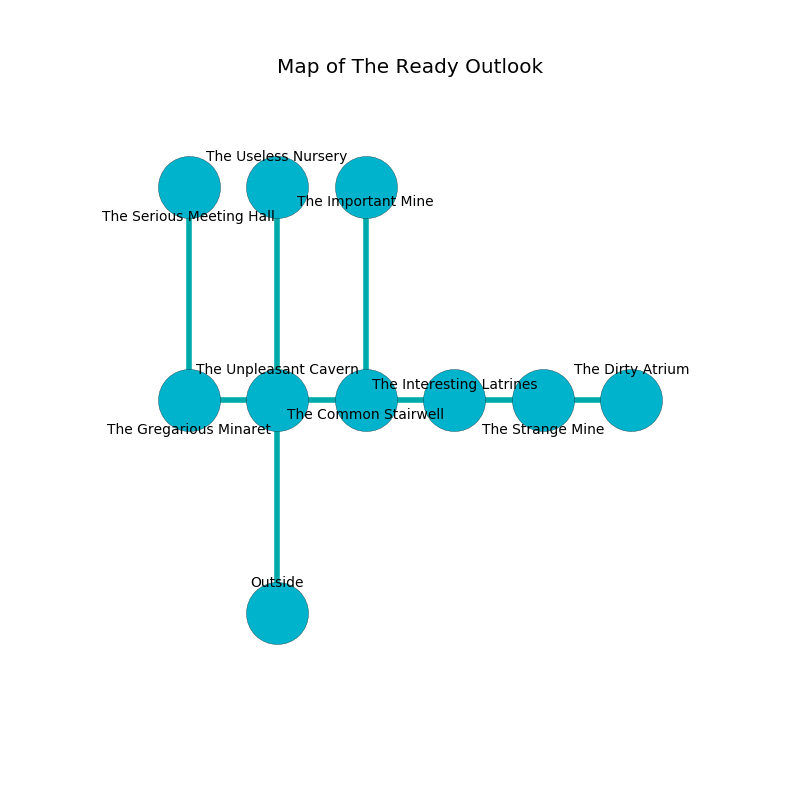

%Ruin Dogs

##The Ready Outlook
###Overview
The Ready Outlook is located under a crystal rift. Some areas of The Ready Outlook are flooded. A battle between raiders is happening outside. It is occupied by Humans. Tyrell Babb The Timid, a Gnoll Fang of Yeenoghu is here. The Humans are the minions of Tyrell Babb The Timid. He  is founding a new religion. 

###Artifact
####Daedha

Daedha is a powerful artifact in the shape of a broken orb. Air glows away from it. When picked up it grants power to its owner. 

###Locations

####the unpleasant cavern
There is a trap here. When activated, a magical sound detector will ring a bell. The floor is bloodstained. 

There is an engraving on the ceiling written in Humans Script. 

> Go away.
>

* There is a fly here.
* To the west a long cavern leads to [the gregarious minaret](#the-gregarious-minaret).
* To the east a narrow hallway opens to [the common stairwell](#the-common-stairwell).
* To the north a narrow threshold opens to [the useless nursery](#the-useless-nursery).
* To the south is the entrance.

####the common stairwell
The air tastes like bell pepper here. 

There is an engraving on a stone written in Humans Script. 

> [Daedha](#Daedha)
>
> serious, reasonable, lonely
>
> always old
>
> [Daedha](#Daedha)
>
> always aggressive
>
> you are not hidden
>

* To the west a narrow hallway connects to [the unpleasant cavern](#the-unpleasant-cavern).
* To the east a long artery connects to [the interesting latrines](#the-interesting-latrines).
* To the north a dripping corridor leads to [the important mine](#the-important-mine).

####the interesting latrines
There are a Centaur, a Githzerai Monk, and a Scout here. The air tastes like sugar here. Blue moss is sprouting in broken urns. 

* To the west a long artery connects to [the common stairwell](#the-common-stairwell).
* To the east a dark threshold connects to [the strange mine](#the-strange-mine).

####the gregarious minaret
The brick walls are caving in. Gray lichens are swaying from the ceiling. There are a Giant Frog, a Cultist, a Grell, a Black Bear, and a Knight here. The air smells like quince here. The floor is bloodstained. 

* To the east a long cavern connects to [the unpleasant cavern](#the-unpleasant-cavern).
* To the north a torchlit walkway opens to [the serious meeting hall](#the-serious-meeting-hall).

####the important mine
The floor is flooded with three inch deep cold water. White lichens are growing in cracks in the floor. 

* There is a cat here.
* [Tyrell Babb The Timid](#Tyrell-Babb-The-Timid) is here.
* To the south a dripping corridor opens to [the common stairwell](#the-common-stairwell).

####the serious meeting hall
There are a Cult Fanatic and a Knight here. The Humans are willing to negotiate. 

* To the south a torchlit walkway opens to [the gregarious minaret](#the-gregarious-minaret).

####the useless nursery
Red moss is sprouting in a patch on the floor. 

* To the south a narrow threshold opens to [the unpleasant cavern](#the-unpleasant-cavern).

####the strange mine
The wooden walls are ruined. The air tastes like roasted coffee here. There are a Mummy, a Bearded Devil, and a Rat here. Blue ferns are decaying from the walls. 

* [Daedha](#Daedha) is here.
* To the west a dark threshold opens to [the interesting latrines](#the-interesting-latrines).
* To the east a dark walkway opens to [the dirty atrium](#the-dirty-atrium).

####the dirty atrium
There are a Blink Dog, a Manes, a Vine Blight, a Crawling Claw, a Rust Monster, a Mastiff, a Steam Mephit, a Brown Bear, an Orog, and a Giant Rat here. The floor is bloodstained. 

There is an engraving on a stone written in Humans Script. 

> Dear me! sad soul
>
> harsh, useless, whole
>
> it is never distant
>
> life is persistent
>

* To the west a dark walkway leads to [the strange mine](#the-strange-mine).

