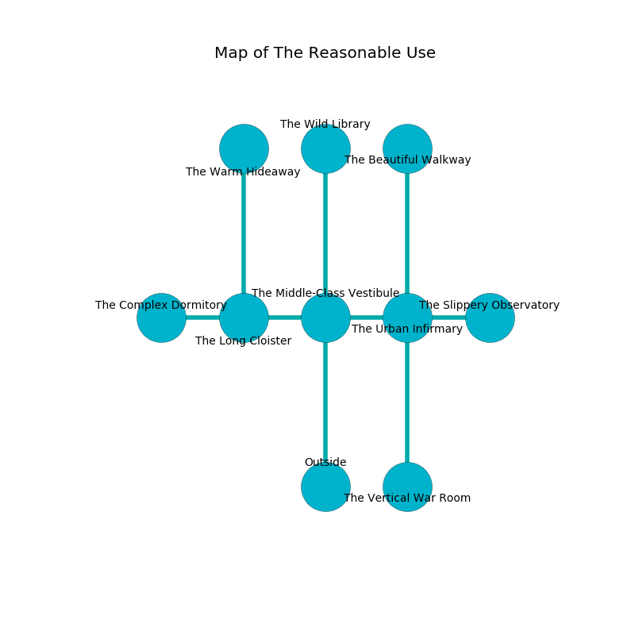

%Ruin Dogs

##The Reasonable Use
###Overview
The Reasonable Use is located under a flooded mountain. Some areas of The Reasonable Use are somewhat cold. The ruin is larger on the inside than the outside. It is occupied by Centaurs. Thurman Goode The Possessive, a Mind Flayer is here. The Centaurs are the slaves of Thurman Goode The Possessive. He  is trying to find [Deiadehh](#Deiadehh). 

###Artifact
####Deiadehh

Deiadehh has the form of a sharp doll. Water incinerates away from it. When smelled it flies into the air. 

###Locations

####the middle-class vestibule
The obsidion walls are covered in mold. The floor is flooded with three inch deep cool water. The air smells like origanum here. 

* There is a brake here.
* There is an egg here.
* There is a hook here.
* To the west a narrow cave opens to [the long cloister](#the-long-cloister).
* To the east a long artery leads to [the urban infirmary](#the-urban-infirmary).
* To the north a dark pathway leads to [the wild library](#the-wild-library).
* To the south is the entrance.

####the urban infirmary
There are three Centaurs here. The air tastes like taco here. The Centaurs are willing to negotiate. 

There is an engraving on a tablet written in Centaurs Script. 

> Maybe try cowering.
>

* [Thurman Goode The Possessive](#Thurman-Goode-The-Possessive) is here.
* To the west a long artery opens to [the middle-class vestibule](#the-middle-class-vestibule).
* To the east a hazy cavern opens to [the slippery observatory](#the-slippery-observatory).
* To the north a windy opening leads to [the beautiful walkway](#the-beautiful-walkway).
* To the south a twisted threshold opens to [the vertical war Room](#the-vertical-war-Room).

####the long cloister
The stone walls are pristine. The air tastes like wax here. 

* [Deiadehh](#Deiadehh) is here.
* To the west a windy pathway opens to [the complex dormitory](#the-complex-dormitory).
* To the east a narrow cave opens to [the middle-class vestibule](#the-middle-class-vestibule).
* To the north a dripping corridor connects to [the warm hideaway](#the-warm-hideaway).

####the wild library
The floor is sticky. There are a Giant Wolf Spider, a Sprite, a Black Bear, a Bat, and a Beholder Zombie here. 

There is an engraving on the wall written in common. 

> Dear me! life is poor
>
> always sympathetic
>
> active, integrated, obscure
>
> fate is genetic
>

* To the south a dark pathway leads to [the middle-class vestibule](#the-middle-class-vestibule).

####the beautiful walkway
The floor is smooth. The concrete walls are pristine. Gray razorgrass is decaying in a patch on the floor. 

* To the south a windy opening leads to [the urban infirmary](#the-urban-infirmary).

####the vertical war Room
The floor is glossy. The glass walls are ruined. Blue mushrooms are decaying in a patch on the floor. 

* To the north a twisted threshold opens to [the urban infirmary](#the-urban-infirmary).

####the slippery observatory
The floor is flooded with four inch deep cool water. The metallic walls are pristine. 

There is an engraving on a tablet written in Centaurs Script. 

> Oh my! cruel fate
>
> unlawful, agricultural, kind
>
> it is always straight
>
> everything is blind
>

* There is a dragon here.
* There is a finger here.
* To the west a hazy cavern opens to [the urban infirmary](#the-urban-infirmary).

####the complex dormitory
The air tastes like fat here. Red mushrooms are decaying in a patch on the floor. 

* To the east a windy pathway opens to [the long cloister](#the-long-cloister).

####the warm hideaway
The floor is glossy. The air tastes like green apple here. There is a trap here. When activated, a magical proximity detector will open a large pit in the floor. 

* To the south a dripping corridor connects to [the long cloister](#the-long-cloister).

