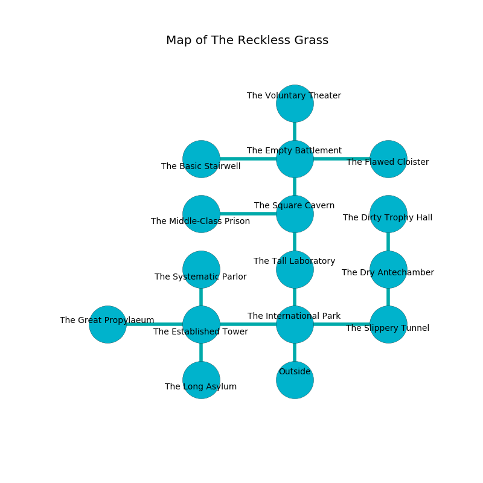

%Ruin Dogs

##The Reckless Grass
###Overview
The Reckless Grass is located in an alien rift. Regions of The Reckless Grass are inaccessible. The ruin is coming to life. It is occupied by Sahuagins. Thalia Switzer The Naughty, a Fire Giant is here. The Sahuagins worship Thalia Switzer The Naughty. She  is trying to find [Cmemca Laeim](#Cmemca-Laeim). 

###Artifact
####Cmemca Laeim

Cmemca Laeim has the form of a wet figurine. Cacophony shifts near it. It smells like cinnamon. When touched it levitates those nearby. 

###Locations

####the international park
The floor is smooth. White ferns are swaying in broken urns. The mirrored walls are caving in. 

* To the west a dark corridor opens to [the established tower](#the-established-tower).
* To the east a torchlit hall connects to [the slippery tunnel](#the-slippery-tunnel).
* To the north a dark passageway leads to [the tall laboratory](#the-tall-laboratory).
* To the south is the entrance.

####the slippery tunnel
The floor is glossy. Gray razorgrass is swaying in broken urns. There are a Young Silver Dragon and a Bone Devil here. 

* [Thalia Switzer The Naughty](#Thalia-Switzer-The-Naughty) is here.
* To the west a torchlit hall leads to [the international park](#the-international-park).
* To the north a dripping hallway leads to [the dry antechamber](#the-dry-antechamber).

####the established tower
White mushrooms are sprouting in a patch on the floor. The floor is glossy. There are a Spectator, an Ogre, a Black Dragon Wyrmling, a Tridrone, and a Werebear here. 

* There is a breastplate here.
* To the west a long corridor connects to [the great propylaeum](#the-great-propylaeum).
* To the east a dark corridor connects to [the international park](#the-international-park).
* To the north a torchlit gap opens to [the systematic parlor](#the-systematic-parlor).
* To the south a narrow corridor connects to [the long asylum](#the-long-asylum).

####the tall laboratory
The floor is glossy. There are two Giant Apes, a Peryton, a Flumph, a Commoner, an Axe Beak, a Giant Bat, a Mule, and  here. The air smells like labdanum here. 

There is an engraving on the floor written in common. 

> I am the best.
>

* To the north a flooded pathway leads to [the square cavern](#the-square-cavern).
* To the south a dark passageway leads to [the international park](#the-international-park).

####the square cavern
The air tastes like graham cracker here. Red razorgrass is sprouting from the walls. 

* To the west a hazy hallway leads to [the middle-class prison](#the-middle-class-prison).
* To the north a windy corridor connects to [the empty battlement](#the-empty-battlement).
* To the south a flooded pathway connects to [the tall laboratory](#the-tall-laboratory).

####the empty battlement
The crystal walls are scratched. There are five Sahuagin Priestesses here. One of the Sahuagins is working a mechanism that can pour snakes from the ceiling. 

There is an engraving on the floor written in Sahuagins Script. 

> Leave at once.
>

* To the west a narrow hall connects to [the basic stairwell](#the-basic-stairwell).
* To the east a twisted pathway connects to [the flawed cloister](#the-flawed-cloister).
* To the north a narrow walkway opens to [the voluntary theater](#the-voluntary-theater).
* To the south a windy corridor leads to [the square cavern](#the-square-cavern).

####the systematic parlor
The floor is glossy. The wooden walls are ruined. 

* To the south a torchlit gap connects to [the established tower](#the-established-tower).

####the great propylaeum
Green lichens are swaying from the walls. The air smells like pomegranate here. The brick walls are bloodstained. 

There is an engraving on a stone written in common. 

> Dig here.
>

* There is a monkey here.
* To the east a long corridor opens to [the established tower](#the-established-tower).

####the dry antechamber
There are an Otyugh, a Swarm of Ravens, a Noble, a Night Hag, and a Mimic here. There is a trap here. When activated, a tripwire will launch a javelin. Gray mushrooms are sprouting in a patch on the floor. The metallic walls are ruined. The floor is glossy. The air smells like melon here. 

* There is a drawer here.
* There is a bird here.
* [Cmemca Laeim](#Cmemca-Laeim) is here.
* To the north a torchlit threshold leads to [the dirty trophy hall](#the-dirty-trophy-hall).
* To the south a dripping hallway leads to [the slippery tunnel](#the-slippery-tunnel).

####the flawed cloister
There are five Sahuagin Priestesses here. The obsidion walls are bloodstained. Green ferns are growing in a patch on the floor. The Sahuagins are willing to negotiate. 

* There is a casket here.
* There is an apple here.
* There is a flag here.
* To the west a twisted pathway leads to [the empty battlement](#the-empty-battlement).

####the middle-class prison
Green moss is sprouting in cracks in the floor. 

There is an engraving on the floor written in common. 

> [Cmemca Laeim](#Cmemca-Laeim)
>
> intellectual, tough, handy
>
> fashionable, absolute, abnormal
>
> yet complex
>
> yet never extinct
>
> fastidious, minimum, physical
>
> discreet, classical, respectable
>
> A nail is a lease
>
> continuous and abnormal
>
> but never separate
>
> solid and nuclear
>

* To the east a hazy hallway leads to [the square cavern](#the-square-cavern).

####the voluntary theater
The floor is flooded with one inch deep hot water. The air smells like onion here. There are a Warhorse, a Ghoul, a Hydra, and a Bronze Dragon Wyrmling here. The glass walls are covered in mold. There is a trap here. When activated, a magical sound detector will shoot a lightning bolt. 

* To the south a narrow walkway connects to [the empty battlement](#the-empty-battlement).

####the basic stairwell
The floor is smooth. There are an Aboleth and a Roper here. The metallic walls are unsettled. Blue lichens are decaying from the ceiling. 

* To the east a narrow hall connects to [the empty battlement](#the-empty-battlement).

####the long asylum
The floor is bloodstained. Yellow mushrooms are growing in cracks in the floor. There are five Sahuagin Priestesses here. The Sahuagins are defending this room from intruders. 

There is an engraving on a monolith written in Sahuagins Script. 

> Oh dire soul
>
> it is never secular
>
> ever whole
>
> everything is molecular
>

* To the north a narrow corridor opens to [the established tower](#the-established-tower).

####the dirty trophy hall
The floor is glossy. There are five Sahuagin Priestesses here. If the Sahuagins notice the Ruin Dogs, one of them will retreat and alert [Thalia Switzer](#Thalia-Switzer). 

* To the south a torchlit threshold connects to [the dry antechamber](#the-dry-antechamber).

