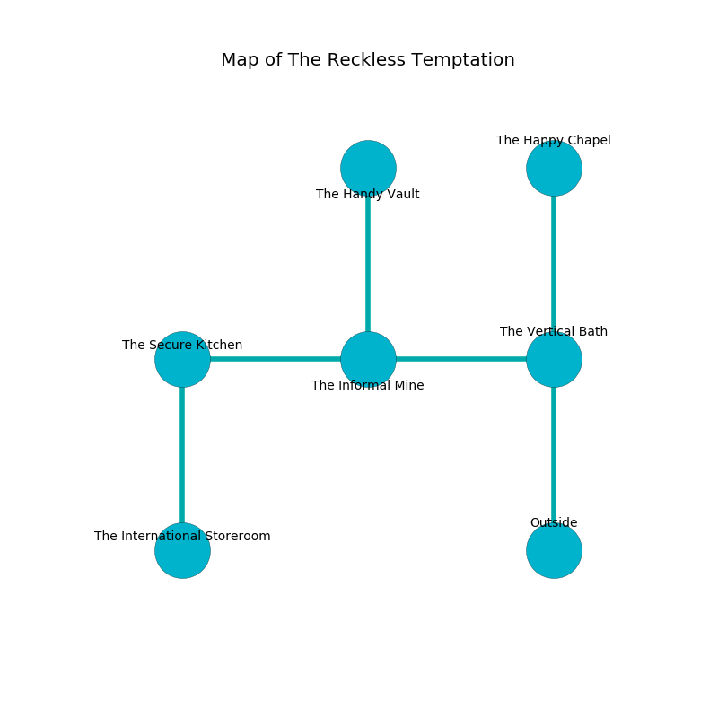

%Ruin Dogs

##The Reckless Temptation
###Overview
The Reckless Temptation is located in a volcanic city. Parts of it are frozen. A solar eclipse is happening outside. It is occupied by Duergars. Perry Snowden The Greedy, a Cambion is here. The Duergars are the soldiers of Perry Snowden The Greedy. He  is trying to find [Cfecc](#Cfecc). 

###Artifact
####Cfecc

Cfecc has the form of a smooth prism. When smelled it curses all nearby. 

###Locations

####the vertical bath
There are six Duergars here. White moss is decaying in cracks in the floor. The floor is bloodstained. The concrete walls are bloodstained. The Duergars are performing a ritual. If not interrupted, a powerful monster will be summoned. 

* [Cfecc](#Cfecc) is here.
* To the west a windy hall connects to [the informal mine](#the-informal-mine).
* To the north a windy cave connects to [the happy chapel](#the-happy-chapel).
* To the south is the entrance.

####the informal mine
The floor is glossy. White lichens are sprouting in broken urns. There are an Azer, a Vine Blight, a Bandit Captain, and a Young Remorhaz here. The wooden walls are covered in mold. 

* [Perry Snowden The Greedy](#Perry-Snowden-The-Greedy) is here.
* To the west a narrow path leads to [the secure kitchen](#the-secure-kitchen).
* To the east a windy hall leads to [the vertical bath](#the-vertical-bath).
* To the north a narrow threshold leads to [the handy vault](#the-handy-vault).

####the secure kitchen
The air tastes like grain here. Blue ferns are sprouting from the walls. 

* To the east a narrow path leads to [the informal mine](#the-informal-mine).
* To the south a windy cavern connects to [the international storeroom](#the-international-storeroom).

####the handy vault
The floor is glossy. 

* To the south a narrow threshold opens to [the informal mine](#the-informal-mine).

####the international storeroom
The floor is cluttered with debris. There are six Duergars here. One of the Duergars is working a mechanism that can lock the exits. 

* There is a cheese here.
* To the north a windy cavern opens to [the secure kitchen](#the-secure-kitchen).

####the happy chapel
There are an Orc War Chief and a Roper here. The floor is cluttered with shells. The air smells like custard here. The glass walls are pristine. Yellow moss is decaying in a patch on the floor. 

* There is a femur here.
* To the south a windy cave leads to [the vertical bath](#the-vertical-bath).

