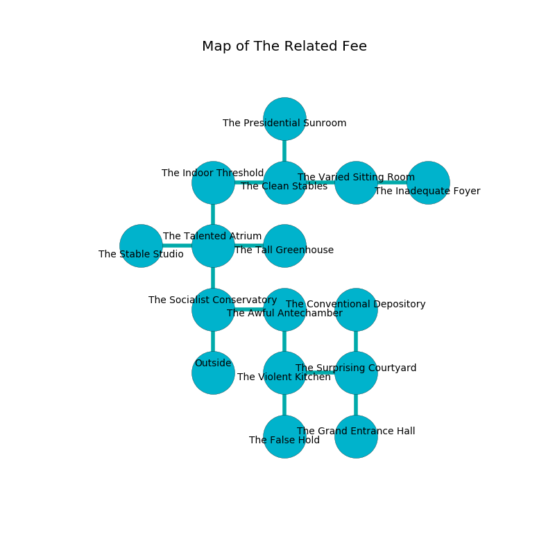

%Ruin Dogs

##The Related Fee
###Overview
The Related Fee is located in a volcanic city. Some rooms of The Related Fee are flooded. A blizzard is happening outside. It is occupied by Demons. Barton Carmichael The Obsessive, a Hill Giant is here. The Demons are the minions of Barton Carmichael The Obsessive. He  is founding a new religion. 

###Artifact
####The Indirect Bench

The Indirect Bench has the form of a hard monument. It smells like hay. Psychic energy slips around it. When carried it grants psychic powers. 

###Locations

####the socialist conservatory
The air tastes like shrimp here. 

There is an engraving on the wall written in Demons Script. 

> A pocket is a rat
>
> unfortunate, tall, wild
>
> important and terminal
>
> main and industrial
>
> always arrogant
>
> [The Indirect Bench](#The-Indirect-Bench)
>
> ever round
>
> scientific and charismatic
>
> ever ugly
>

* To the east a windy corridor connects to [the awful antechamber](#the-awful-antechamber).
* To the north a hazy gap opens to [the talented atrium](#the-talented-atrium).
* To the south is the entrance.

####the awful antechamber

* There is a nut here.
* To the west a windy corridor connects to [the socialist conservatory](#the-socialist-conservatory).
* To the south a torchlit path leads to [the violent kitchen](#the-violent-kitchen).

####the violent kitchen
The wooden walls are bloodstained. There are a Rhinoceros, a Helmed Horror, and a Tridrone here. The floor is bloodstained. 

* To the east a dripping hallway connects to [the surprising courtyard](#the-surprising-courtyard).
* To the north a torchlit path connects to [the awful antechamber](#the-awful-antechamber).
* To the south a dripping opening connects to [the false hold](#the-false-hold).

####the false hold
White ferns are growing from the ceiling. The floor is bloodstained. 

* There is a pendant here.
* To the north a dripping opening opens to [the violent kitchen](#the-violent-kitchen).

####the surprising courtyard
The air smells like beeswax here. Red moss is sprouting from the walls. There are two Giant Sharks here. 

* There is a boat here.
* To the west a dripping hallway connects to [the violent kitchen](#the-violent-kitchen).
* To the north a windy walkway leads to [the conventional depository](#the-conventional-depository).
* To the south a narrow corridor leads to [the grand entrance hall](#the-grand-entrance-hall).

####the talented atrium
The floor is glossy. Yellow moss is swaying from the ceiling. The air tastes like styrene here. The crystal walls are unsettled. 

* [The Indirect Bench](#The-Indirect-Bench) is here.
* To the west a torchlit cave opens to [the stable studio](#the-stable-studio).
* To the east a narrow corridor opens to [the tall greenhouse](#the-tall-greenhouse).
* To the north a narrow hallway opens to [the indoor threshold](#the-indoor-threshold).
* To the south a hazy gap opens to [the socialist conservatory](#the-socialist-conservatory).

####the grand entrance hall
Blue lichens are decaying from the walls. There are a Displacer Beast, a Swarm of Bats, a Mage, a Scarecrow, a Swarm of Quippers, a Cultist, and a Vulture here. 

* To the north a narrow corridor leads to [the surprising courtyard](#the-surprising-courtyard).

####the indoor threshold
Yellow lichens are growing from the ceiling. There are a Spined Devil and a Cambion here. The Demons are sleeping. 

* To the east a torchlit passageway connects to [the clean stables](#the-clean-stables).
* To the south a narrow hallway opens to [the talented atrium](#the-talented-atrium).

####the clean stables
The stone walls are bloodstained. The floor is smooth. There are a Kuo-Toa Monitor and a Knight here. 

* There is a spear here.
* To the west a torchlit passageway opens to [the indoor threshold](#the-indoor-threshold).
* To the east a dark artery connects to [the varied sitting Room](#the-varied-sitting-Room).
* To the north a small artery opens to [the presidential sunroom](#the-presidential-sunroom).

####the varied sitting Room
The stone walls are ruined. The air smells like geranium here. The floor is glossy. 

* To the west a dark artery opens to [the clean stables](#the-clean-stables).
* To the east a twisted walkway opens to [the inadequate foyer](#the-inadequate-foyer).

####the inadequate foyer
The air tastes like nutmeg here. Green ferns are sprouting from the walls. 

* There is an arch here.
* To the west a twisted walkway leads to [the varied sitting Room](#the-varied-sitting-Room).

####the conventional depository
The stone walls are bloodstained. The air smells like burnt sugar here. There are two Succubi here. The floor is sticky. White mushrooms are growing in broken urns. One of the Demons is pointing a ballista at the entrance. 

* To the south a windy walkway leads to [the surprising courtyard](#the-surprising-courtyard).

####the tall greenhouse
Green mushrooms are sprouting from the ceiling. The metallic walls are ruined. 

* To the west a narrow corridor connects to [the talented atrium](#the-talented-atrium).

####the presidential sunroom
The glass walls are bloodstained. The air tastes like earth here. 

* To the south a small artery opens to [the clean stables](#the-clean-stables).

####the stable studio
The air tastes like green tea here. The floor is bloodstained. There are an Imp, a Succubus, and an Incubus here. The brick walls are caving in. One of the Demons is on watch, the rest are sleeping. 

* [Barton Carmichael The Obsessive](#Barton-Carmichael-The-Obsessive) is here.
* To the east a torchlit cave leads to [the talented atrium](#the-talented-atrium).

