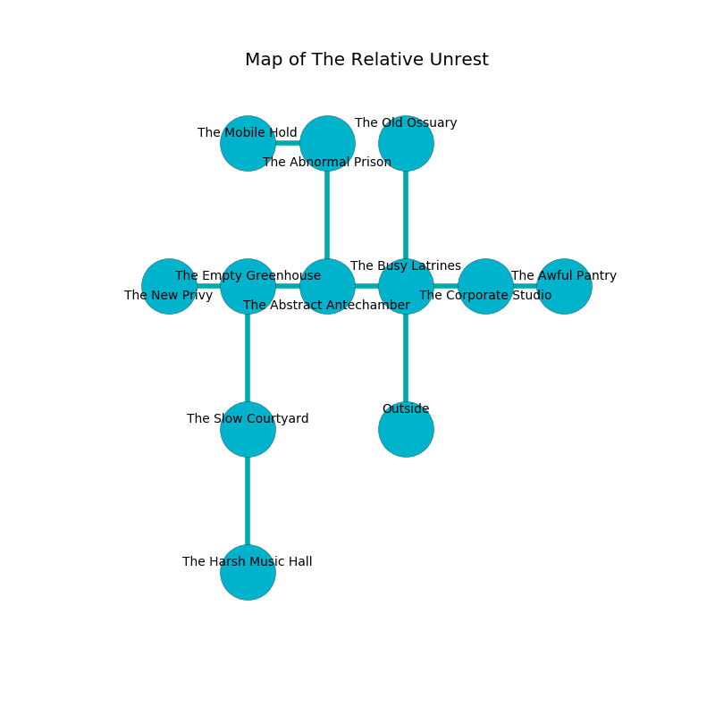

%Ruin Dogs

##The Relative Unrest
###Overview
The Relative Unrest is located under a ruined rift. Some areas of The Relative Unrest are cursed. The ruin is coming to life. It is occupied by Deep Gnomes. Elanor Gauthier The Nervous, a Veteran is here. The Deep Gnomes are the soldiers of Elanor Gauthier The Nervous. She  is trying to steal [Codduefl Uafiaeum](#Codduefl-Uafiaeum). 

###Artifact
####Codduefl Uafiaeum

Codduefl Uafiaeum has the form of a cold rock. Psychic energy flows around it. It is a dark orange color. It smells like toasted grain. When picked up it repels insects. 

###Locations

####the busy latrines
The air tastes like fungus here. 

* [Elanor Gauthier The Nervous](#Elanor-Gauthier-The-Nervous) is here.
* To the west a long pathway leads to [the abstract antechamber](#the-abstract-antechamber).
* To the east a flooded passageway opens to [the corporate studio](#the-corporate-studio).
* To the north a hazy threshold leads to [the old ossuary](#the-old-ossuary).
* To the south is the entrance.

####the abstract antechamber
There are a Lizardfolk Shaman, a Crab, and a Mule here. The glass walls are ruined. Red ferns are growing in broken urns. 

* To the west a torchlit walkway opens to [the empty greenhouse](#the-empty-greenhouse).
* To the east a long pathway connects to [the busy latrines](#the-busy-latrines).
* To the north a dark walkway connects to [the abnormal prison](#the-abnormal-prison).

####the abnormal prison
The air tastes like rose tea here. There is a Poltergeist here. Yellow moss is swaying from the ceiling. 

* To the west a twisted cavern leads to [the mobile hold](#the-mobile-hold).
* To the south a dark walkway leads to [the abstract antechamber](#the-abstract-antechamber).

####the empty greenhouse
The brick walls are pristine. There are four Deep Gnomes here. The air smells like linden flower here. The floor is flooded with seven inch deep scalding water. Blue lichens are swaying in broken urns. The Deep Gnomes are caring for babies. 

* To the west a long threshold opens to [the new privy](#the-new-privy).
* To the east a torchlit walkway opens to [the abstract antechamber](#the-abstract-antechamber).
* To the south a windy opening leads to [the slow courtyard](#the-slow-courtyard).

####the corporate studio
The stone walls are pristine. There are four Deep Gnomes here. The air smells like potato chip here. The floor is glossy. One of the Deep Gnomes is on watch, the rest are drunk. 

* To the west a flooded passageway connects to [the busy latrines](#the-busy-latrines).
* To the east a dripping threshold leads to [the awful pantry](#the-awful-pantry).

####the new privy
The air tastes like rain here. The floor is smooth. There is a trap here. When activated, a magical sound detector will make the walls close in. 

There is an engraving on a stone written in common. 

> Oh cruel soul
>
> it is always whole
>
> but never economic
>
> fate is whole
>

* To the east a long threshold leads to [the empty greenhouse](#the-empty-greenhouse).

####the slow courtyard
There are a Spined Devil and a Gas Spore here. The air tastes like incense here. The stone walls are pristine. The floor is flooded with six inch deep cold water. 

* [Codduefl Uafiaeum](#Codduefl-Uafiaeum) is here.
* To the north a windy opening connects to [the empty greenhouse](#the-empty-greenhouse).
* To the south a twisted cavern opens to [the harsh music hall](#the-harsh-music-hall).

####the old ossuary
The floor is cluttered with debris. Blue ferns are sprouting in broken urns. The air smells like toffee here. 

* There is a roof here.
* To the south a hazy threshold connects to [the busy latrines](#the-busy-latrines).

####the mobile hold
There are a Giant Rat, a Thug, a Gnoll Pack Lord, and a Hyena here. The air smells like oats here. 

* To the east a twisted cavern opens to [the abnormal prison](#the-abnormal-prison).

####the awful pantry
There are a Green Dragon Wyrmling and a Giant Goat here. The concrete walls are ruined. 

There is an engraving on a tablet written in common. 

> A camera is a leadership
>
> literary, modern, noble
>
> A camera is a leadership
>

* To the west a dripping threshold leads to [the corporate studio](#the-corporate-studio).

####the harsh music hall
The air smells like cassia here. 

There is an engraving on the ceiling written in common. 

> I lost [Codduefl Uafiaeum](#Codduefl-Uafiaeum).
>

* There is a spade here.
* To the north a twisted cavern opens to [the slow courtyard](#the-slow-courtyard).

