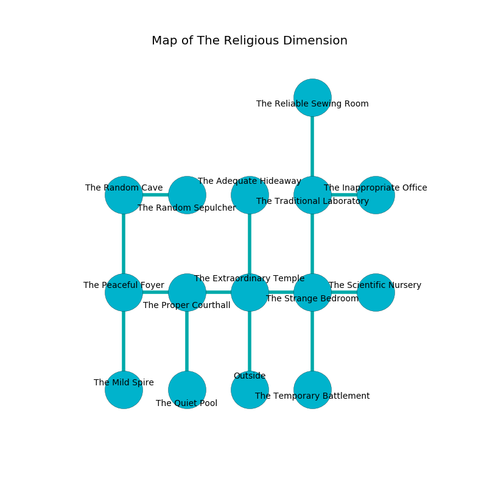

%Ruin Dogs

##The Religious Dimension
###Overview
The Religious Dimension is located under a giant plain. Parts of The Religious Dimension are corrupted. The ruin is burning. It is occupied by Satyrs. Lorrie Morley The Vengeful, a Duergar is here. The Satyrs are the slaves of Lorrie Morley The Vengeful. She  is founding a new religion. 

###Artifact
####The Conservative Black

The Conservative Black is a powerful artifact in the shape of a sharp gem. It smells like the fresh outdoors. When smelled it destroys others. 

###Locations

####the extraordinary temple
Yellow razorgrass is sprouting from the walls. The glass walls are unsettled. 

There is an engraving on the floor written in common. 

> An island is a bread
>
> spontaneous and modern
>
> yet never racial
>
> lonely and modest
>
> yet never perfect
>

* To the west a dripping walkway leads to [the proper courthall](#the-proper-courthall).
* To the east a small gap leads to [the strange bedroom](#the-strange-bedroom).
* To the north a hazy hall leads to [the adequate hideaway](#the-adequate-hideaway).
* To the south is the entrance.

####the strange bedroom
There is a trap here. When activated, a tripwire will ring a bell. The floor is cluttered with bones. There are four Satyrs here. The Satyrs are defending this room from intruders. 

* To the west a small gap opens to [the extraordinary temple](#the-extraordinary-temple).
* To the east a flooded passageway opens to [the scientific nursery](#the-scientific-nursery).
* To the north a dripping hall opens to [the traditional laboratory](#the-traditional-laboratory).
* To the south a twisted path opens to [the temporary battlement](#the-temporary-battlement).

####the proper courthall
The air smells like hyssop here. The metallic walls are ruined. 

There is an engraving on a tablet written in common. 

> I thought about leaving.
>

* To the west a dripping walkway opens to [the peaceful foyer](#the-peaceful-foyer).
* To the east a dripping walkway leads to [the extraordinary temple](#the-extraordinary-temple).
* To the south a twisted opening leads to [the quiet pool](#the-quiet-pool).

####the scientific nursery
The concrete walls are covered in mold. Blue ferns are decaying from the ceiling. The air smells like lemon here. 

There is an engraving on the wall written in common. 

> I am lost in The Religious Dimension.
>

* To the west a flooded passageway opens to [the strange bedroom](#the-strange-bedroom).

####the peaceful foyer

* To the east a dripping walkway opens to [the proper courthall](#the-proper-courthall).
* To the north a long gap connects to [the random cave](#the-random-cave).
* To the south a flooded opening connects to [the mild spire](#the-mild-spire).

####the mild spire
There are four Satyrs here. Green moss is sprouting in a patch on the floor. The stone walls are pristine. The floor is glossy. The Satyrs are performing a ritual. If not interrupted, a powerful monster will be summoned. 

* To the north a flooded opening opens to [the peaceful foyer](#the-peaceful-foyer).

####the adequate hideaway
Blue ferns are swaying in a patch on the floor. There are a Poltergeist, a Giant Crab, a Baboon, and a Giant Goat here. The floor is smooth. 

* There is a lock here.
* To the south a hazy hall connects to [the extraordinary temple](#the-extraordinary-temple).

####the traditional laboratory
The air smells like beef here. There are four Satyrs here. The Satyrs are berserk with rage. 

* [The Conservative Black](#The-Conservative-Black) is here.
* To the east a torchlit passageway opens to [the inappropriate office](#the-inappropriate-office).
* To the north a flooded hallway leads to [the reliable sewing room](#the-reliable-sewing-room).
* To the south a dripping hall leads to [the strange bedroom](#the-strange-bedroom).

####the random cave
The floor is glossy. The concrete walls are unsettled. Red moss is swaying in a patch on the floor. 

* There is a mug here.
* To the east a dripping gap connects to [the random sepulcher](#the-random-sepulcher).
* To the south a long gap connects to [the peaceful foyer](#the-peaceful-foyer).

####the inappropriate office
The floor is flooded with four inch deep cool water. The air tastes like hyacinth here. 

* To the west a torchlit passageway connects to [the traditional laboratory](#the-traditional-laboratory).

####the temporary battlement
The floor is smooth. The concrete walls are scratched. 

There is an engraving on a tablet written in Satyrs Script. 

> I am lost in The Religious Dimension.
>
> I thought about cowering.
>

* [Lorrie Morley The Vengeful](#Lorrie-Morley-The-Vengeful) is here.
* To the north a twisted path leads to [the strange bedroom](#the-strange-bedroom).

####the random sepulcher
There are a Ghoul, a Black Bear, and an Ogre Zombie here. The air smells like roast beef here. 

There is an engraving on the ceiling written in Satyrs Script. 

> Oh my! sad soul
>
> ever whole
>
> academic and ample
>
> the world is whole
>

* To the west a dripping gap connects to [the random cave](#the-random-cave).

####the quiet pool
Yellow razorgrass is decaying in cracks in the floor. The air smells like sarsaparilla here. The floor is flooded with six inch deep cold water. The stone walls are bloodstained. 

* To the north a twisted opening opens to [the proper courthall](#the-proper-courthall).

####the reliable sewing room
The air smells like pear skin here. There is a trap here. When activated, a pressure plate will fire a scything blade. The floor is sticky. 

* To the south a flooded hallway opens to [the traditional laboratory](#the-traditional-laboratory).

