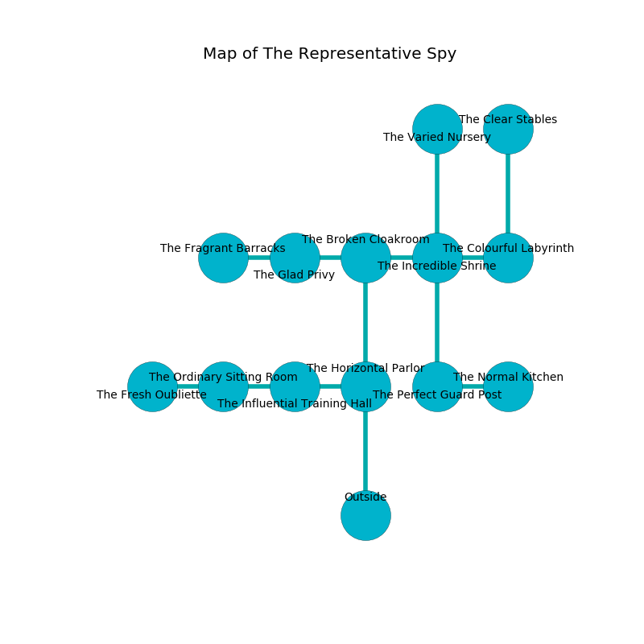

%Ruin Dogs

##The Representative Spy
###Overview
The Representative Spy is located in a poisoned plain. Regions of The Representative Spy are unbearably hot. A battle between raiders is happening outside. It is occupied by Githzerai. Pamela March The Compulsive, a Fire Giant is here. The Githzerai have been charmed by Pamela March The Compulsive. She  is trying to destroy [Iaed Iaaemluia](#Iaed-Iaaemluia). 

###Artifact
####Iaed Iaaemluia

Iaed Iaaemluia looks like a broken doll. It is a bright yellow color. It smells like tequila. When held it floats in the air. 

###Locations

####the horizontal parlor
There are five Githzerai Monks here. The floor is cluttered with bones. If the Githzerai notice the Ruin Dogs, one of them will retreat and alert [Pamela March](#Pamela-March). 

* There is a snake here.
* To the west a hazy walkway opens to [the influential training hall](#the-influential-training-hall).
* To the north a narrow opening connects to [the broken cloakroom](#the-broken-cloakroom).
* To the south is the entrance.

####the broken cloakroom
White razorgrass is decaying in a patch on the floor. The floor is smooth. The crystal walls are caving in. 

* There is a goblin here.
* [Pamela March The Compulsive](#Pamela-March-The-Compulsive) is here.
* To the west a hazy gap leads to [the glad privy](#the-glad-privy).
* To the east a torchlit gap opens to [the incredible shrine](#the-incredible-shrine).
* To the south a narrow opening opens to [the horizontal parlor](#the-horizontal-parlor).

####the glad privy
Gray mushrooms are sprouting in a patch on the floor. 

* [Iaed Iaaemluia](#Iaed-Iaaemluia) is here.
* To the west a dark passageway opens to [the fragrant barracks](#the-fragrant-barracks).
* To the east a hazy gap leads to [the broken cloakroom](#the-broken-cloakroom).

####the influential training hall

* To the west a torchlit walkway connects to [the ordinary sitting Room](#the-ordinary-sitting-Room).
* To the east a hazy walkway leads to [the horizontal parlor](#the-horizontal-parlor).

####the incredible shrine
The mirrored walls are scratched. The floor is glossy. 

* To the west a torchlit gap opens to [the broken cloakroom](#the-broken-cloakroom).
* To the east a hazy gap opens to [the colourful labyrinth](#the-colourful-labyrinth).
* To the north a dripping gap opens to [the varied nursery](#the-varied-nursery).
* To the south a torchlit path opens to [the perfect guard post](#the-perfect-guard-post).

####the perfect guard post
The glass walls are caving in. 

* To the east a hazy artery connects to [the normal kitchen](#the-normal-kitchen).
* To the north a torchlit path connects to [the incredible shrine](#the-incredible-shrine).

####the colourful labyrinth
The stone walls are pristine. There are a Red Dragon Wyrmling, a Tyrannosaurus Rex, and a Shrieker here. The floor is sticky. White razorgrass is growing in a patch on the floor. 

* There is a breastplate here.
* To the west a hazy gap opens to [the incredible shrine](#the-incredible-shrine).
* To the north a flooded cave leads to [the clear stables](#the-clear-stables).

####the ordinary sitting Room
The metallic walls are scratched. 

There is an engraving on the floor written in common. 

> I am lost in The Representative Spy.
>

* To the west a hazy artery connects to [the fresh oubliette](#the-fresh-oubliette).
* To the east a torchlit walkway opens to [the influential training hall](#the-influential-training-hall).

####the varied nursery
The glass walls are ruined. There are a Fire Elemental, a Werewolf, and a Phase Spider here. Green lichens are sprouting from the walls. 

* To the south a dripping gap leads to [the incredible shrine](#the-incredible-shrine).

####the fresh oubliette
The wooden walls are scratched. The floor is cluttered with rocks. The air smells like pumpkin here. There is a trap here. When activated, a tripwire will launch an arrow. 

* To the east a hazy artery leads to [the ordinary sitting Room](#the-ordinary-sitting-Room).

####the clear stables
The floor is flooded with nine inch deep cool water. There is a trap here. When activated, a magical proximity detector will extend a spring loaded spear. The air tastes like black currant here. 

* To the south a flooded cave opens to [the colourful labyrinth](#the-colourful-labyrinth).

####the normal kitchen
The metallic walls are unsettled. The air tastes like lemon peel here. The floor is sticky. 

* To the west a hazy artery connects to [the perfect guard post](#the-perfect-guard-post).

####the fragrant barracks
White razorgrass is decaying in cracks in the floor. The air smells like corn chip here. 

There is an engraving on the ceiling written in common. 

> I am looting The Representative Spy.
>
> Hide here.
>

* To the east a dark passageway connects to [the glad privy](#the-glad-privy).

