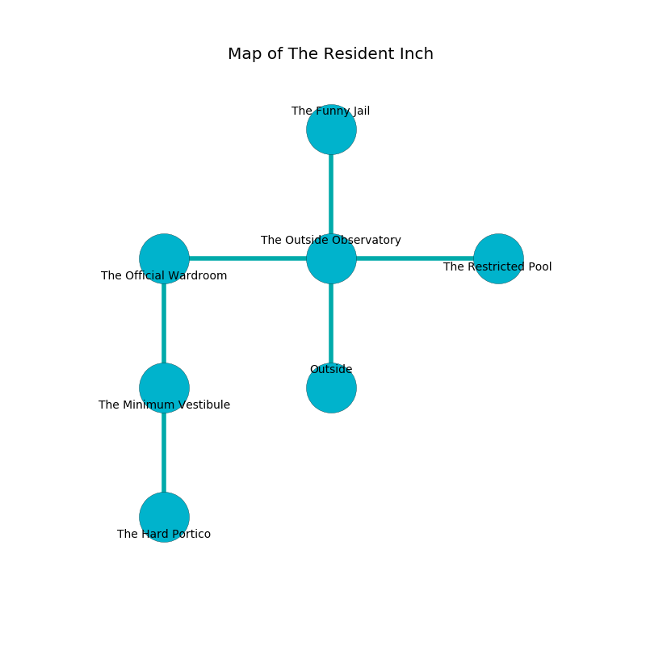

%Ruin Dogs

##The Resident Inch
###Overview
The Resident Inch is located in a ruined tree. Some rooms of The Resident Inch are somewhat hot. The ruin is larger on the inside than the outside. It is occupied by Humans. Lang Maestas The Arrogant, a Drow Priestess of Lolth is here. The Humans are the soldiers of Lang Maestas The Arrogant. She  is founding a new religion. 

###Artifact
####The Applied Blue Jean

The Applied Blue Jean looks like a warm spear. It smells like potato. Air shifts near it. When worshipped it becomes a force of destiny. 

###Locations

####the outside observatory
The air tastes like turni here. The floor is smooth. 

There is an engraving on a tablet written in common. 

> Treasure here.
>

* [The Applied Blue Jean](#The-Applied-Blue-Jean) is here.
* To the west a dripping cavern opens to [the official wardroom](#the-official-wardroom).
* To the east a small passageway opens to [the restricted pool](#the-restricted-pool).
* To the north a dark path connects to [the funny jail](#the-funny-jail).
* To the south is the entrance.

####the official wardroom
There are a Guard, a Veteran, a Tribal Warrior, a Mage, and an Acolyte here. The floor is sticky. The Humans are performing a ritual. If not interrupted, the ruin dogs will be weakened. 

* There is a fish here.
* To the east a dripping cavern opens to [the outside observatory](#the-outside-observatory).
* To the south a windy artery connects to [the minimum vestibule](#the-minimum-vestibule).

####the minimum vestibule
Red razorgrass is swaying in broken urns. The air smells like urine here. The floor is sticky. 

There is an engraving on a stone written in Humans Script. 

> Oh terrible god
>
> always odd
>
> obscure and hilarious
>
> death is gregarious
>

* There is a basket here.
* [Lang Maestas The Arrogant](#Lang-Maestas-The-Arrogant) is here.
* To the north a windy artery connects to [the official wardroom](#the-official-wardroom).
* To the south a dark hall opens to [the hard portico](#the-hard-portico).

####the hard portico
The floor is smooth. The air smells like marshmallow here. The brick walls are bloodstained. 

* To the north a dark hall connects to [the minimum vestibule](#the-minimum-vestibule).

####the funny jail
The floor is cluttered with debris. Red lichens are sprouting from the walls. There are a Giant Frog, an Incubus, a Mummy, a Giant Spider, and a Griffon here. The brick walls are scratched. The air smells like banana peel here. 

* To the south a dark path leads to [the outside observatory](#the-outside-observatory).

####the restricted pool
The floor is cluttered with ashes. The air smells like tarragon here. White mushrooms are decaying from the ceiling. 

There is an engraving on the floor written in Humans Script. 

> Poor me! everything is sadistic
>
> obese and explicit
>
> arrogant, official, artistic
>
> nothing is implicit
>

* To the west a small passageway opens to [the outside observatory](#the-outside-observatory).

