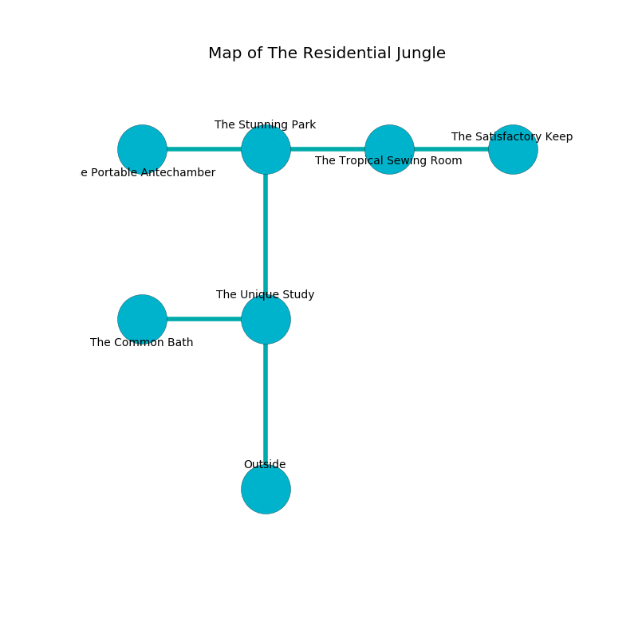

%Ruin Dogs

##The Residential Jungle
###Overview
The Residential Jungle is located in a poisoned tree. Some areas of The Residential Jungle are inaccessible. The ruin is coming to life. It is occupied by Demons. Marcelene Ricci The Conservative, a Fire Giant is here. The Demons are the slaves of Marcelene Ricci The Conservative. She  is trying to steal [Idfael Ibuca](#Idfael-Ibuca). 

###Artifact
####Idfael Ibuca

Idfael Ibuca has the form of a soft meteorite. It is a pale orange color. It smells like bouillon. When worn it projects energy. 

###Locations

####the unique study
The air smells like rain here. The floor is flooded with eight inch deep hot water. Yellow ferns are growing from the ceiling. The glass walls are unsettled. 

There is an engraving on the wall written in common. 

> I am free.
>
> Leave at once.
>

* To the west a windy corridor leads to [the common bath](#the-common-bath).
* To the north a narrow passageway leads to [the stunning park](#the-stunning-park).
* To the south is the entrance.

####the stunning park
Blue mushrooms are swaying in cracks in the floor. The floor is cluttered with ashes. The obsidion walls are ruined. 

* [Idfael Ibuca](#Idfael-Ibuca) is here.
* To the west a flooded hallway leads to [the portable antechamber](#the-portable-antechamber).
* To the east a dark path leads to [the tropical sewing room](#the-tropical-sewing-room).
* To the south a narrow passageway connects to [the unique study](#the-unique-study).

####the tropical sewing room
There are a Myconid Sprout, an Orog, an Orc Eye of Gruumsh, and a Werebear here. Gray razorgrass is growing in a patch on the floor. The floor is sticky. The air smells like caraway here. 

* To the west a dark path connects to [the stunning park](#the-stunning-park).
* To the east a twisted hallway connects to [the satisfactory keep](#the-satisfactory-keep).

####the common bath
There are a Drider, a Ghoul, a Giant Eagle, and a Giant Boar here. Green moss is sprouting in broken urns. The concrete walls are caving in. 

* [Marcelene Ricci The Conservative](#Marcelene-Ricci-The-Conservative) is here.
* To the east a windy corridor leads to [the unique study](#the-unique-study).

####the satisfactory keep
Green moss is growing from the walls. The air smells like sawdust here. There are an Imp, a Spined Devil, a Succubus, and a Cambion here. The concrete walls are covered in mold. The Demons are crazy with bloodlust. 

* To the west a twisted hallway opens to [the tropical sewing room](#the-tropical-sewing-room).

####the portable antechamber
The air smells like nasturtium here. Gray ferns are growing in cracks in the floor. The floor is sticky. 

* To the east a flooded hallway leads to [the stunning park](#the-stunning-park).

