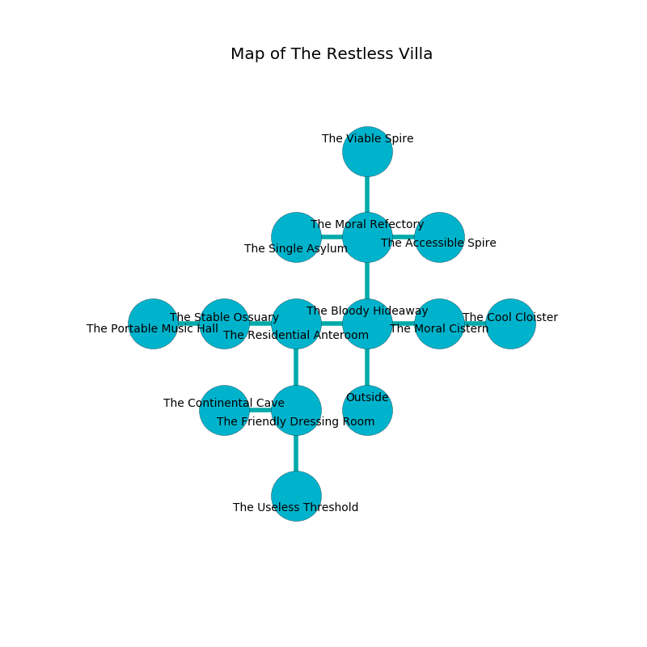

%Ruin Dogs

##The Restless Villa
###Overview
The Restless Villa is located in a spikey city. Some areas of it are flooded. The ruin is coming to life. It is occupied by Gnolls. Kenyatta Merrick The Quarrelsome, a Mage is here. The Gnolls are ruled by Kenyatta Merrick The Quarrelsome. She  is founding a new religion. 

###Artifact
####Muid

Muid is a powerful artifact in the shape of a broken sphere. It smells like urine. When picked up it burns the mind. 

###Locations

####the bloody hideaway
The floor is sticky. The metallic walls are unsettled. Blue mushrooms are decaying in cracks in the floor. 

* To the west a dripping pathway opens to [the residential anteroom](#the-residential-anteroom).
* To the east a torchlit gap opens to [the moral cistern](#the-moral-cistern).
* To the north a flooded pathway leads to [the moral refectory](#the-moral-refectory).
* To the south is the entrance.

####the residential anteroom
There are a Gnoll Fang of Yeenoghu and a Gnoll Pack Lord here. The obsidion walls are ruined. Gray razorgrass is sprouting in broken urns. The air smells like old wood here. The Gnolls are defending this room from intruders. 

There is an engraving on the wall written in Gnolls Script. 

> You are sorrowful
>
> imperial, past, rough
>

* To the west a twisted opening leads to [the stable ossuary](#the-stable-ossuary).
* To the east a dripping pathway leads to [the bloody hideaway](#the-bloody-hideaway).
* To the south a twisted pathway leads to [the friendly dressing room](#the-friendly-dressing-room).

####the moral refectory
The concrete walls are bloodstained. There are two Gnoll Fangs of Yeenoghu here. The Gnolls are caring for babies. 

* There is a specter here.
* To the west a dripping hall leads to [the single asylum](#the-single-asylum).
* To the east a flooded corridor opens to [the accessible spire](#the-accessible-spire).
* To the north a dripping walkway leads to [the viable spire](#the-viable-spire).
* To the south a flooded pathway leads to [the bloody hideaway](#the-bloody-hideaway).

####the moral cistern
The air smells like sulfur here. Gray mushrooms are decaying from the walls. There are a Gnoll Pack Lord, a Giant Elk, and a Sea Hag here. 

* To the west a torchlit gap leads to [the bloody hideaway](#the-bloody-hideaway).
* To the east a flooded threshold connects to [the cool cloister](#the-cool-cloister).

####the friendly dressing room
The air tastes like starch here. The metallic walls are pristine. 

There is an engraving on a tablet written in Gnolls Script. 

> Leave now.
>

* [Kenyatta Merrick The Quarrelsome](#Kenyatta-Merrick-The-Quarrelsome) is here.
* To the west a small artery opens to [the continental cave](#the-continental-cave).
* To the north a twisted pathway opens to [the residential anteroom](#the-residential-anteroom).
* To the south a dripping threshold connects to [the useless threshold](#the-useless-threshold).

####the useless threshold
The wooden walls are pristine. The air tastes like liver here. Yellow mushrooms are swaying in a patch on the floor. There is a Salamander here. 

* To the north a dripping threshold leads to [the friendly dressing room](#the-friendly-dressing-room).

####the cool cloister
The floor is flooded with eight inch deep scalding water. 

* To the west a flooded threshold connects to [the moral cistern](#the-moral-cistern).

####the single asylum
The obsidion walls are covered in mold. The floor is cluttered with shells. The air tastes like grape skin here. 

There is an engraving on a monolith written in common. 

> Leave now.
>

* To the east a dripping hall connects to [the moral refectory](#the-moral-refectory).

####the continental cave
There are a Gnoll Fang of Yeenoghu, a Gnoll, two Gnoll Pack Lords, and  here. The air smells like roasted almond here. One of the Gnolls is pointing a ballista at the entrance. 

There is an engraving on a stone written in Gnolls Script. 

> Leave at once.
>

* To the east a small artery leads to [the friendly dressing room](#the-friendly-dressing-room).

####the accessible spire
The floor is flooded with three inch deep cold water. 

* There is a key here.
* To the west a flooded corridor leads to [the moral refectory](#the-moral-refectory).

####the viable spire
White razorgrass is decaying in broken urns. There are a Gnoll and three Gnoll Pack Lords here. The floor is sticky. If the Gnolls notice the Ruin Dogs, one of them will retreat and alert [Kenyatta Merrick](#Kenyatta-Merrick). 

There is an engraving on a stone written in Gnolls Script. 

> You are hidden
>
> talented, finished, slippery
>

* To the south a dripping walkway connects to [the moral refectory](#the-moral-refectory).

####the stable ossuary
The air tastes like molasses here. The stone walls are ruined. There is a trap here. When activated, a magical sound detector will close a portcullis. 

* There is a basket here.
* [Muid](#Muid) is here.
* To the west a long gap opens to [the portable music hall](#the-portable-music-hall).
* To the east a twisted opening connects to [the residential anteroom](#the-residential-anteroom).

####the portable music hall
There are a Thug and a Cambion here. White lichens are growing in broken urns. 

There is an engraving on a tablet written in common. 

> [Muid](#Muid)
>
> cool and stubborn
>
> amber, perfect, essential
>
> [Muid](#Muid)
>

* There is a face here.
* To the east a long gap opens to [the stable ossuary](#the-stable-ossuary).

