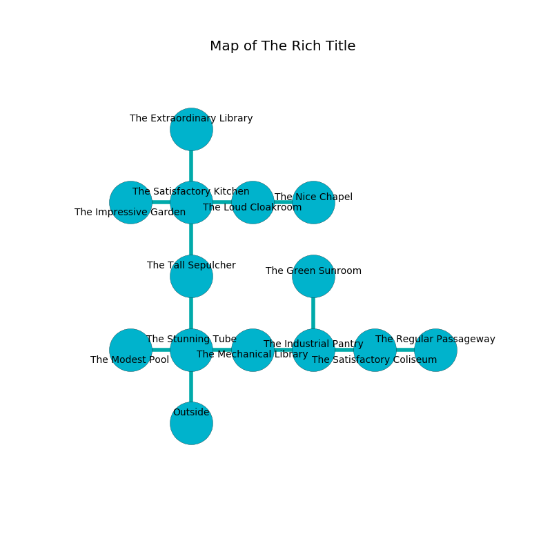

%Ruin Dogs

##The Rich Title
###Overview
The Rich Title is located in a volcanic rift. Regions of it are cursed. The ruin is flooding. It is occupied by Sprites. Lloyd Helton The Conservative, a Githyanki Warrior is here. The Sprites are the minions of Lloyd Helton The Conservative. He  is trying to steal [Uccodedaeum](#Uccodedaeum). 

###Artifact
####Uccodedaeum

Uccodedaeum looks like a broken figurine. It is a light black color. When rubbed it changes probabilities. 

###Locations

####the stunning tube

* There is a wight here.
* There is a wheel here.
* To the west a dripping hallway connects to [the modest pool](#the-modest-pool).
* To the east a twisted opening opens to [the mechanical library](#the-mechanical-library).
* To the north a dark hall connects to [the tall sepulcher](#the-tall-sepulcher).
* To the south is the entrance.

####the modest pool
The concrete walls are ruined. There are a Stirge, an Aarakocra, a Myconid Sprout, a Slaad Tadpole, an Axe Beak, a Winged Kobold, and a Quadrone here. 

There is an engraving on a monolith written in Sprites Script. 

> I tried swimming.
>

* [Lloyd Helton The Conservative](#Lloyd-Helton-The-Conservative) is here.
* To the east a dripping hallway opens to [the stunning tube](#the-stunning-tube).

####the tall sepulcher
There are a Sprite, a Kuo-Toa Monitor, a Magma Mephit, a Warhorse, a Mule, a Pseudodragon, and a Flying Snake here. White moss is decaying in a patch on the floor. The floor is bloodstained. 

* To the north a dark opening connects to [the satisfactory kitchen](#the-satisfactory-kitchen).
* To the south a dark hall connects to [the stunning tube](#the-stunning-tube).

####the satisfactory kitchen
The floor is cluttered with rocks. The air tastes like allspice here. There is a Yuan-Ti Malison here. Blue razorgrass is growing in cracks in the floor. The brick walls are scratched. 

* To the west a narrow threshold connects to [the impressive garden](#the-impressive-garden).
* To the east a flooded gap opens to [the loud cloakroom](#the-loud-cloakroom).
* To the north a windy cavern opens to [the extraordinary library](#the-extraordinary-library).
* To the south a dark opening connects to [the tall sepulcher](#the-tall-sepulcher).

####the mechanical library
The air smells like cherry here. 

* To the west a twisted opening connects to [the stunning tube](#the-stunning-tube).
* To the east a small cave connects to [the industrial pantry](#the-industrial-pantry).

####the extraordinary library
The floor is bloodstained. Gray ferns are sprouting in cracks in the floor. The air tastes like agarwood here. There are a Frog, a Bugbear, and a Lizardfolk Shaman here. The stone walls are covered in mold. 

* To the south a windy cavern leads to [the satisfactory kitchen](#the-satisfactory-kitchen).

####the loud cloakroom
The wooden walls are unsettled. White mushrooms are swaying from the ceiling. 

* To the west a flooded gap connects to [the satisfactory kitchen](#the-satisfactory-kitchen).
* To the east a hazy threshold leads to [the nice chapel](#the-nice-chapel).

####the impressive garden

* To the east a narrow threshold opens to [the satisfactory kitchen](#the-satisfactory-kitchen).

####the industrial pantry
The air tastes like lavender here. The floor is cluttered with bones. The glass walls are unsettled. 

* There is a spear here.
* There is a ghost here.
* To the west a small cave connects to [the mechanical library](#the-mechanical-library).
* To the east a dripping hall leads to [the satisfactory coliseum](#the-satisfactory-coliseum).
* To the north a long artery connects to [the green sunroom](#the-green-sunroom).

####the green sunroom
Blue razorgrass is growing from the ceiling. The concrete walls are covered in mold. 

* To the south a long artery connects to [the industrial pantry](#the-industrial-pantry).

####the satisfactory coliseum
The concrete walls are covered in mold. There are twelve Sprites here. The air tastes like barley here. The floor is flooded with seven inch deep hot water. The Sprites are willing to negotiate. 

* [Uccodedaeum](#Uccodedaeum) is here.
* To the west a dripping hall leads to [the industrial pantry](#the-industrial-pantry).
* To the east a small gap opens to [the regular passageway](#the-regular-passageway).

####the nice chapel
The crystal walls are ruined. There are twelve Sprites here. The Sprites are drunk. 

* To the west a hazy threshold leads to [the loud cloakroom](#the-loud-cloakroom).

####the regular passageway
The floor is smooth. 

There is an engraving on the ceiling written in Sprites Script. 

> I tried hiding.
>

* To the west a small gap leads to [the satisfactory coliseum](#the-satisfactory-coliseum).

