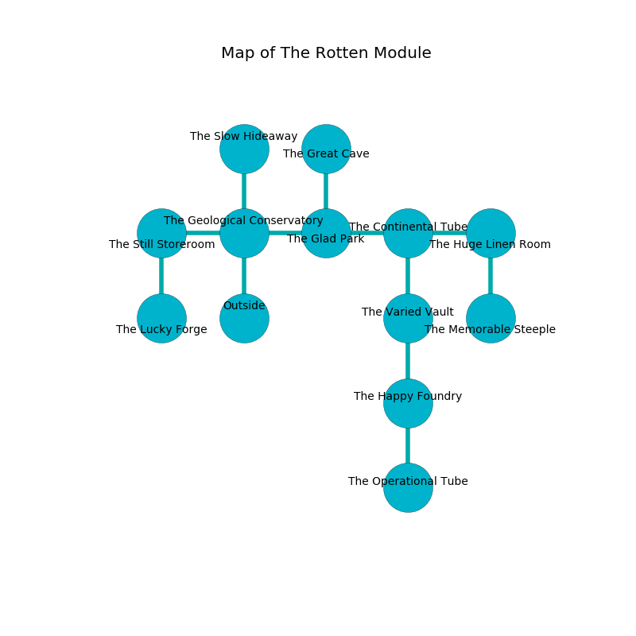

%Ruin Dogs

##The Rotten Module
###Overview
The Rotten Module is located in a crystal rift. Some rooms of it are cursed. A massive storm is happening outside. It is occupied by Demons. Beula Betancourt The Secretive, a Cloud Giant is here. The Demons have been charmed by Beula Betancourt The Secretive. She  is founding a new religion. 

###Artifact
####The Artificial Sin

The Artificial Sin has the form of a cold cube. It smells like dill. Gravity slides around it. It is a sickly red color. When rubbed it burns the mind. 

###Locations

####the geological conservatory
There is a trap here. When activated, a magical proximity detector will launch a poison needle. The concrete walls are caving in. The air tastes like corn here. The floor is bloodstained. 

There is an engraving on the floor written in common. 

> A blade is a battery
>
> always parallel
>
> able, ultimate, healthy
>
> you shall be frozen
>

* To the west a dripping gap connects to [the still storeroom](#the-still-storeroom).
* To the east a dark threshold connects to [the glad park](#the-glad-park).
* To the north a hazy opening connects to [the slow hideaway](#the-slow-hideaway).
* To the south is the entrance.

####the glad park
Gray moss is sprouting in a patch on the floor. The mirrored walls are caving in. There is a Young Gold Dragon here. 

* To the west a dark threshold connects to [the geological conservatory](#the-geological-conservatory).
* To the east a flooded cave leads to [the continental tube](#the-continental-tube).
* To the north a flooded corridor connects to [the great cave](#the-great-cave).

####the continental tube
The wooden walls are caving in. Red moss is sprouting in a patch on the floor. 

There is an engraving on the ceiling written in common. 

> I am hiding in The Rotten Module.
>
> Dig here.
>

* To the west a flooded cave connects to [the glad park](#the-glad-park).
* To the east a narrow path leads to [the huge linen room](#the-huge-linen-room).
* To the south a flooded threshold leads to [the varied vault](#the-varied-vault).

####the varied vault
There are a Githzerai Zerth, a Young Silver Dragon, and a Yuan-Ti Malison here. Blue razorgrass is decaying in broken urns. The air smells like vanilla here. 

* There is a card here.
* There is a hook here.
* To the north a flooded threshold leads to [the continental tube](#the-continental-tube).
* To the south a flooded threshold leads to [the happy foundry](#the-happy-foundry).

####the huge linen room
The air tastes like garlic here. 

* [Beula Betancourt The Secretive](#Beula-Betancourt-The-Secretive) is here.
* To the west a narrow path opens to [the continental tube](#the-continental-tube).
* To the south a flooded passageway connects to [the memorable steeple](#the-memorable-steeple).

####the great cave
There are an Imp and two Cambions here. Blue ferns are growing in cracks in the floor. The Demons are defending this room from intruders. 

* To the south a flooded corridor connects to [the glad park](#the-glad-park).

####the happy foundry
There are a Warhorse, an Umber Hulk, a Young Green Dragon, a Bearded Devil, and a Pixie here. Green mushrooms are decaying in a patch on the floor. 

* [The Artificial Sin](#The-Artificial-Sin) is here.
* To the north a flooded threshold connects to [the varied vault](#the-varied-vault).
* To the south a hazy opening connects to [the operational tube](#the-operational-tube).

####the memorable steeple
There are a Troglodyte, a Pteranodon, a Giant Spider, a Swarm of Insects, a Swarm of Quippers, a Deer, a Giant Owl, a Minotaur Skeleton, a Githzerai Monk, a Specter, an Awakened Shrub, a Poltergeist, two Lemures, and  here. Gray moss is swaying in broken urns. 

* To the north a flooded passageway connects to [the huge linen room](#the-huge-linen-room).

####the slow hideaway
The wooden walls are ruined. Red razorgrass is decaying in a patch on the floor. 

* There is a potato here.
* To the south a hazy opening connects to [the geological conservatory](#the-geological-conservatory).

####the still storeroom
The floor is sticky. Gray lichens are swaying in cracks in the floor. 

* To the east a dripping gap leads to [the geological conservatory](#the-geological-conservatory).
* To the south a long hallway opens to [the lucky forge](#the-lucky-forge).

####the lucky forge
The metallic walls are scratched. The floor is cluttered with debris. 

There is an engraving on a monolith written in common. 

> I could not try hiding.
>

* There is a brush here.
* There is a spring here.
* To the north a long hallway connects to [the still storeroom](#the-still-storeroom).

####the operational tube
Red moss is swaying in a patch on the floor. The air tastes like shrimp here. The stone walls are caving in. 

* To the north a hazy opening leads to [the happy foundry](#the-happy-foundry).

