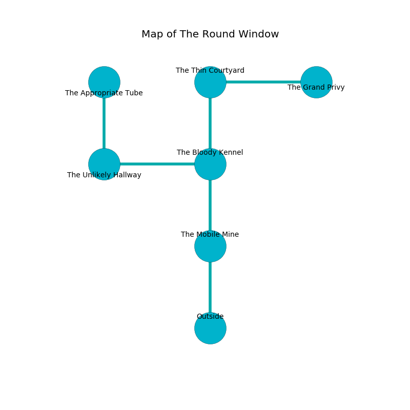

%Ruin Dogs

##The Round Window
###Overview
The Round Window is located on a flooded mountain. Some areas of it are cursed. A massive flood is happening outside. It is occupied by Demons. Travis Calloway The Unreliable, a Mind Flayer Arcanist is here. The Demons have been charmed by Travis Calloway The Unreliable. He  is trying to destroy [Becufaedwi Dfaeid](#Becufaedwi-Dfaeid). 

###Artifact
####Becufaedwi Dfaeid

Becufaedwi Dfaeid has the form of a wet prism. When touched it changes probabilities. 

###Locations

####the mobile mine
Blue razorgrass is sprouting in broken urns. The floor is cluttered with debris. There are a Bulette and a Cambion here. The Demons are feasting. 

* To the north a narrow opening connects to [the bloody kennel](#the-bloody-kennel).
* To the south is the entrance.

####the bloody kennel
The air tastes like tea here. The glass walls are ruined. 

There is an engraving on a stone written in common. 

> We are maddened
>
> yet aloof
>
> We are maddened
>

* There is a gold coin here.
* To the west a torchlit corridor connects to [the unlikely hallway](#the-unlikely-hallway).
* To the north a small opening opens to [the thin courtyard](#the-thin-courtyard).
* To the south a narrow opening connects to [the mobile mine](#the-mobile-mine).

####the thin courtyard
The floor is smooth. The air tastes like petitgrain here. There are an Imp, an Incubus, and a Cambion here. The Demons are caring for babies. 

There is an engraving on the floor written in common. 

> I thought about swimming.
>

* [Travis Calloway The Unreliable](#Travis-Calloway-The-Unreliable) is here.
* To the east a long path leads to [the grand privy](#the-grand-privy).
* To the south a small opening connects to [the bloody kennel](#the-bloody-kennel).

####the unlikely hallway
The concrete walls are covered in mold. The air tastes like sarsaparilla here. The floor is smooth. 

There is an engraving on a stone written in common. 

> I am fleeing The Round Window.
>
> I tried hiding.
>

* [Becufaedwi Dfaeid](#Becufaedwi-Dfaeid) is here.
* To the east a torchlit corridor connects to [the bloody kennel](#the-bloody-kennel).
* To the north a dark cave opens to [the appropriate tube](#the-appropriate-tube).

####the grand privy
Green ferns are sprouting from the ceiling. 

There is an engraving on the wall written in common. 

> Dig here.
>

* To the west a long path opens to [the thin courtyard](#the-thin-courtyard).

####the appropriate tube
The air tastes like oily here. There are a Green Slaad and a Succubus here. The floor is smooth. The wooden walls are scratched. Gray razorgrass is growing in broken urns. 

* To the south a dark cave leads to [the unlikely hallway](#the-unlikely-hallway).

