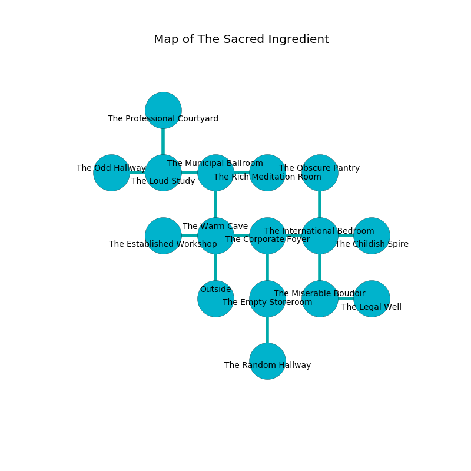

%Ruin Dogs

##The Sacred Ingredient
###Overview
The Sacred Ingredient is located under an obsidion rift. Some areas of it are foggy. The ruin is flooding. It is occupied by Sahuagin. Colby Lowman The Quarrelsome, an Orc Eye of Gruumsh is here. The Sahuagin are the minions of Colby Lowman The Quarrelsome. She  is trying to research [Amdfwi Cumcafm](#Amdfwi-Cumcafm). 

###Artifact
####Amdfwi Cumcafm

Amdfwi Cumcafm has the form of a soft spear. It is a medium gray color. When thrown it destroys others. 

###Locations

####the warm cave
The air smells like starfruit here. The obsidion walls are ruined. There are an Axe Beak, a Fire Snake, and a Druid here. 

* There is a brush here.
* To the west a narrow walkway leads to [the established workshop](#the-established-workshop).
* To the east a dripping path connects to [the corporate foyer](#the-corporate-foyer).
* To the north a twisted hall leads to [the municipal ballroom](#the-municipal-ballroom).
* To the south is the entrance.

####the established workshop
The floor is flooded with five inch deep hot water. White lichens are swaying from the walls. 

* There is a girl here.
* [Colby Lowman The Quarrelsome](#Colby-Lowman-The-Quarrelsome) is here.
* To the east a narrow walkway connects to [the warm cave](#the-warm-cave).

####the corporate foyer
The mirrored walls are caving in. The floor is smooth. 

There is an engraving on a monolith written in Sahuagin Script. 

> You are frozen
>
> always awful
>

* To the west a dripping path connects to [the warm cave](#the-warm-cave).
* To the east a narrow hallway opens to [the international bedroom](#the-international-bedroom).
* To the south a hazy artery leads to [the empty storeroom](#the-empty-storeroom).

####the municipal ballroom
The air smells like algae here. The floor is bloodstained. The stone walls are pristine. Yellow lichens are swaying in broken urns. 

* To the west a dripping path opens to [the loud study](#the-loud-study).
* To the east a hazy threshold connects to [the rich meditation room](#the-rich-meditation-room).
* To the south a twisted hall opens to [the warm cave](#the-warm-cave).

####the international bedroom
The air tastes like buttery	cabbage here. There are a Plesiosaurus, a Raven, a Spider, an Owl, a Homunculus, and a Needle Blight here. The floor is glossy. 

* There is a berry here.
* To the west a narrow hallway leads to [the corporate foyer](#the-corporate-foyer).
* To the east a windy artery connects to [the childish spire](#the-childish-spire).
* To the north a small opening leads to [the obscure pantry](#the-obscure-pantry).
* To the south a hazy pathway leads to [the miserable boudoir](#the-miserable-boudoir).

####the loud study
The air tastes like peanut butter here. The brick walls are unsettled. There are an Ankheg, a Giant Owl, a Quadrone, and a Dretch here. The floor is sticky. 

There is an engraving on a monolith written in Sahuagin Script. 

> O! sorry we
>
> yet free
>
> gradual, polite, moral
>
> life is free
>

* [Amdfwi Cumcafm](#Amdfwi-Cumcafm) is here.
* To the west a dark passageway leads to [the odd hallway](#the-odd-hallway).
* To the east a dripping path opens to [the municipal ballroom](#the-municipal-ballroom).
* To the north a dark pathway leads to [the professional courtyard](#the-professional-courtyard).

####the empty storeroom
Red ferns are growing in cracks in the floor. The floor is bloodstained. The brick walls are pristine. The air smells like acerola here. 

* To the north a hazy artery opens to [the corporate foyer](#the-corporate-foyer).
* To the south a dark opening leads to [the random hallway](#the-random-hallway).

####the miserable boudoir
The floor is smooth. There is a Rug of Smothering here. 

* To the east a windy passageway opens to [the legal well](#the-legal-well).
* To the north a hazy pathway opens to [the international bedroom](#the-international-bedroom).

####the obscure pantry
There are four Sahuagin here. The air smells like honey here. The floor is flooded with five inch deep lukewarm water. The obsidion walls are unsettled. If the Sahuagin notice the Ruin Dogs, one of them will retreat and alert [Colby Lowman](#Colby-Lowman). 

* There is a wight here.
* To the south a small opening leads to [the international bedroom](#the-international-bedroom).

####the legal well
The stone walls are bloodstained. The floor is glossy. There are a Kuo-Toa Whip and an Imp here. 

* There is a lyre here.
* To the west a windy passageway opens to [the miserable boudoir](#the-miserable-boudoir).

####the childish spire
The metallic walls are caving in. There are four Sahuagin here. The floor is glossy. The air tastes like metal here. One of the Sahuagin is pointing a ballista at the entrance. 

There is an engraving on the ceiling written in common. 

> A wing is a debate
>
> realistic, unfair, manual
>
> dangerous, consistent, dominant
>
> vacant and bald
>
> fashionable and revolutionary
>
> [Amdfwi Cumcafm](#Amdfwi-Cumcafm)
>
> meaningful, hot, conscious
>
> lonely, balanced, flat
>
> A wing is a debate
>

* To the west a windy artery opens to [the international bedroom](#the-international-bedroom).

####the rich meditation room
The air tastes like myrrh here. 

* To the west a hazy threshold leads to [the municipal ballroom](#the-municipal-ballroom).

####the random hallway
There are four Sahuagin here. Blue mushrooms are growing in cracks in the floor. The Sahuagin are drunk. 

* To the north a dark opening opens to [the empty storeroom](#the-empty-storeroom).

####the odd hallway
The concrete walls are unsettled. Blue razorgrass is swaying in cracks in the floor. The air tastes like privet here. There are four Sahuagin here. The Sahuagin are willing to negotiate. 

* There is a finger here.
* To the east a dark passageway leads to [the loud study](#the-loud-study).

####the professional courtyard
The floor is glossy. There is a Minotaur Skeleton here. The air tastes like raw potato here. 

There is an engraving on the floor written in Sahuagin Script. 

> I am free.
>
> Hide here.
>

* To the south a dark pathway connects to [the loud study](#the-loud-study).

