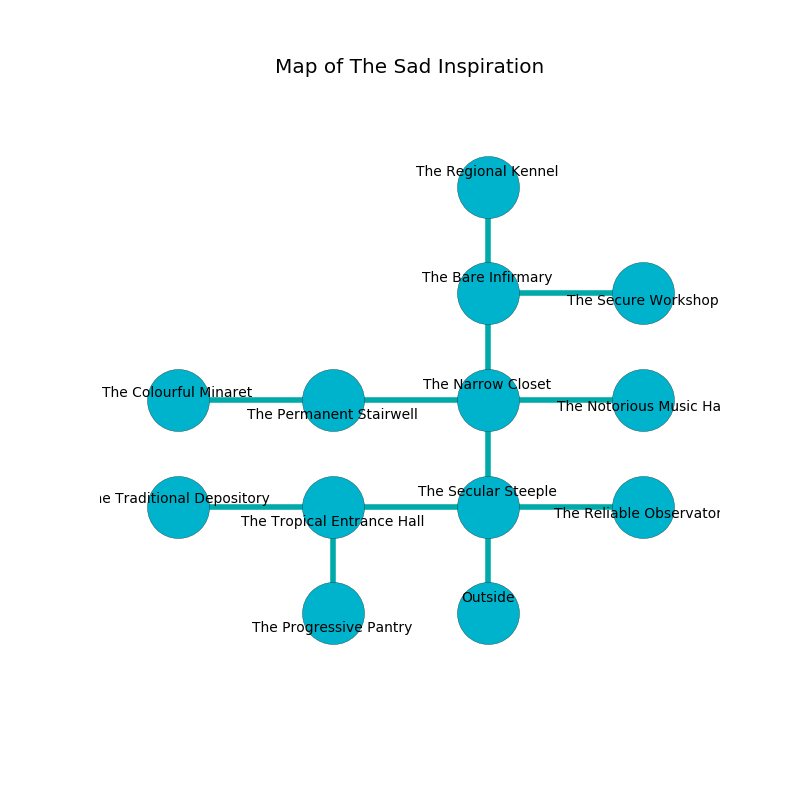

%Ruin Dogs

##The Sad Inspiration
###Overview
The Sad Inspiration is located under a haunted mountain. Some rooms of The Sad Inspiration are inaccessible. The ruin is larger on the inside than the outside. It is occupied by Sprites. Rocio Card The Unkind, a Cloud Giant is here. The Sprites are ruled by Rocio Card The Unkind. She  is trying to steal [Gfaeamlimaed Guhc](#Gfaeamlimaed-Guhc). 

###Artifact
####Gfaeamlimaed Guhc

Gfaeamlimaed Guhc has the form of an opaque prism. It smells like bell pepper. When gazed upon it destroys itself. 

###Locations

####the secular steeple
The crystal walls are caving in. The air tastes like moss here. The floor is flooded with five inch deep scalding water. Blue moss is sprouting from the walls. 

There is an engraving on the ceiling written in Sprites Script. 

> Oh my! everything is woe
>
> persistent, raw, slow
>
> bland and slow
>
> death is low
>

* [Rocio Card The Unkind](#Rocio-Card-The-Unkind) is here.
* To the west a flooded passageway leads to [the tropical entrance hall](#the-tropical-entrance-hall).
* To the east a hazy corridor opens to [the reliable observatory](#the-reliable-observatory).
* To the north a hazy hall opens to [the narrow closet](#the-narrow-closet).
* To the south is the entrance.

####the narrow closet
The crystal walls are covered in mold. There is a trap here. When activated, a pressure plate will launch an arrow. There are a Chain Devil, a Winged Kobold, a Druid, an Old Faerie Dragon, a Giant Centipede, a Hook Horror, a Giant Boar, and a Cultist here. 

* To the west a windy path leads to [the permanent stairwell](#the-permanent-stairwell).
* To the east a twisted threshold opens to [the notorious music hall](#the-notorious-music-hall).
* To the north a hazy passageway leads to [the bare infirmary](#the-bare-infirmary).
* To the south a hazy hall opens to [the secular steeple](#the-secular-steeple).

####the reliable observatory
The floor is glossy. Red razorgrass is swaying from the ceiling. The metallic walls are unsettled. There are forty Sprites here. One of the Sprites is working a mechanism that can flood the room. 

* There is a comb here.
* To the west a hazy corridor leads to [the secular steeple](#the-secular-steeple).

####the tropical entrance hall
Yellow moss is swaying in a patch on the floor. The floor is flooded with five inch deep scalding water. There are forty Sprites here. The air smells like geranium here. One of the Sprites is working a mechanism that can engulf the room in a fiery blaze. 

* To the west a narrow hallway connects to [the traditional depository](#the-traditional-depository).
* To the east a flooded passageway leads to [the secular steeple](#the-secular-steeple).
* To the south a windy hallway opens to [the progressive pantry](#the-progressive-pantry).

####the notorious music hall
The air tastes like chicken coup here. The crystal walls are caving in. 

* There is a rod here.
* To the west a twisted threshold opens to [the narrow closet](#the-narrow-closet).

####the traditional depository
The glass walls are covered in mold. There are a Guard, a Poisonous Snake, and a Death Slaad here. 

* There is a baby here.
* To the east a narrow hallway opens to [the tropical entrance hall](#the-tropical-entrance-hall).

####the progressive pantry
Red razorgrass is swaying from the ceiling. The air smells like grilling here. The brick walls are bloodstained. There are forty Sprites here. One of the Sprites is working a mechanism that can launch acid at the Ruin Dogs. 

* To the north a windy hallway leads to [the tropical entrance hall](#the-tropical-entrance-hall).

####the permanent stairwell
The floor is flooded with six inch deep scalding water. 

* To the west a small walkway connects to [the colourful minaret](#the-colourful-minaret).
* To the east a windy path connects to [the narrow closet](#the-narrow-closet).

####the bare infirmary
The air smells like marigold here. There are a Grick Alpha, a Spider, and an Elephant here. Green mushrooms are sprouting from the ceiling. 

There is an engraving on a tablet written in Sprites Script. 

> O! everything is poor
>
> yet never efficient
>
> it is never mature
>
> cruelty is insufficient
>

* [Gfaeamlimaed Guhc](#Gfaeamlimaed-Guhc) is here.
* To the east a torchlit pathway connects to [the secure workshop](#the-secure-workshop).
* To the north a long artery leads to [the regional kennel](#the-regional-kennel).
* To the south a hazy passageway leads to [the narrow closet](#the-narrow-closet).

####the colourful minaret
The concrete walls are ruined. The air tastes like acetone here. There are a Magma Mephit, a Giant Hyena, a Crawling Claw, a Yuan-Ti Abomination, and a Young Bronze Dragon here. 

* To the east a small walkway opens to [the permanent stairwell](#the-permanent-stairwell).

####the secure workshop
The crystal walls are covered in mold. The air tastes like ammonia here. 

* To the west a torchlit pathway connects to [the bare infirmary](#the-bare-infirmary).

####the regional kennel
The glass walls are ruined. The floor is sticky. Red ferns are sprouting from the walls. The air smells like vanilla here. 

* There is an amulet here.
* To the south a long artery leads to [the bare infirmary](#the-bare-infirmary).

