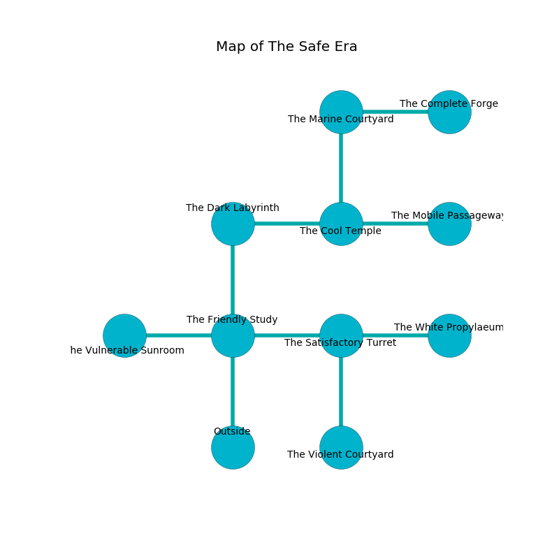

%Ruin Dogs

##The Safe Era
###Overview
The Safe Era is located in a flooded mountain. Some rooms of The Safe Era are corrupted. A battle between raiders is happening outside. It is occupied by Satyrs. Maud Gold The Belligerent, a Hobgoblin Warlord is here. The Satyrs are battling Maud Gold The Belligerent. She  is founding a new religion. 

###Artifact
####Feda

Feda is a powerful artifact in the shape of a transparent monument. Fire slides around it. When touched it projects energy. 

###Locations

####the friendly study
The concrete walls are ruined. Blue mushrooms are decaying from the walls. The floor is sticky. 

* To the west a dripping corridor opens to [the vulnerable sunroom](#the-vulnerable-sunroom).
* To the east a small cave leads to [the satisfactory turret](#the-satisfactory-turret).
* To the north a hazy artery leads to [the dark labyrinth](#the-dark-labyrinth).
* To the south is the entrance.

####the dark labyrinth
Red razorgrass is swaying in cracks in the floor. There are an Ape, a Giant Poisonous Snake, an Ogre Zombie, an Old Faerie Dragon, and a Knight here. The air smells like juniper here. The brick walls are ruined. 

* There is a stamp here.
* To the east a long hall leads to [the cool temple](#the-cool-temple).
* To the south a hazy artery opens to [the friendly study](#the-friendly-study).

####the cool temple
There are a Hippogriff and a Cambion here. 

* To the west a long hall opens to [the dark labyrinth](#the-dark-labyrinth).
* To the east a dripping gap connects to [the mobile passageway](#the-mobile-passageway).
* To the north a hazy gap connects to [the marine courtyard](#the-marine-courtyard).

####the vulnerable sunroom
The air tastes like phenolic here. The obsidion walls are bloodstained. There are twelve Satyrs here. Gray mushrooms are growing in broken urns. The Satyrs are caring for babies. 

There is an engraving on a stone written in Satyrs Script. 

> A shoe is an immigration
>
> dramatic and indigenous
>
> medieval and abundant
>
> main and immune
>
> but never socialist
>
> [Feda](#Feda)
>
> pregnant and bureaucratic
>
> [Feda](#Feda)
>
> integrated, peaceful, open
>
> definite and stubborn
>

* There is an icon here.
* To the east a dripping corridor leads to [the friendly study](#the-friendly-study).

####the mobile passageway
Red mushrooms are growing from the walls. There are twelve Satyrs here. The air smells like honeysuckle here. The Satyrs are performing a ritual. If not interrupted, a powerful monster will be summoned. 

* To the west a dripping gap connects to [the cool temple](#the-cool-temple).

####the marine courtyard

* To the east a dark corridor opens to [the complete forge](#the-complete-forge).
* To the south a hazy gap opens to [the cool temple](#the-cool-temple).

####the satisfactory turret
The air smells like pineapple here. 

* [Feda](#Feda) is here.
* To the west a small cave opens to [the friendly study](#the-friendly-study).
* To the east a torchlit corridor connects to [the white propylaeum](#the-white-propylaeum).
* To the south a small path opens to [the violent courtyard](#the-violent-courtyard).

####the complete forge
White mushrooms are sprouting from the walls. There are a Noble, a Violet Fungus, a Dire Wolf, a Giant Goat, a Lamia, a Bone Naga, and an Eagle here. 

* To the west a dark corridor leads to [the marine courtyard](#the-marine-courtyard).

####the white propylaeum
The air tastes like beef here. White razorgrass is growing in broken urns. The crystal walls are ruined. 

There is an engraving on a tablet written in common. 

> [Feda](#Feda)
>
> kind and rotten
>

* To the west a torchlit corridor opens to [the satisfactory turret](#the-satisfactory-turret).

####the violent courtyard
Green razorgrass is sprouting in a patch on the floor. 

There is an engraving on the wall written in common. 

> I found [Feda](#Feda).
>
> Maybe try praying.
>

* There is a wall here.
* [Maud Gold The Belligerent](#Maud-Gold-The-Belligerent) is here.
* To the north a small path leads to [the satisfactory turret](#the-satisfactory-turret).

