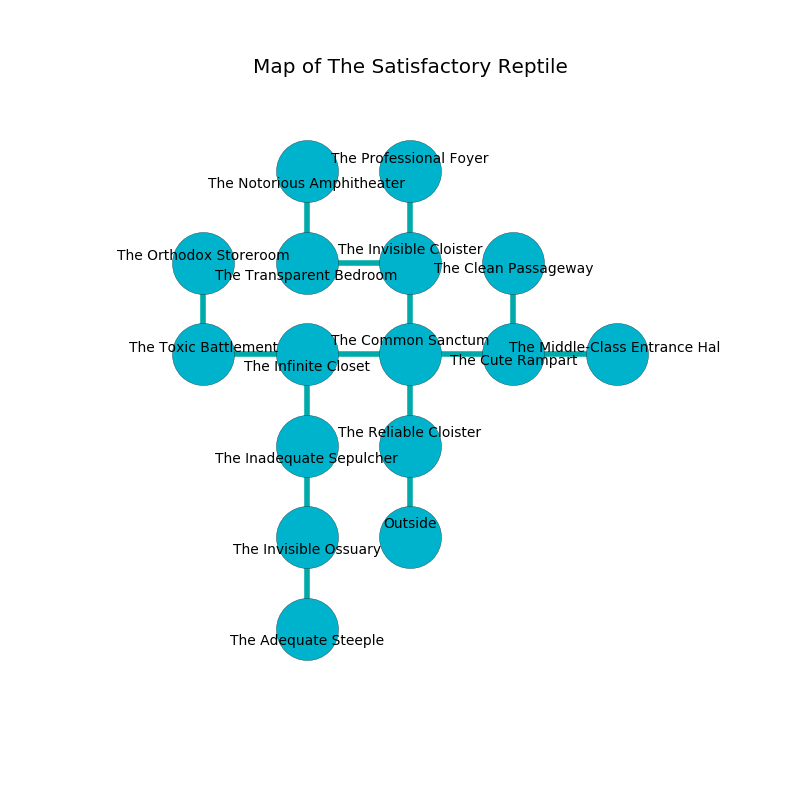

%Ruin Dogs

##The Satisfactory Reptile
###Overview
The Satisfactory Reptile is located on a volcanic tree. Parts of it are flooded. The ruin is coming to life. It is occupied by Troglodytes. Erin Clement The Belligerent, a Bearded Devil is here. The Troglodytes are the slaves of Erin Clement The Belligerent. He  is trying to destroy [Facuuafwi Cehcohedaeum](#Facuuafwi-Cehcohedaeum). 

###Artifact
####Facuuafwi Cehcohedaeum

Facuuafwi Cehcohedaeum looks like a transparent blade. It smells like freesia. It is a pale brown color. When gazed upon it frightens children. 

###Locations

####the reliable cloister
The floor is bloodstained. 

There is an engraving on a stone written in Troglodytes Script. 

> Poor me! dire we
>
> subjective and moral
>
> yet free
>
> everything is oral
>

* There is a monkey here.
* There is a bee here.
* To the north a windy hall connects to [the common sanctum](#the-common-sanctum).
* To the south is the entrance.

####the common sanctum
Red razorgrass is swaying from the walls. There are a Slaad Tadpole, a Giant Vulture, a Swarm of Ravens, a Winged Kobold, and a Vine Blight here. 

* To the west a dripping artery opens to [the infinite closet](#the-infinite-closet).
* To the east a dripping gap opens to [the cute rampart](#the-cute-rampart).
* To the north a small walkway connects to [the invisible cloister](#the-invisible-cloister).
* To the south a windy hall connects to [the reliable cloister](#the-reliable-cloister).

####the cute rampart
The mirrored walls are covered in mold. The floor is glossy. The air smells like clam here. 

* To the west a dripping gap opens to [the common sanctum](#the-common-sanctum).
* To the east a windy gap leads to [the middle-class entrance hall](#the-middle-class-entrance-hall).
* To the north a dark walkway opens to [the clean passageway](#the-clean-passageway).

####the infinite closet
Gray moss is growing in broken urns. 

There is an engraving on a stone written in Troglodytes Script. 

> O! my life is sadistic
>
> it is never optimistic
>
> yet never thick
>
> the world is sick
>

* There is a fork here.
* To the west a dark corridor connects to [the toxic battlement](#the-toxic-battlement).
* To the east a dripping artery connects to [the common sanctum](#the-common-sanctum).
* To the south a torchlit path leads to [the inadequate sepulcher](#the-inadequate-sepulcher).

####the invisible cloister

* To the west a twisted threshold leads to [the transparent bedroom](#the-transparent-bedroom).
* To the north a dripping corridor opens to [the professional foyer](#the-professional-foyer).
* To the south a small walkway opens to [the common sanctum](#the-common-sanctum).

####the inadequate sepulcher

There is an engraving on a tablet written in common. 

> O the memory of you is poor
>
> yet never secure
>
> ever ignorant
>
> cruelty is pure
>

* There is a femur here.
* To the north a torchlit path leads to [the infinite closet](#the-infinite-closet).
* To the south a dark walkway connects to [the invisible ossuary](#the-invisible-ossuary).

####the clean passageway

There is an engraving on a monolith written in Troglodytes Script. 

> Oh my! my life is sadistic
>
> adequate, still, geological
>
> but artistic
>
> hope is archaeological
>

* To the south a dark walkway leads to [the cute rampart](#the-cute-rampart).

####the toxic battlement
The stone walls are pristine. The air smells like foliage here. The floor is cluttered with bones. Blue moss is sprouting from the walls. There are eight Troglodytes here. The Troglodytes are willing to negotiate. 

* [Erin Clement The Belligerent](#Erin-Clement-The-Belligerent) is here.
* To the east a dark corridor connects to [the infinite closet](#the-infinite-closet).
* To the north a dripping pathway leads to [the orthodox storeroom](#the-orthodox-storeroom).

####the orthodox storeroom
Gray moss is growing in cracks in the floor. The air tastes like skunk here. 

* To the south a dripping pathway opens to [the toxic battlement](#the-toxic-battlement).

####the transparent bedroom
The air tastes like saffron here. Green razorgrass is sprouting in cracks in the floor. 

* There is a spade here.
* To the east a twisted threshold connects to [the invisible cloister](#the-invisible-cloister).
* To the north a windy cavern leads to [the notorious amphitheater](#the-notorious-amphitheater).

####the notorious amphitheater

* To the south a windy cavern connects to [the transparent bedroom](#the-transparent-bedroom).

####the invisible ossuary
The crystal walls are caving in. There are eight Troglodytes here. White lichens are growing in broken urns. If the Troglodytes notice the Ruin Dogs, one of them will retreat and alert the others. 

* [Facuuafwi Cehcohedaeum](#Facuuafwi-Cehcohedaeum) is here.
* To the north a dark walkway leads to [the inadequate sepulcher](#the-inadequate-sepulcher).
* To the south a windy hallway opens to [the adequate steeple](#the-adequate-steeple).

####the middle-class entrance hall
Blue razorgrass is sprouting in a patch on the floor. The air smells like freshly cut hay here. The glass walls are covered in mold. 

* To the west a windy gap leads to [the cute rampart](#the-cute-rampart).

####the professional foyer
The stone walls are caving in. The air smells like banana here. 

* To the south a dripping corridor leads to [the invisible cloister](#the-invisible-cloister).

####the adequate steeple
There are eight Troglodytes here. The air smells like freshly cut hay here. The wooden walls are unsettled. One of the Troglodytes is working a mechanism that can lock the exits. 

There is an engraving on a stone written in common. 

> Oh dire soul
>
> it is always whole
>
> experimental, dark, trivial
>
> nothing is whole
>

* To the north a windy hallway opens to [the invisible ossuary](#the-invisible-ossuary).

