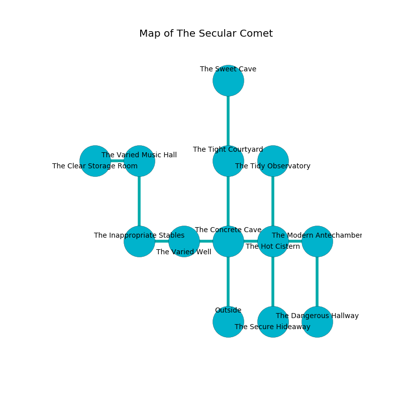

%Ruin Dogs

##The Secular Comet
###Overview
The Secular Comet is located under a haunted mountain. Some rooms of it are foggy. A lunar eclipse is happening outside. It is occupied by Dryads. Tresa Berube The Bone-Idle, a Kuo-Toa Archpriest is here. The Dryads are the slaves of Tresa Berube The Bone-Idle. She  is founding a new religion. 

###Artifact
####The Active Excavation

The Active Excavation is a powerful artifact in the shape of a broken blade. Magic glows away from it. It smells like acrylate. When worshipped it changes probabilities. 

###Locations

####the concrete cave

* There is a leprechaun here.
* To the west a narrow corridor connects to [the varied well](#the-varied-well).
* To the east a small corridor opens to [the hot cistern](#the-hot-cistern).
* To the north a dark threshold connects to [the tight courtyard](#the-tight-courtyard).
* To the south is the entrance.

####the tight courtyard
The floor is smooth. The air tastes like hyssop here. 

* To the north a hazy opening connects to [the sweet cave](#the-sweet-cave).
* To the south a dark threshold opens to [the concrete cave](#the-concrete-cave).

####the varied well
There are an Aarakocra, a Peryton, a Noble, a Raven, a Nightmare, a Sahuagin, a Giant Wasp, and a Rug of Smothering here. The air smells like fermentation here. The obsidion walls are covered in mold. The floor is glossy. There is a trap here. When activated, a tripwire will launch a hail of needles. Gray moss is decaying in cracks in the floor. 

There is an engraving on a tablet written in Dryads Script. 

> I am afraid.
>

* [Tresa Berube The Bone-Idle](#Tresa-Berube-The-Bone-Idle) is here.
* To the west a dark artery opens to [the inappropriate stables](#the-inappropriate-stables).
* To the east a narrow corridor connects to [the concrete cave](#the-concrete-cave).

####the inappropriate stables
There are a Young Brass Dragon, a Bandit, and a Dire Wolf here. Blue moss is sprouting from the walls. The air smells like spearmint here. 

* There is a match here.
* To the east a dark artery opens to [the varied well](#the-varied-well).
* To the north a long gap connects to [the varied music hall](#the-varied-music-hall).

####the hot cistern
The obsidion walls are bloodstained. There are six Dryads here. One of the Dryads is on watch, the rest are feasting. 

There is an engraving on a monolith written in Dryads Script. 

> Try jumping.
>

* There is a trousers here.
* To the west a small corridor opens to [the concrete cave](#the-concrete-cave).
* To the east a dripping cave opens to [the modern antechamber](#the-modern-antechamber).
* To the north a hazy cavern opens to [the tidy observatory](#the-tidy-observatory).
* To the south a dripping pathway opens to [the secure hideaway](#the-secure-hideaway).

####the varied music hall
Red mushrooms are swaying from the walls. The floor is glossy. The metallic walls are unsettled. There are six Dryads here. One of the Dryads is working a mechanism that can launch acid at the Ruin Dogs. 

* There is a breastplate here.
* There is a whip here.
* To the west a hazy pathway connects to [the clear storage room](#the-clear-storage-room).
* To the south a long gap opens to [the inappropriate stables](#the-inappropriate-stables).

####the tidy observatory
The stone walls are caving in. The air smells like sassafrass here. There are six Dryads here. The floor is flooded with seven inch deep scalding water. One of the Dryads is on watch, the rest are fighting amongst themselves. 

* To the south a hazy cavern connects to [the hot cistern](#the-hot-cistern).

####the clear storage room
Yellow moss is growing from the walls. The mirrored walls are scratched. The floor is sticky. 

* To the east a hazy pathway leads to [the varied music hall](#the-varied-music-hall).

####the modern antechamber
Yellow mushrooms are decaying in cracks in the floor. The air smells like praline here. The floor is bloodstained. 

* [The Active Excavation](#The-Active-Excavation) is here.
* To the west a dripping cave connects to [the hot cistern](#the-hot-cistern).
* To the south a narrow path leads to [the dangerous hallway](#the-dangerous-hallway).

####the secure hideaway
There are six Dryads here. Yellow razorgrass is decaying in cracks in the floor. The crystal walls are ruined. If the Dryads notice the Ruin Dogs, one of them will retreat and alert the others. 

* To the north a dripping pathway connects to [the hot cistern](#the-hot-cistern).

####the sweet cave
The air smells like molasses here. The brick walls are pristine. The floor is glossy. 

* There is a heart here.
* To the south a hazy opening leads to [the tight courtyard](#the-tight-courtyard).

####the dangerous hallway
The air tastes like ambergris here. There are a Winter Wolf, a Quasit, a Pteranodon, and a Ghost here. 

* To the north a narrow path leads to [the modern antechamber](#the-modern-antechamber).

