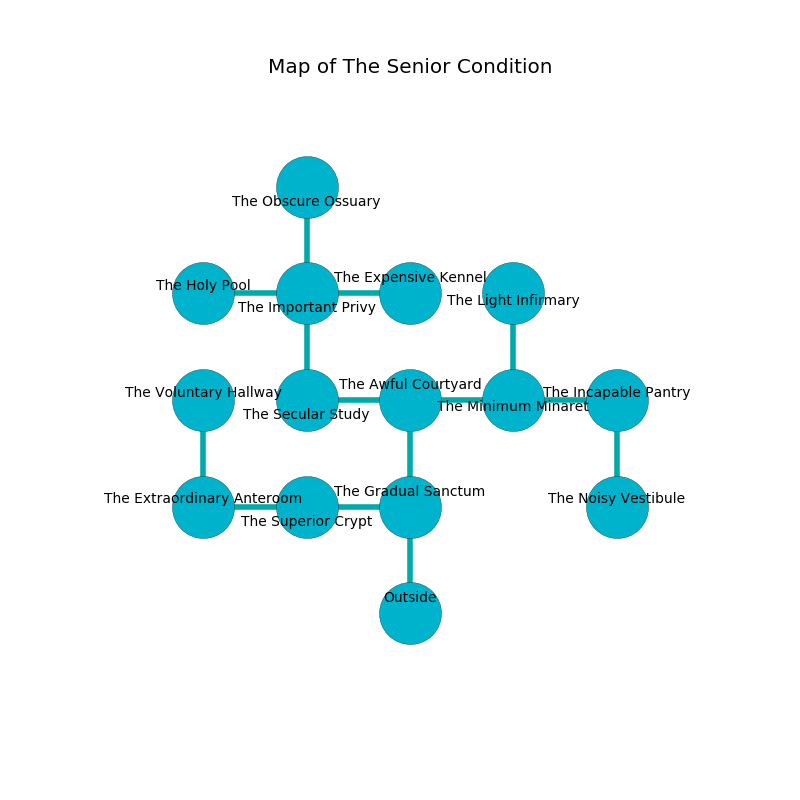

%Ruin Dogs

##The Senior Condition
###Overview
The Senior Condition is constructed on a poisoned mountain. Regions of it are flooded. A solar eclipse is happening outside. It is occupied by Sprites. Tod Keene The Narrow-Minded, a Cloud Giant is here. The Sprites are the soldiers of Tod Keene The Narrow-Minded. He  is founding a new religion. 

###Artifact
####Omfaid Leohmdaf

Omfaid Leohmdaf is a powerful artifact in the shape of a broken amulet. Magic shifts around it. When cradled it becomes lost. 

###Locations

####the gradual sanctum
The air smells like mimosa here. The mirrored walls are unsettled. Yellow mushrooms are decaying in a patch on the floor. There are a Pentadrone, a Young White Dragon, a Knight, a Quadrone, and a Brown Bear here. 

* There is a fowl here.
* To the west a long hall leads to [the superior crypt](#the-superior-crypt).
* To the north a narrow pathway connects to [the awful courtyard](#the-awful-courtyard).
* To the south is the entrance.

####the superior crypt
There are a Cloaker and a Berserker here. The air tastes like celery here. White razorgrass is growing from the walls. 

* [Tod Keene The Narrow-Minded](#Tod-Keene-The-Narrow-Minded) is here.
* To the west a torchlit artery opens to [the extraordinary anteroom](#the-extraordinary-anteroom).
* To the east a long hall opens to [the gradual sanctum](#the-gradual-sanctum).

####the awful courtyard
The mirrored walls are scratched. The floor is smooth. 

There is an engraving on a stone written in Sprites Script. 

> [Omfaid Leohmdaf](#Omfaid-Leohmdaf)
>
> yet never philosophical
>
> always indirect
>
> yet familiar
>
> You are cursed
>
> skilled and balanced
>
> A whistle is a preservation
>
> desirable, conservative, conservative
>
> A cat is a museum
>
> reliable and orthodox
>

* There is a shield here.
* To the west a twisted hall leads to [the secular study](#the-secular-study).
* To the east a dripping path leads to [the minimum minaret](#the-minimum-minaret).
* To the south a narrow pathway leads to [the gradual sanctum](#the-gradual-sanctum).

####the secular study
There are a Displacer Beast, an Incubus, and a Mammoth here. The floor is smooth. Green mushrooms are sprouting in cracks in the floor. There is a trap here. When activated, a pressure plate will launch a fusillade of darts. The air smells like apricot here. 

* There is a goat here.
* To the east a twisted hall connects to [the awful courtyard](#the-awful-courtyard).
* To the north a long passageway connects to [the important privy](#the-important-privy).

####the minimum minaret
The floor is flooded with three inch deep hot water. The wooden walls are scratched. The air smells like bay here. 

* There is a boat here.
* To the west a dripping path opens to [the awful courtyard](#the-awful-courtyard).
* To the east a long threshold connects to [the incapable pantry](#the-incapable-pantry).
* To the north a flooded artery opens to [the light infirmary](#the-light-infirmary).

####the incapable pantry

* To the west a long threshold connects to [the minimum minaret](#the-minimum-minaret).
* To the south a narrow cavern connects to [the noisy vestibule](#the-noisy-vestibule).

####the important privy
The air smells like bay here. There is a trap here. When activated, a pressure plate will make the walls close in. The floor is sticky. 

* [Omfaid Leohmdaf](#Omfaid-Leohmdaf) is here.
* To the west a flooded threshold opens to [the holy pool](#the-holy-pool).
* To the east a windy walkway opens to [the expensive kennel](#the-expensive-kennel).
* To the north a long opening leads to [the obscure ossuary](#the-obscure-ossuary).
* To the south a long passageway connects to [the secular study](#the-secular-study).

####the extraordinary anteroom
There are thirty two Sprites here. The Sprites are berserk with rage. 

* To the east a torchlit artery connects to [the superior crypt](#the-superior-crypt).
* To the north a small hallway leads to [the voluntary hallway](#the-voluntary-hallway).

####the voluntary hallway
The air tastes like alcohol here. White mushrooms are decaying in a patch on the floor. 

There is an engraving on the wall written in Sprites Script. 

> Dear me! meak you
>
> slow and due
>
> it is always true
>
> all is due
>

* There is a berry here.
* To the south a small hallway connects to [the extraordinary anteroom](#the-extraordinary-anteroom).

####the holy pool
There are thirty two Sprites here. The glass walls are ruined. The floor is flooded with nine inch deep hot water. The air smells like egg yolk here. The Sprites are willing to negotiate. 

There is an engraving on the wall written in Sprites Script. 

> Oh meak we
>
> it is always ordinary
>
> regular, bold, free
>
> fate is extraordinary
>

* There is a brooch here.
* To the east a flooded threshold connects to [the important privy](#the-important-privy).

####the noisy vestibule
Red mushrooms are sprouting from the ceiling. There are thirty two Sprites here. The Sprites are performing a ritual. If not interrupted, a powerful monster will be summoned. 

There is an engraving on the ceiling written in Sprites Script. 

> A  is a football
>
> dramatic and voluntary
>
> always feminine
>
> [Omfaid Leohmdaf](#Omfaid-Leohmdaf)
>
> regional and physical
>
> but historical
>
> A  is a football
>

* To the north a narrow cavern leads to [the incapable pantry](#the-incapable-pantry).

####the expensive kennel
Gray mushrooms are growing in cracks in the floor. The mirrored walls are unsettled. The floor is cluttered with bones. 

* To the west a windy walkway connects to [the important privy](#the-important-privy).

####the light infirmary

There is an engraving on the wall written in Sprites Script. 

> I am hiding in this place.
>

* To the south a flooded artery opens to [the minimum minaret](#the-minimum-minaret).

####the obscure ossuary
The brick walls are pristine. Green moss is swaying from the ceiling. 

* There is a pot here.
* To the south a long opening leads to [the important privy](#the-important-privy).

