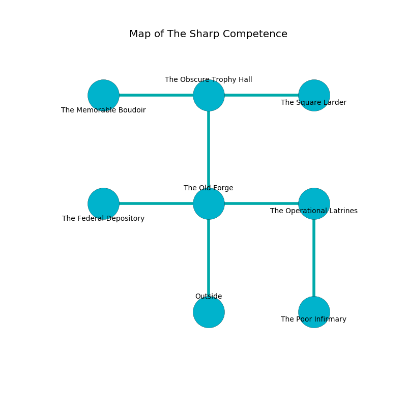

%Ruin Dogs

##The Sharp Competence
###Overview
The Sharp Competence is located on a poisoned city. Some rooms of it are cursed. A windstorm is happening outside. It is occupied by Goblins. Cole Beckett The Boastful, a Drow Priestess of Lolth is here. The Goblins are the minions of Cole Beckett The Boastful. He  is founding a new religion. 

###Artifact
####Iehel Fadadaedaeum

Iehel Fadadaedaeum has the form of a wet monument. Cacophony bends from it. It is a medium orange color. When touched it illuminates its surroundings. 

###Locations

####the old forge
White lichens are swaying from the ceiling. The air tastes like lamb here. The floor is bloodstained. There are a Triceratops, a Vampire Spawn, and a Sahuagin Priestess here. The wooden walls are scratched. 

There is an engraving on a tablet written in Goblins Script. 

> Oh my! life is woe
>
> it is always distinct
>
> yet low
>
> everything is extinct
>

* To the west a twisted gap leads to [the federal depository](#the-federal-depository).
* To the east a flooded passageway leads to [the operational latrines](#the-operational-latrines).
* To the north a small passageway opens to [the obscure trophy hall](#the-obscure-trophy-hall).
* To the south is the entrance.

####the obscure trophy hall
White lichens are decaying from the ceiling. The air tastes like mahogany here. 

* [Iehel Fadadaedaeum](#Iehel-Fadadaedaeum) is here.
* To the west a hazy pathway leads to [the memorable boudoir](#the-memorable-boudoir).
* To the east a torchlit path opens to [the square larder](#the-square-larder).
* To the south a small passageway opens to [the old forge](#the-old-forge).

####the operational latrines
There is a trap here. When activated, a magical rune will launch a blade. The floor is smooth. The air smells like feces here. 

* To the west a flooded passageway connects to [the old forge](#the-old-forge).
* To the south a dripping hall leads to [the poor infirmary](#the-poor-infirmary).

####the square larder
The brick walls are ruined. The air tastes like lamb here. There are a Sprite, a Riding Horse, a Galeb Duhr, a Giant Weasel, a Gas Spore, and a Giant Constrictor Snake here. 

There is an engraving on the floor written in Goblins Script. 

> Oh my! meak we
>
> it is never free
>
> charismatic, skilled, international
>
> life is national
>

* [Cole Beckett The Boastful](#Cole-Beckett-The-Boastful) is here.
* To the west a torchlit path connects to [the obscure trophy hall](#the-obscure-trophy-hall).

####the federal depository
Yellow mushrooms are growing from the ceiling. 

* To the east a twisted gap leads to [the old forge](#the-old-forge).

####the poor infirmary
There are a Goblin, a Hobgoblin, three Hobgoblin Captains,  here. The wooden walls are unsettled. Gray moss is decaying in broken urns. The air smells like naphthyl here. The Goblins are performing a ritual. If not interrupted, a powerful monster will be summoned. 

* To the north a dripping hall connects to [the operational latrines](#the-operational-latrines).

####the memorable boudoir
The floor is glossy. The air smells like ginger here. 

* To the east a hazy pathway leads to [the obscure trophy hall](#the-obscure-trophy-hall).

