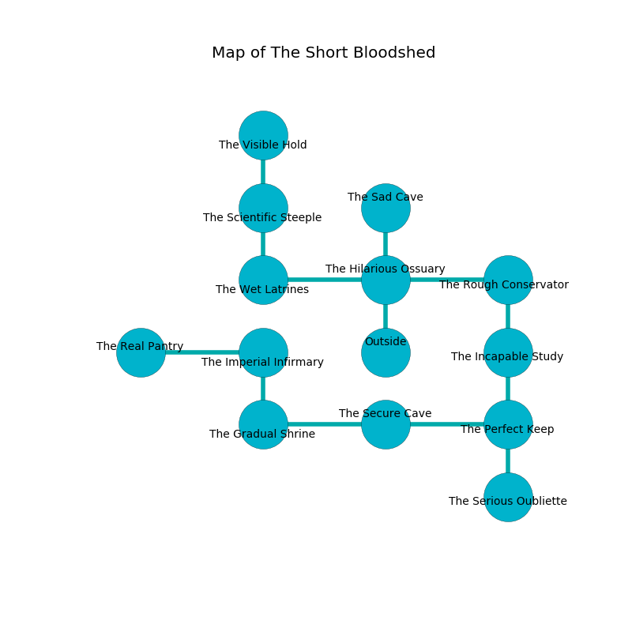

%Ruin Dogs

##The Short Bloodshed
###Overview
The Short Bloodshed is located under a volcanic tree. Parts of it are cursed. A massive flood is happening outside. It is occupied by Harpies. Delores Peebles The Miserly, a Kuo-Toa Archpriest is here. The Harpies are the slaves of Delores Peebles The Miserly. She  is trying to recover [Daehh Gofmaedofa](#Daehh-Gofmaedofa). 

###Artifact
####Daehh Gofmaedofa

Daehh Gofmaedofa has the form of a soft blade. Magic bends towards it. It smells like grapefruit. When worshipped it becomes a force of destiny. 

###Locations

####the hilarious ossuary
Yellow mushrooms are growing from the walls. The floor is cluttered with shells. 

There is an engraving on the floor written in Harpies Script. 

> O sorry soul
>
> compatible and whole
>
> it is always aesthetic
>
> sadness is magnetic
>

* [Delores Peebles The Miserly](#Delores-Peebles-The-Miserly) is here.
* To the west a flooded cave connects to [the wet latrines](#the-wet-latrines).
* To the east a hazy gap leads to [the rough conservatory](#the-rough-conservatory).
* To the north a dark pathway opens to [the sad cave](#the-sad-cave).
* To the south is the entrance.

####the rough conservatory
The floor is cluttered with shells. There are a Lizardfolk Shaman, a Cambion, and an Animated Armor here. 

* To the west a hazy gap opens to [the hilarious ossuary](#the-hilarious-ossuary).
* To the south a windy cave connects to [the incapable study](#the-incapable-study).

####the wet latrines
The floor is smooth. Blue ferns are swaying from the walls. The stone walls are unsettled. The air smells like gooseberry here. There are a Giant Wolf Spider, a Cockatrice, a Lizard King, a Giant Sea Horse, and an Elephant here. 

* There is a leprechaun here.
* To the east a flooded cave leads to [the hilarious ossuary](#the-hilarious-ossuary).
* To the north a long hallway opens to [the scientific steeple](#the-scientific-steeple).

####the incapable study
The concrete walls are scratched. The air tastes like avocado here. 

* To the north a windy cave leads to [the rough conservatory](#the-rough-conservatory).
* To the south a small gap opens to [the perfect keep](#the-perfect-keep).

####the perfect keep
Red lichens are swaying from the walls. There are a Giant Eagle, a Jackalwere, a Shadow, a Lemure, a Gnoll, a Spider, a Sea Horse, a Killer Whale, and an Owlbear here. 

* [Daehh Gofmaedofa](#Daehh-Gofmaedofa) is here.
* To the west a hazy cave leads to [the secure cave](#the-secure-cave).
* To the north a small gap connects to [the incapable study](#the-incapable-study).
* To the south a windy gap leads to [the serious oubliette](#the-serious-oubliette).

####the secure cave
The brick walls are covered in mold. There are six Harpies here. The Harpies are performing a ritual. If not interrupted, [Delores Peebles](#Delores-Peebles) will be magically alarmed. 

There is an engraving on a monolith written in common. 

> I could not try leaving.
>

* There is a carriage here.
* There is a church here.
* To the west a windy hallway connects to [the gradual shrine](#the-gradual-shrine).
* To the east a hazy cave leads to [the perfect keep](#the-perfect-keep).

####the sad cave
The mirrored walls are unsettled. Yellow mushrooms are sprouting in broken urns. 

There is an engraving on the floor written in Harpies Script. 

> A gun is a junction
>
> intense, ignorant, encouraging
>

* There is a brain here.
* To the south a dark pathway opens to [the hilarious ossuary](#the-hilarious-ossuary).

####the gradual shrine
The floor is glossy. 

There is an engraving on a tablet written in Harpies Script. 

> I am defending The Short Bloodshed.
>

* To the east a windy hallway opens to [the secure cave](#the-secure-cave).
* To the north a long passageway leads to [the imperial infirmary](#the-imperial-infirmary).

####the imperial infirmary
The wooden walls are pristine. The air tastes like peanut butter here. There are a Lamia and a Bulette here. 

* To the west a flooded walkway connects to [the real pantry](#the-real-pantry).
* To the south a long passageway opens to [the gradual shrine](#the-gradual-shrine).

####the scientific steeple
Yellow moss is decaying in cracks in the floor. The stone walls are pristine. The floor is cluttered with broken glass. 

* To the north a hazy hall leads to [the visible hold](#the-visible-hold).
* To the south a long hallway connects to [the wet latrines](#the-wet-latrines).

####the real pantry
The air smells like onion here. The floor is bloodstained. There are six Harpies here. The Harpies are performing a ritual. If not interrupted, the Harpies will become more powerful. 

* To the east a flooded walkway connects to [the imperial infirmary](#the-imperial-infirmary).

####the visible hold
White ferns are sprouting in cracks in the floor. There are an Ape, an Ochre Jelly, an Incubus, and a Pegasus here. The floor is sticky. The air tastes like melon here. 

There is an engraving on the wall written in Harpies Script. 

> [Daehh Gofmaedofa](#Daehh-Gofmaedofa)
>
> automatic, soft, sufficient
>
> always sympathetic
>
> miserable and personal
>
> [Daehh Gofmaedofa](#Daehh-Gofmaedofa)
>

* There is a trousers here.
* To the south a hazy hall opens to [the scientific steeple](#the-scientific-steeple).

####the serious oubliette
The air smells like curry here. The stone walls are bloodstained. 

* To the north a windy gap opens to [the perfect keep](#the-perfect-keep).

