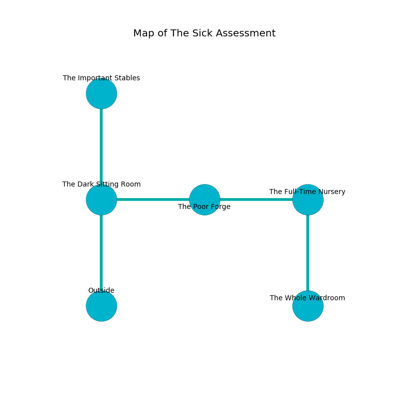

%Ruin Dogs

##The Sick Assessment
###Overview
The Sick Assessment is located on a broken mountain. Regions of it are unbearably cold. A massive storm is happening outside. It is occupied by Centaurs. Clement Medina The Belligerent, an Orc War Chief is here. The Centaurs are the slaves of Clement Medina The Belligerent. He  is founding a new religion. 

###Artifact
####The Unexpected Mine

The Unexpected Mine has the form of a warm monument. It smells like pear skin. Light pours from it. When smelled it shows an image of the future. 

###Locations

####the dark sitting Room
The air tastes like root here. There is a trap here. When activated, a tripwire will open a large pit in the floor. The obsidion walls are pristine. Yellow moss is decaying from the ceiling. The floor is bloodstained. 

* There is a rod here.
* To the east a narrow artery opens to [the poor forge](#the-poor-forge).
* To the north a windy pathway opens to [the important stables](#the-important-stables).
* To the south is the entrance.

####the poor forge
Red razorgrass is decaying from the walls. There is a trap here. When activated, a pressure plate will open a large pit in the floor. The obsidion walls are bloodstained. The floor is sticky. There are a Deer, a Giant Scorpion, a Dire Wolf, a Priest, a Giant fire beetle, a Young Faerie Dragon, a Cultist, and a Giant Crab here. 

* There is an eye here.
* There is a wight here.
* There is a lyre here.
* There is a book here.
* To the west a narrow artery opens to [the dark sitting Room](#the-dark-sitting-Room).
* To the east a long walkway opens to [the full-time nursery](#the-full-time-nursery).

####the full-time nursery
Red lichens are decaying in a patch on the floor. 

* There is a basket here.
* [The Unexpected Mine](#The-Unexpected-Mine) is here.
* To the west a long walkway leads to [the poor forge](#the-poor-forge).
* To the south a small pathway leads to [the whole wardroom](#the-whole-wardroom).

####the important stables
The floor is bloodstained. The air smells like frankincense here. Blue ferns are decaying in a patch on the floor. 

There is an engraving on a monolith written in Centaurs Script. 

> O weak god
>
> yet odd
>
> but multiple
>
> the world is odd
>

* [Clement Medina The Belligerent](#Clement-Medina-The-Belligerent) is here.
* To the south a windy pathway connects to [the dark sitting Room](#the-dark-sitting-Room).

####the whole wardroom
There are a Night Hag, an Ankylosaurus, and a Manes here. The floor is smooth. The concrete walls are bloodstained. 

* To the north a small pathway leads to [the full-time nursery](#the-full-time-nursery).

