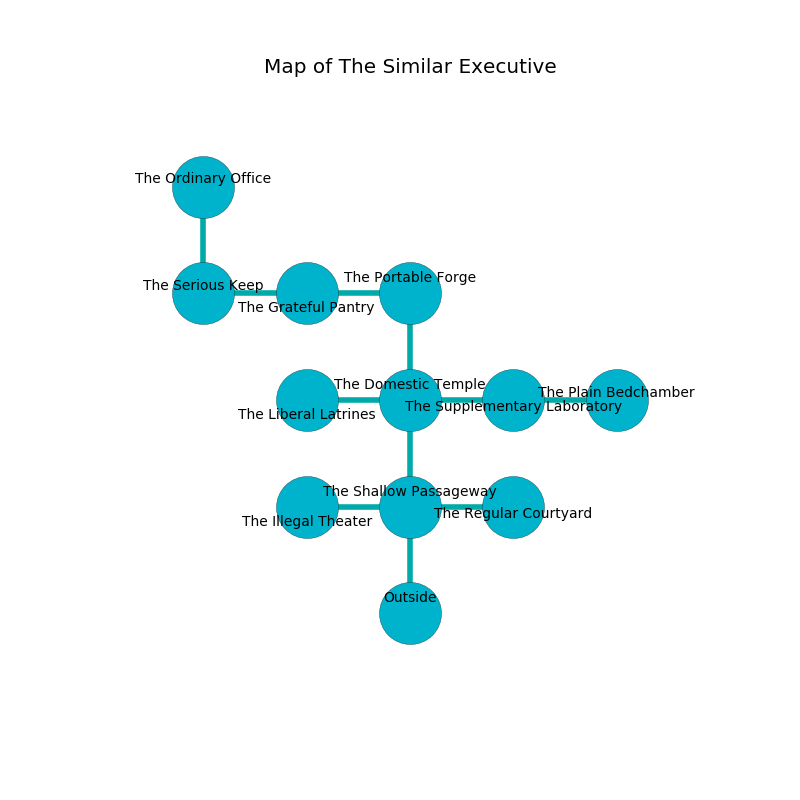

%Ruin Dogs

##The Similar Executive
###Overview
The Similar Executive is located in an obsidion city. Regions of it are flooded. The ruin is flooding. It is occupied by Deep Gnomes. Jinny Reis The Interfering, a Bearded Devil is here. The Deep Gnomes are the minions of Jinny Reis The Interfering. She  is founding a new religion. 

###Artifact
####Laeic Dmuduhfedmaf

Laeic Dmuduhfedmaf is a powerful artifact in the shape of a smooth meteorite. It smells like currant. It is a bright red color. When thrown it curses all nearby. 

###Locations

####the shallow passageway
The floor is flooded with eight inch deep lukewarm water. The crystal walls are scratched. The air tastes like lychee here. 

* [Jinny Reis The Interfering](#Jinny-Reis-The-Interfering) is here.
* To the west a torchlit threshold connects to [the illegal theater](#the-illegal-theater).
* To the east a hazy hallway connects to [the regular courtyard](#the-regular-courtyard).
* To the north a dripping cavern opens to [the domestic temple](#the-domestic-temple).
* To the south is the entrance.

####the illegal theater
The air tastes like capers here. The floor is glossy. Green ferns are decaying from the ceiling. There are four Deep Gnomes here. The Deep Gnomes are crazy with bloodlust. 

* To the east a torchlit threshold connects to [the shallow passageway](#the-shallow-passageway).

####the regular courtyard
There are a Rug of Smothering and a Manes here. Gray moss is swaying from the ceiling. There is a trap here. When activated, a magical sound detector will launch stone blocks from the ceiling. The floor is glossy. 

* To the west a hazy hallway opens to [the shallow passageway](#the-shallow-passageway).

####the domestic temple
The air tastes like rye bread here. The wooden walls are covered in mold. 

There is an engraving on a monolith written in common. 

> A trap ahead.
>

* To the west a dark hall leads to [the liberal latrines](#the-liberal-latrines).
* To the east a hazy cavern opens to [the supplementary laboratory](#the-supplementary-laboratory).
* To the north a dark artery connects to [the portable forge](#the-portable-forge).
* To the south a dripping cavern leads to [the shallow passageway](#the-shallow-passageway).

####the portable forge
Yellow razorgrass is sprouting from the ceiling. The air tastes like logenberry here. The floor is glossy. 

* To the west a dripping cavern opens to [the grateful pantry](#the-grateful-pantry).
* To the south a dark artery connects to [the domestic temple](#the-domestic-temple).

####the supplementary laboratory
The obsidion walls are scratched. 

* [Laeic Dmuduhfedmaf](#Laeic-Dmuduhfedmaf) is here.
* To the west a hazy cavern opens to [the domestic temple](#the-domestic-temple).
* To the east a twisted passageway connects to [the plain bedchamber](#the-plain-bedchamber).

####the grateful pantry
The floor is smooth. White ferns are sprouting from the walls. The crystal walls are unsettled. 

* To the west a long path connects to [the serious keep](#the-serious-keep).
* To the east a dripping cavern leads to [the portable forge](#the-portable-forge).

####the liberal latrines
The floor is smooth. There are four Deep Gnomes here. The obsidion walls are ruined. One of the Deep Gnomes is on watch, the rest are caring for babies. 

* To the east a dark hall connects to [the domestic temple](#the-domestic-temple).

####the serious keep
The concrete walls are ruined. The floor is bloodstained. The air smells like asparagus here. 

* There is a rat here.
* To the east a long path leads to [the grateful pantry](#the-grateful-pantry).
* To the north a long artery connects to [the ordinary office](#the-ordinary-office).

####the ordinary office
There are a Poisonous Snake, a Spined Devil, a Commoner, and a Vulture here. The glass walls are bloodstained. 

* To the south a long artery leads to [the serious keep](#the-serious-keep).

####the plain bedchamber
The floor is cluttered with debris. White mushrooms are decaying in broken urns. 

There is an engraving on a monolith written in common. 

> O my fate is poor
>
> square and blank
>
> it is always premature
>
> hope is frank
>

* There is a drake here.
* To the west a twisted passageway leads to [the supplementary laboratory](#the-supplementary-laboratory).

