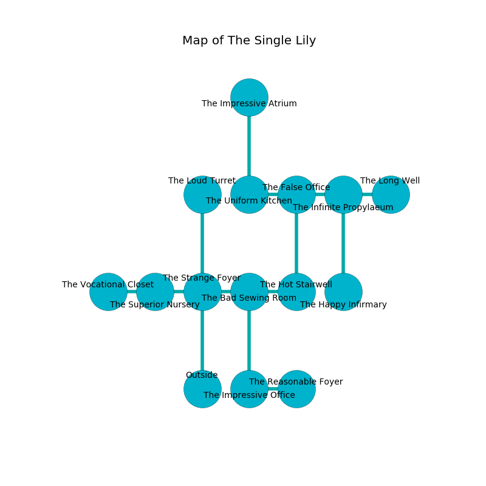

%Ruin Dogs

##The Single Lily
###Overview
The Single Lily is located under a cursed mountain. Regions of The Single Lily are somewhat hot. The ruin is collapsing slowly. It is occupied by Sprites. Cyndi Burdette The Nasty, a Mind Flayer Arcanist is here. The Sprites are the slaves of Cyndi Burdette The Nasty. She  is trying to destroy [Camioi Gaehofa](#Camioi-Gaehofa). 

###Artifact
####Camioi Gaehofa

Camioi Gaehofa has the form of a glassy cube. Psychic energy pours from it. When gazed upon it floats in the air. 

###Locations

####the strange foyer
The floor is cluttered with rocks. White moss is sprouting from the ceiling. The air smells like styrene here. The glass walls are caving in. 

* To the west a torchlit passageway connects to [the superior nursery](#the-superior-nursery).
* To the east a small hallway opens to [the bad sewing room](#the-bad-sewing-room).
* To the north a dripping cave leads to [the loud turret](#the-loud-turret).
* To the south is the entrance.

####the bad sewing room
White lichens are swaying in cracks in the floor. The air smells like smoke here. The floor is cluttered with rocks. The glass walls are caving in. 

* There is a shoe here.
* To the west a small hallway connects to [the strange foyer](#the-strange-foyer).
* To the east a windy cavern connects to [the hot stairwell](#the-hot-stairwell).
* To the south a small hallway opens to [the impressive office](#the-impressive-office).

####the impressive office
The concrete walls are ruined. The air smells like privet blossom here. There is a trap here. When activated, a magical rune will open a trapdoor in the floor. 

* There is a skull here.
* To the east a flooded hallway opens to [the reasonable foyer](#the-reasonable-foyer).
* To the north a small hallway opens to [the bad sewing room](#the-bad-sewing-room).

####the loud turret
The air tastes like peach here. The floor is bloodstained. The glass walls are bloodstained. There are thirty two Sprites here. One of the Sprites is working a mechanism that can launch acid at the Ruin Dogs. 

* To the south a dripping cave opens to [the strange foyer](#the-strange-foyer).

####the superior nursery
There are thirty two Sprites here. The Sprites are willing to negotiate. 

* To the west a narrow gap connects to [the vocational closet](#the-vocational-closet).
* To the east a torchlit passageway connects to [the strange foyer](#the-strange-foyer).

####the hot stairwell
Red moss is sprouting in a patch on the floor. The floor is flooded with two inch deep cool water. 

* There is a bridge here.
* To the west a windy cavern leads to [the bad sewing room](#the-bad-sewing-room).
* To the north a windy cave connects to [the false office](#the-false-office).

####the false office
The mirrored walls are covered in mold. The air tastes like tolu here. The floor is glossy. 

* To the west a windy hallway connects to [the uniform kitchen](#the-uniform-kitchen).
* To the east a flooded threshold connects to [the infinite propylaeum](#the-infinite-propylaeum).
* To the south a windy cave connects to [the hot stairwell](#the-hot-stairwell).

####the reasonable foyer
There are thirty two Sprites here. Blue razorgrass is sprouting from the walls. The floor is glossy. The Sprites are celebrating. 

* To the west a flooded hallway opens to [the impressive office](#the-impressive-office).

####the infinite propylaeum
The air tastes like fruit here. There are thirty two Sprites here. White lichens are swaying in cracks in the floor. The floor is smooth. The Sprites are willing to negotiate. 

* [Camioi Gaehofa](#Camioi-Gaehofa) is here.
* To the west a flooded threshold leads to [the false office](#the-false-office).
* To the east a flooded artery leads to [the long well](#the-long-well).
* To the south a dripping cavern connects to [the happy infirmary](#the-happy-infirmary).

####the long well
The mirrored walls are ruined. There are thirty two Sprites here. The Sprites are defending this room from intruders. 

* There is a nut here.
* To the west a flooded artery leads to [the infinite propylaeum](#the-infinite-propylaeum).

####the uniform kitchen
The air tastes like feces here. 

* [Cyndi Burdette The Nasty](#Cyndi-Burdette-The-Nasty) is here.
* To the east a windy hallway connects to [the false office](#the-false-office).
* To the north a flooded artery leads to [the impressive atrium](#the-impressive-atrium).

####the impressive atrium
Gray mushrooms are decaying from the walls. There are thirty two Sprites here. The floor is smooth. The Sprites are crazy with bloodlust. 

* To the south a flooded artery opens to [the uniform kitchen](#the-uniform-kitchen).

####the vocational closet
There are an Ettin, a Bandit Captain, an Ogre Zombie, and an Acolyte here. The floor is flooded with seven inch deep cold water. The air tastes like powder here. There is a trap here. When activated, a tripwire will ring a bell. Blue razorgrass is growing in a patch on the floor. 

* To the east a narrow gap connects to [the superior nursery](#the-superior-nursery).

####the happy infirmary
There are thirty two Sprites here. The Sprites are fighting amongst themselves. 

* To the north a dripping cavern leads to [the infinite propylaeum](#the-infinite-propylaeum).

