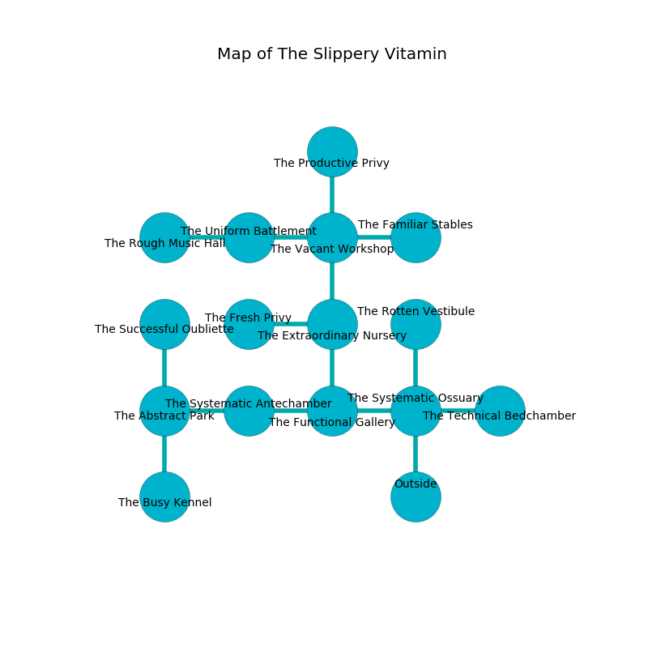

%Ruin Dogs

##The Slippery Vitamin
###Overview
The Slippery Vitamin is located in an obsidion city. Parts of it are frozen. The ruin is collapsing slowly. It is occupied by Vampires. Leif Merrell The Flirtatious, a Fire Giant is here. The Vampires have been charmed by Leif Merrell The Flirtatious. He  is trying to recover [The Academic Moment](#The-Academic-Moment). 

###Artifact
####The Academic Moment

The Academic Moment looks like a broken sphere. Fire slides away from it. It smells like acetone. When gazed upon it illuminates its surroundings. 

###Locations

####the systematic ossuary
The air tastes like origanum here. The concrete walls are bloodstained. The floor is cluttered with bones. 

* To the west a torchlit threshold opens to [the functional gallery](#the-functional-gallery).
* To the east a windy gap connects to [the technical bedchamber](#the-technical-bedchamber).
* To the north a dripping path leads to [the rotten vestibule](#the-rotten-vestibule).
* To the south is the entrance.

####the technical bedchamber
The glass walls are ruined. The air smells like cinnamon here. There are a Blink Dog, a Lamia, a Shambling Mound, and a Berserker here. 

There is an engraving on a monolith written in common. 

> O cruel fate
>
> cruel, grand, thick
>
> miserable, urban, straight
>
> the world is sick
>

* To the west a windy gap connects to [the systematic ossuary](#the-systematic-ossuary).

####the rotten vestibule
The air tastes like walnut here. 

* There is a door here.
* There is a bowl here.
* There is a trousers here.
* [Leif Merrell The Flirtatious](#Leif-Merrell-The-Flirtatious) is here.
* To the south a dripping path connects to [the systematic ossuary](#the-systematic-ossuary).

####the functional gallery
The air smells like green onion here. The floor is bloodstained. The concrete walls are ruined. There are two Vampire Spawns here. The Vampires are performing a ritual. If not interrupted, the Vampires will become more powerful. 

* To the west a long artery connects to [the systematic antechamber](#the-systematic-antechamber).
* To the east a torchlit threshold leads to [the systematic ossuary](#the-systematic-ossuary).
* To the north a hazy artery leads to [the extraordinary nursery](#the-extraordinary-nursery).

####the extraordinary nursery
The air tastes like absinthe here. The floor is smooth. 

* To the west a twisted passageway leads to [the fresh privy](#the-fresh-privy).
* To the north a dripping pathway connects to [the vacant workshop](#the-vacant-workshop).
* To the south a hazy artery connects to [the functional gallery](#the-functional-gallery).

####the vacant workshop
There are a Frog, a Revenant, and a Frost Giant here. 

* To the west a dripping hall leads to [the uniform battlement](#the-uniform-battlement).
* To the east a small threshold leads to [the familiar stables](#the-familiar-stables).
* To the north a flooded hall connects to [the productive privy](#the-productive-privy).
* To the south a dripping pathway connects to [the extraordinary nursery](#the-extraordinary-nursery).

####the systematic antechamber
The air smells like banana peel here. The wooden walls are pristine. There are two Vampire Spawns here. Gray ferns are growing in cracks in the floor. One of the Vampires is on watch, the rest are drunk. 

* To the west a dripping corridor connects to [the abstract park](#the-abstract-park).
* To the east a long artery opens to [the functional gallery](#the-functional-gallery).

####the abstract park
Gray mushrooms are sprouting in broken urns. The air smells like licorice here. The floor is smooth. There is a trap here. When activated, a magical proximity detector will make the walls close in. 

* To the east a dripping corridor leads to [the systematic antechamber](#the-systematic-antechamber).
* To the north a twisted gap connects to [the successful oubliette](#the-successful-oubliette).
* To the south a narrow corridor opens to [the busy kennel](#the-busy-kennel).

####the busy kennel
Gray ferns are swaying in a patch on the floor. The floor is bloodstained. The air tastes like banana here. There are two Vampire Spawns here. The wooden walls are pristine. The Vampires are defending this room from intruders. 

* To the north a narrow corridor opens to [the abstract park](#the-abstract-park).

####the successful oubliette
There is a trap here. When activated, a magical rune will make the walls close in. There are a Lamia, a Veteran, a Giant Elk, and a Giant Boar here. The glass walls are caving in. Gray razorgrass is growing from the walls. 

* To the south a twisted gap connects to [the abstract park](#the-abstract-park).

####the familiar stables
There are two Vampire Spawns here. The air tastes like urine here. The Vampires are performing a ritual. If not interrupted, the Vampires will become more powerful. 

* There is a dagger here.
* To the west a small threshold connects to [the vacant workshop](#the-vacant-workshop).

####the productive privy
The floor is cluttered with bones. The air tastes like buttery	cabbage here. The brick walls are covered in mold. 

* To the south a flooded hall opens to [the vacant workshop](#the-vacant-workshop).

####the fresh privy
The air smells like lavender here. The floor is bloodstained. Red ferns are decaying in broken urns. 

* To the east a twisted passageway leads to [the extraordinary nursery](#the-extraordinary-nursery).

####the uniform battlement
The air tastes like absinthe here. There are a Salamander, a Brown Bear, and a Troll here. The floor is smooth. The brick walls are ruined. 

* There is a roof here.
* There is a nail here.
* There is a cord here.
* [The Academic Moment](#The-Academic-Moment) is here.
* To the west a torchlit artery connects to [the rough music hall](#the-rough-music-hall).
* To the east a dripping hall connects to [the vacant workshop](#the-vacant-workshop).

####the rough music hall
There are a Red Dragon Wyrmling, a Jackalwere, a Giant Goat, a Worg, a Fire Snake, and a Couatl here. The air tastes like eggs here. Green moss is growing in cracks in the floor. 

There is an engraving on the ceiling written in common. 

> Oh sad fate
>
> practical, joint, late
>
> yet never tense
>
> everything is late
>

* To the east a torchlit artery leads to [the uniform battlement](#the-uniform-battlement).

