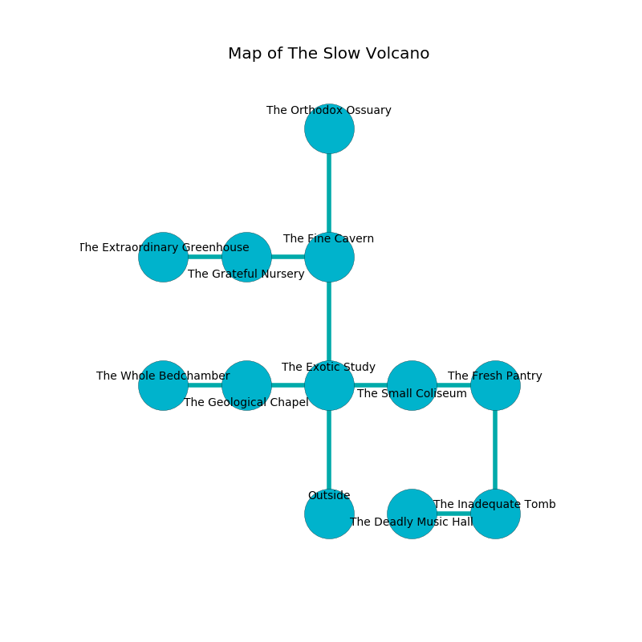

%Ruin Dogs

##The Slow Volcano
###Overview
The Slow Volcano is located in an obsidion rift. Some rooms of The Slow Volcano are flooded. The ruin is sinking into the earth. It is occupied by Goblins. Byron Rich The Interfering, a Myconid Sovereign is here. The Goblins are the soldiers of Byron Rich The Interfering. He  is trying to discover [The Certain Sound](#The-Certain-Sound). 

###Artifact
####The Certain Sound

The Certain Sound is a powerful artifact in the shape of a hard doll. It smells like licorice. It is a medium pink color. When worn it levitates surrounding objects. 

###Locations

####the exotic study

There is an engraving on the ceiling written in common. 

> Dear me! pitiful we
>
> frozen, rural, unaware
>
> plain and free
>
> nothing is fair
>

* To the west a narrow path connects to [the geological chapel](#the-geological-chapel).
* To the east a dripping path connects to [the small coliseum](#the-small-coliseum).
* To the north a flooded cavern opens to [the fine cavern](#the-fine-cavern).
* To the south is the entrance.

####the fine cavern
The air smells like mint here. The floor is smooth. 

There is an engraving on the ceiling written in common. 

> All of us are envious
>
> artificial and distant
>
> short, frequent, practical
>
> A clock is a deviation
>
> efficient, commercial, tired
>
> but never particular
>

* To the west a dark threshold opens to [the grateful nursery](#the-grateful-nursery).
* To the north a torchlit threshold leads to [the orthodox ossuary](#the-orthodox-ossuary).
* To the south a flooded cavern connects to [the exotic study](#the-exotic-study).

####the small coliseum
The air smells like horhound here. The floor is glossy. 

* To the west a dripping path opens to [the exotic study](#the-exotic-study).
* To the east a narrow cavern opens to [the fresh pantry](#the-fresh-pantry).

####the grateful nursery
There are two Goblins and three Hobgoblins here. The floor is cluttered with debris. The obsidion walls are unsettled. The Goblins are willing to negotiate. 

There is an engraving on a tablet written in common. 

> Poor me! terrible you
>
> absolute, fastidious, due
>
> it is always new
>
> life is new
>

* To the west a dripping hall leads to [the extraordinary greenhouse](#the-extraordinary-greenhouse).
* To the east a dark threshold leads to [the fine cavern](#the-fine-cavern).

####the orthodox ossuary
There are two Goblins and three Hobgoblins here. The floor is flooded with three inch deep cool water. The Goblins are willing to negotiate. 

* There is a diamond here.
* To the south a torchlit threshold leads to [the fine cavern](#the-fine-cavern).

####the geological chapel
The brick walls are caving in. There are four Goblins and two Hobgoblins here. The floor is flooded with four inch deep hot water. The air tastes like cantaloupe here. The Goblins are berserk with rage. 

There is an engraving on the wall written in common. 

> I am looting this place.
>

* [The Certain Sound](#The-Certain-Sound) is here.
* To the west a flooded opening leads to [the whole bedchamber](#the-whole-bedchamber).
* To the east a narrow path leads to [the exotic study](#the-exotic-study).

####the fresh pantry
The wooden walls are unsettled. The air smells like feces here. The floor is flooded with seven inch deep hot water. 

There is an engraving on the wall written in Goblins Script. 

> Dear me! dire soul
>
> sympathetic, genuine, whole
>
> rural and rural
>
> nothing is whole
>

* To the west a narrow cavern leads to [the small coliseum](#the-small-coliseum).
* To the south a windy passageway leads to [the inadequate tomb](#the-inadequate-tomb).

####the inadequate tomb

* There is a cake here.
* To the west a torchlit passageway opens to [the deadly music hall](#the-deadly-music-hall).
* To the north a windy passageway opens to [the fresh pantry](#the-fresh-pantry).

####the deadly music hall
The air tastes like styrene here. The floor is flooded with six inch deep cold water. There are a Goblin and four Hobgoblins here. The Goblins are crazy with bloodlust. 

There is an engraving on the wall written in Goblins Script. 

> I want to find [The Certain Sound](#The-Certain-Sound).
>

* To the east a torchlit passageway leads to [the inadequate tomb](#the-inadequate-tomb).

####the extraordinary greenhouse
The stone walls are pristine. Green mushrooms are sprouting in a patch on the floor. The air smells like petitgrain here. 

* To the east a dripping hall leads to [the grateful nursery](#the-grateful-nursery).

####the whole bedchamber
Yellow razorgrass is sprouting in cracks in the floor. The floor is sticky. 

There is an engraving on the ceiling written in common. 

> Treasure here.
>

* There is a potato here.
* [Byron Rich The Interfering](#Byron-Rich-The-Interfering) is here.
* To the east a flooded opening connects to [the geological chapel](#the-geological-chapel).

