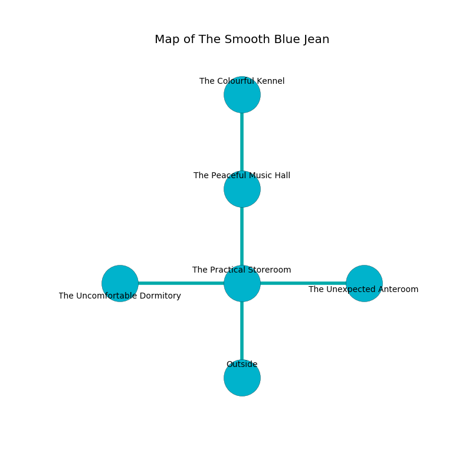

%Ruin Dogs

##The Smooth Blue Jean
###Overview
The Smooth Blue Jean is constructed on a broken plain. Regions of it are flooded. A massive flood is happening outside. It is occupied by Kobolds. Broderick Somers The Aggressive, a Cambion is here. The Kobolds are ruled by Broderick Somers The Aggressive. He  is founding a new religion. 

###Artifact
####The Memorable Personality

The Memorable Personality looks like a broken orb. When worn it grants power to its owner. 

###Locations

####the practical storeroom
The floor is cluttered with ashes. 

* [The Memorable Personality](#The-Memorable-Personality) is here.
* To the west a flooded hall opens to [the uncomfortable dormitory](#the-uncomfortable-dormitory).
* To the east a hazy artery leads to [the unexpected anteroom](#the-unexpected-anteroom).
* To the north a hazy artery leads to [the peaceful music hall](#the-peaceful-music-hall).
* To the south is the entrance.

####the peaceful music hall
There is a trap here. When activated, a pressure plate will launch a poison dart. There are a Lion, a Cultist, a Flameskull, and a Scorpion here. The concrete walls are unsettled. The air smells like cardamom here. 

* [Broderick Somers The Aggressive](#Broderick-Somers-The-Aggressive) is here.
* To the north a long threshold leads to [the colourful kennel](#the-colourful-kennel).
* To the south a hazy artery opens to [the practical storeroom](#the-practical-storeroom).

####the colourful kennel
The floor is smooth. The air tastes like grease here. Gray mushrooms are growing in cracks in the floor. 

* To the south a long threshold connects to [the peaceful music hall](#the-peaceful-music-hall).

####the uncomfortable dormitory
The crystal walls are bloodstained. 

* There is a horse here.
* To the east a flooded hall leads to [the practical storeroom](#the-practical-storeroom).

####the unexpected anteroom
There are ten Winged Kobolds and twelve Kobolds here. Gray lichens are swaying in a patch on the floor. The mirrored walls are ruined. The floor is flooded with four inch deep hot water. The air tastes like cream here. The Kobolds are performing a ritual. If not interrupted, [Broderick Somers](#Broderick-Somers) will be magically alarmed. 

* To the west a hazy artery connects to [the practical storeroom](#the-practical-storeroom).

