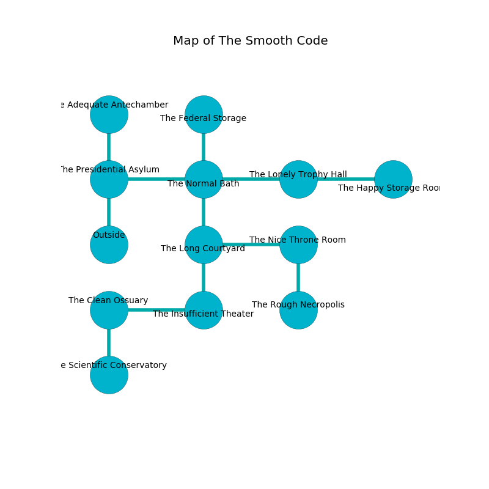

%Ruin Dogs

##The Smooth Code
###Overview
The Smooth Code is located in a volcanic mountain. Regions of The Smooth Code are cursed. A lunar eclipse is happening outside. It is occupied by Drows. Dante Tijerina The Thoughtless, a Druid is here. The Drows are the minions of Dante Tijerina The Thoughtless. He  is trying to exploit [Iofhafwi](#Iofhafwi). 

###Artifact
####Iofhafwi

Iofhafwi is a powerful artifact in the shape of a mushy crystal. When held it ignites its surrroundings. 

###Locations

####the presidential asylum
The floor is bloodstained. The air smells like wasabi here. White lichens are swaying from the ceiling. 

There is an engraving on the ceiling written in common. 

> Poor me! meak fate
>
> memorable and great
>
> oral and ambitious
>
> death is vicious
>

* To the east a dark passageway opens to [the normal bath](#the-normal-bath).
* To the north a long hallway leads to [the adequate antechamber](#the-adequate-antechamber).
* To the south is the entrance.

####the normal bath
The floor is cluttered with broken glass. Blue lichens are sprouting from the ceiling. 

* To the west a dark passageway leads to [the presidential asylum](#the-presidential-asylum).
* To the east a small cave leads to [the lonely trophy hall](#the-lonely-trophy-hall).
* To the north a torchlit artery opens to [the federal storage](#the-federal-storage).
* To the south a dripping opening opens to [the long courtyard](#the-long-courtyard).

####the federal storage
The floor is flooded with eight inch deep cool water. There is a Githyanki Warrior here. The air tastes like tolu here. White ferns are growing from the walls. 

* To the south a torchlit artery opens to [the normal bath](#the-normal-bath).

####the lonely trophy hall
The floor is smooth. There are twelve Drows here. Gray ferns are sprouting from the walls. The air tastes like orris here. The Drows are willing to fight to the death. 

There is an engraving on the ceiling written in common. 

> All of us are sorrowful
>
> controversial, presidential, left
>
> We are free
>
> confident and close
>
> You are joyful
>
> childish, controversial, popular
>

* There is a dagger here.
* [Iofhafwi](#Iofhafwi) is here.
* To the west a small cave connects to [the normal bath](#the-normal-bath).
* To the east a small artery opens to [the happy storage room](#the-happy-storage-room).

####the long courtyard
Red mushrooms are sprouting in broken urns. The floor is smooth. 

There is an engraving on a stone written in Drows Script. 

> We are maddened
>
> conventional and interactive
>
> You are free
>
> temporary and structural
>
> ethnic and complete
>
> They are joyful
>
> ever kind
>
> careful and perfect
>
> A fly is a tycoon
>
> yet never maximum
>
> first and superior
>
> [Iofhafwi](#Iofhafwi)
>
> yet ethical
>
> monthly, political, intense
>
> occupational and annual
>
> [Iofhafwi](#Iofhafwi)
>
> tense and negative
>
> political, particular, objective
>
> [Iofhafwi](#Iofhafwi)
>
> yet never predictable
>

* To the east a dripping walkway opens to [the nice throne room](#the-nice-throne-room).
* To the north a dripping opening connects to [the normal bath](#the-normal-bath).
* To the south a dark passageway leads to [the insufficient theater](#the-insufficient-theater).

####the nice throne room
The metallic walls are scratched. There is a Nightmare here. 

* There is a dagger here.
* There is a head here.
* To the west a dripping walkway leads to [the long courtyard](#the-long-courtyard).
* To the south a flooded artery opens to [the rough necropolis](#the-rough-necropolis).

####the insufficient theater
The floor is flooded with six inch deep scalding water. 

* There is a belt here.
* [Dante Tijerina The Thoughtless](#Dante-Tijerina-The-Thoughtless) is here.
* To the west a long hallway leads to [the clean ossuary](#the-clean-ossuary).
* To the north a dark passageway connects to [the long courtyard](#the-long-courtyard).

####the rough necropolis
The air smells like sweet pea here. There are a Magma Mephit, a Copper Dragon Wyrmling, an Allosaurus, a Camel, and a Shrieker here. 

* There is a lyre here.
* To the north a flooded artery connects to [the nice throne room](#the-nice-throne-room).

####the adequate antechamber
The floor is sticky. There are an Orog and a Giant Hyena here. Green mushrooms are decaying from the walls. The concrete walls are scratched. 

* To the south a long hallway connects to [the presidential asylum](#the-presidential-asylum).

####the clean ossuary
There are twelve Drows here. The air smells like goat here. Red razorgrass is sprouting from the walls. The floor is glossy. The Drows are caring for babies. 

* To the east a long hallway opens to [the insufficient theater](#the-insufficient-theater).
* To the south a narrow pathway leads to [the scientific conservatory](#the-scientific-conservatory).

####the scientific conservatory
The floor is cluttered with ashes. The air tastes like cotton candy here. The crystal walls are bloodstained. 

* To the north a narrow pathway leads to [the clean ossuary](#the-clean-ossuary).

####the happy storage room
The metallic walls are scratched. The air tastes like buttermilk here. Red moss is growing in broken urns. 

* To the west a small artery opens to [the lonely trophy hall](#the-lonely-trophy-hall).

