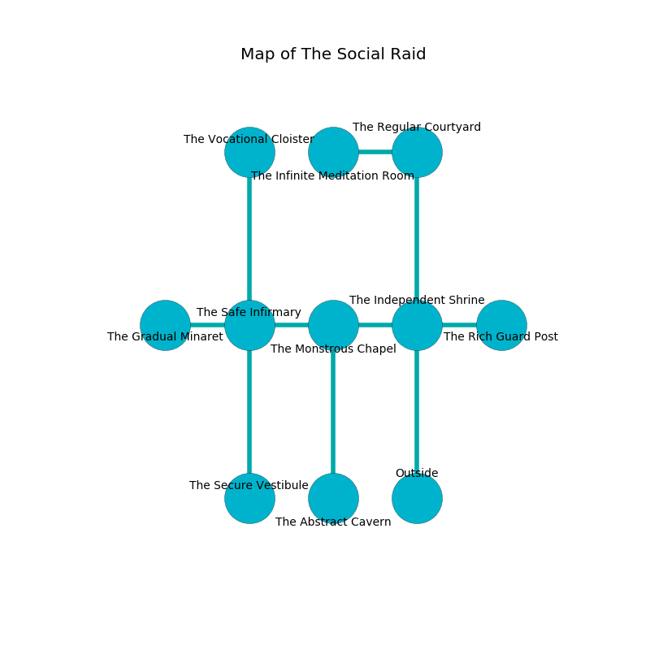

%Ruin Dogs

##The Social Raid
###Overview
The Social Raid is located in a crystal mountain. Regions of it are somewhat hot. The ruin is collapsing slowly. It is occupied by Orc. Belva Jones The Moody, a Hobgoblin Warlord is here. The Orc are ruled by Belva Jones The Moody. She  is trying to understand [Fucc Asmaedaedaeum](#Fucc-Asmaedaedaeum). 

###Artifact
####Fucc Asmaedaedaeum

Fucc Asmaedaedaeum is a powerful artifact in the shape of a wet figurine. Gravity pours away from it. When rubbed it destroys itself. 

###Locations

####the independent shrine
The floor is smooth. The brick walls are unsettled. The air smells like rum here. 

* To the west a narrow cavern leads to [the monstrous chapel](#the-monstrous-chapel).
* To the east a small pathway connects to [the rich guard post](#the-rich-guard-post).
* To the north a twisted hallway leads to [the regular courtyard](#the-regular-courtyard).
* To the south is the entrance.

####the monstrous chapel
Yellow moss is sprouting from the ceiling. 

* There is a blade here.
* There is a drawer here.
* To the west a long corridor leads to [the safe infirmary](#the-safe-infirmary).
* To the east a narrow cavern connects to [the independent shrine](#the-independent-shrine).
* To the south a flooded walkway connects to [the abstract cavern](#the-abstract-cavern).

####the safe infirmary
The air tastes like plastic here. The floor is glossy. 

* [Fucc Asmaedaedaeum](#Fucc-Asmaedaedaeum) is here.
* [Belva Jones The Moody](#Belva-Jones-The-Moody) is here.
* To the west a dark opening leads to [the gradual minaret](#the-gradual-minaret).
* To the east a long corridor opens to [the monstrous chapel](#the-monstrous-chapel).
* To the north a torchlit walkway opens to [the vocational cloister](#the-vocational-cloister).
* To the south a hazy pathway connects to [the secure vestibule](#the-secure-vestibule).

####the regular courtyard
White lichens are decaying from the ceiling. The crystal walls are ruined. 

* To the west a windy path connects to [the infinite meditation room](#the-infinite-meditation-room).
* To the south a twisted hallway opens to [the independent shrine](#the-independent-shrine).

####the abstract cavern
There are twelve Orcs here. The air smells like gas here. The Orc are crazy with bloodlust. 

* There is a boot here.
* To the north a flooded walkway connects to [the monstrous chapel](#the-monstrous-chapel).

####the rich guard post
The mirrored walls are pristine. 

* To the west a small pathway opens to [the independent shrine](#the-independent-shrine).

####the vocational cloister
Blue razorgrass is swaying from the walls. The floor is glossy. There are a Revenant and a Githzerai Monk here. 

* There is a crossbow here.
* There is a hat here.
* To the south a torchlit walkway connects to [the safe infirmary](#the-safe-infirmary).

####the secure vestibule
The floor is bloodstained. The wooden walls are covered in mold. 

* To the north a hazy pathway opens to [the safe infirmary](#the-safe-infirmary).

####the infinite meditation room
Red lichens are decaying in broken urns. There are a Giant Crocodile, a Brass Dragon Wyrmling, and a Violet Fungus here. The air smells like butterscotch here. The floor is smooth. The glass walls are caving in. 

* There is a pendant here.
* To the east a windy path connects to [the regular courtyard](#the-regular-courtyard).

####the gradual minaret
Blue razorgrass is growing from the ceiling. 

* To the east a dark opening leads to [the safe infirmary](#the-safe-infirmary).

